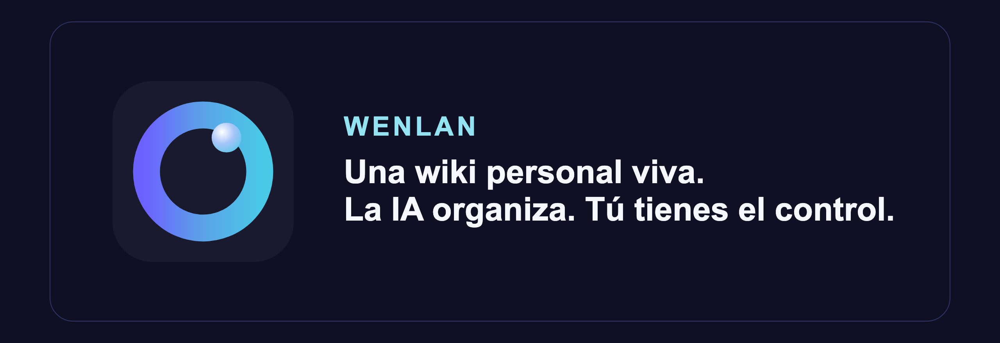

<!-- README_SYNC: source=README.md sha256=2a49328fcd22bc919f7d58a62912f8e211ad0c4412e5f75b2f8213128ef70308 -->

<p align="center">
  <picture>
    <source media="(max-width: 600px)" srcset="./docs/assets/readme-banner-es-ES-mobile.png">
    
  </picture>
</p>

Wenlan convierte tus documentos, notas y conversaciones con IA en páginas editables con enlaces a sus fuentes, para que tú y tus herramientas de IA podáis seguir trabajando a partir de ellas.

Cuando las fuentes cambian, la IA mantiene las páginas al día. Si has editado una página, Wenlan te propone cambios para que los revises, en lugar de sobrescribir tu trabajo automáticamente.

<p align="center">
  <a href="./README.md">English</a> | <a href="./README.zh-Hans.md">简体中文</a> | <a href="./README.zh-Hant.md">繁體中文</a> | Español
</p>

<p align="center">
  <a href="https://github.com/7xuanlu/wenlan/actions/workflows/ci.yml?query=branch%3Amain"></a>
  <a href="https://github.com/7xuanlu/wenlan/releases/latest"></a>
  <a href="#license"></a>
</p>

<p align="center">
  <a href="#start-in-30-seconds">Primeros&nbsp;pasos</a> ·
  <a href="#what-does-wenlan-build">¿Qué&nbsp;es&nbsp;esto?</a> ·
  <a href="#what-can-it-do">Capacidades</a> ·
  <a href="#how-does-it-work">Flujo&nbsp;diario</a> ·
  <a href="#evaluation">Evaluación</a> ·
  <a href="#learn-more">Leer&nbsp;más</a>
</p>

https://github.com/user-attachments/assets/35f06749-00e5-484d-a9f4-5e462de8d11e

<p align="center">
  <sub>Una Página mantenida en la aplicación de escritorio: abre cualquier cita para inspeccionar la Fuente o Memoria detrás de la afirmación.</sub>
</p>

<p align="center">
  <a href="https://github.com/7xuanlu/wenlan/releases/latest">Descargar&nbsp;la&nbsp;aplicación</a> ·
  <a href="#mcp-setup">Conectar&nbsp;tu&nbsp;IA</a>
</p>


<a id="quickstart"></a>
<a id="start-in-30-seconds"></a>

## Primeros pasos

<a id="start-with-the-app"></a>
<a id="open-the-wiki"></a>
<a id="desktop-app"></a>

### 1. Descarga y abre Wenlan

[Descarga la aplicación](https://github.com/7xuanlu/wenlan/releases/latest) y ábrela tras instalarla:

- **macOS (Apple Silicon):** abre el `.dmg` y arrastra Wenlan a Aplicaciones. La aplicación está firmada y notarizada.
- **Windows x64:** ejecuta el `-setup.exe`. Todavía no está firmado. Si SmartScreen muestra un aviso, confirma que lo has descargado de la página oficial de Releases antes de elegir "Más información" → "Ejecutar de todas formas".
- **Linux:** todavía no tiene versión de escritorio; sigue la [guía de configuración](docs/setup-with-ai.md#install-the-runtime) para usar Wenlan con tus herramientas de IA sin la aplicación.

<a id="claude-code-in-30-seconds"></a>

<a id="codex-plugin"></a>

<a id="mcp-setup"></a>
<a id="mcp-clients"></a>

### 2. Conecta tus IA a la misma wiki

En la configuración de Wenlan, conecta Claude Code, Codex u otras herramientas de IA compatibles para que usen el mismo conocimiento.

<details>
<summary>¿Necesitas ayuda? Pídesela a tu IA</summary>

Reinicia tu herramienta de IA si se te indica. Si necesitas ayuda con la configuración, pega esto en Claude Code, Codex u otra herramienta que pueda seguir una guía:

```text
Conecta esta herramienta de IA a Wenlan siguiendo:
https://raw.githubusercontent.com/7xuanlu/wenlan/main/docs/setup-with-ai.md

Reutiliza mi instalación de Wenlan si ya existe.
Configura solo esta herramienta y comprueba que puede guardar y recuperar
una memoria de prueba.
```

</details>

### 3. Guarda tu trabajo para retomarlo

> Convierte lo más importante de esta conversación en una página de Wenlan.

<details>
<summary>Modelos, instalación y actualizaciones</summary>

**Modelos**

Puedes pedirle a tu IA conectada que organice las páginas. Para que Wenlan las organice en segundo plano, [configura un modelo](#models-and-privacy).

**Instalar la aplicación de macOS desde el terminal**

El instalador descarga la aplicación, comprueba su SHA-256 y la mueve a Aplicaciones:

```bash
/bin/bash -c "$(curl -fsSL https://raw.githubusercontent.com/7xuanlu/wenlan/main/scripts/install-macos-app.sh)"
```

**Sin la aplicación de escritorio**

En macOS Apple Silicon:

```bash
npx -y wenlan setup
```

`npx` requiere Node.js. Si no lo tienes, ejecuta `curl -fsSL https://raw.githubusercontent.com/7xuanlu/wenlan/main/install.sh | bash` y después `wenlan setup --basic`.

Esto descarga la CLI precompilada, el daemon y el conector MCP, inicia el entorno local y lo verifica. No se requiere toolchain de Rust ni Cargo. Linux x64/ARM64 con glibc tiene una [ruta de configuración automática de shell](docs/setup-with-ai.md#install-the-runtime); Windows x64 utiliza el archivo correspondiente de [Releases](https://github.com/7xuanlu/wenlan/releases/latest). macOS Intel actualmente [no tiene una instalación completa soportada del runtime](crates/wenlan-cli/README.md#macos-intel).

**Qué se instala y cómo actualizar**

La aplicación incluye el daemon, la CLI y el conector MCP. Inicia el daemon al abrirse y ofrece conectar los clientes detectados mediante el plugin de Claude Code o Codex, o una entrada MCP para otros clientes compatibles. La instalación sin interfaz ejecuta el mismo daemon sin ventana; en ambos casos, tus herramientas de IA usan la misma base de conocimiento local.

Para actualizar la aplicación de macOS, arrastra la nueva sobre la antigua y ábrela. Cierra manualmente Wenlan 0.17.0 y anteriores antes de hacerlo.

Instrucciones manuales y específicas por herramienta: [Configuración asistida por IA](docs/setup-with-ai.md) · [Plugin de Claude Code](plugin/README.md) · [Plugin de Codex](plugin-codex/README.md) · [CLI y MCP](crates/wenlan-cli/README.md).

</details>


<a id="what-does-wenlan-build"></a>
<a id="why-it-compounds"></a>

<a id="qué-es-esto"></a>

## Tu wiki, para ti y tu IA

- **Retoma donde lo dejaste.** Pide a Claude Code o Codex que use una página existente de Wenlan para tu siguiente tarea.
- **Consulta de dónde viene una respuesta.** Abre las citas de una página para ver los documentos, conversaciones o decisiones guardadas que la sustentan.
- **Mantén el control de tus cambios.** Cuando Wenlan actualiza automáticamente una página que has editado, propone cambios para que los revises.

Tus páginas son archivos Markdown locales que puedes leer, editar y llevarte contigo.

<p align="center">
  <picture>
    <source media="(max-width: 600px)" srcset="./docs/assets/wenlan-system-mobile.png">
    
  </picture>
</p>

<details>
<summary>Cómo se conectan las fuentes, memorias y páginas</summary>

Con Wenlan, el trabajo en curso no se queda dentro de la ventana del chat. Puedes guardar los documentos y conversaciones que elijas, anotar las decisiones que tomes y organizarlos en páginas que puedas leer, editar y reutilizar. La generación de páginas y su mantenimiento en segundo plano requieren configurar la [vía de IA](#models-and-privacy).

<a id="what-wenlan-is-not"></a>

**Pensado para trabajos que continúan.** Si usas la IA durante días o semanas para el mismo tema y tienes que buscar continuamente el material anterior o volver a explicar decisiones ya tomadas, Wenlan está pensado para ese flujo de trabajo. No es un sistema de gestión personal ni un SDK de memoria integrado en otro producto. Puedes seguir usando Obsidian; Wenlan no promete sustituir sus plugins ni migrar todas las funciones de tu vault.

**Un sistema de conocimiento, tres roles:**

- **Las Fuentes mantienen rastreable el material que lee Wenlan.** Las conversaciones importadas permanecen como registros capturados; los archivos registrados sincronizan su contenido actual a medida que cambian.
- **Las Memorias preservan lo que el trabajo te enseña.** Los agentes capturan decisiones atómicas, lecciones, correcciones y sustituciones con procedencia.
- **Las Páginas compilan el conocimiento actual.** Wenlan convierte Fuentes y Memorias relevantes en Markdown con citas de fuente que puedes reutilizar, actualizar y revisar.

**Cómo se actualizan las páginas:** Tanto las Fuentes como las Memorias capturadas pueden sustentar una misma Página. El historial de Memoria registra los cambios en cada Memoria; el historial de la Página registra las fuentes que la sustentan y sus revisiones. Durante la actualización automática, las Páginas elegibles mantenidas por el sistema pueden actualizarse directamente; las que hayas editado reciben una revisión propuesta. La revisión te permite decidir si aplicarla; no garantiza que la conclusión de la IA sea correcta.

Para lectores técnicos: Wenlan sigue el patrón de las wikis para LLM. Consulta la [guía de implementación de LLM wiki](https://wenlan.app/learn/distilled-wiki-pages-ai-memory) y los [fundamentos técnicos](docs/technical-foundations.md) para conocer el modelo de datos, la recuperación y las reglas de mantenimiento.

</details>

<a id="knowledge-graph"></a>

### Un grafo de conocimiento que se vuelve más útil con el tiempo

<p align="center">
  <picture>
    <source media="(max-width: 600px)" srcset="./docs/assets/wenlan-knowledge-network-mobile.png">
    
  </picture>
</p>

<details>
<summary>Detalles del grafo y la búsqueda</summary>

El grafo de entidad-relación es una parte de la wiki conectada más amplia de Wenlan. Las **Páginas de Conocimiento** contienen la síntesis mantenida, las **Entidades** anclan personas, proyectos y conceptos reutilizables, las **Páginas de Fuente** hacen que el material importado o sincronizado sea inspeccionable, y las **Memorias** atómicas preservan decisiones y cambios. Funcionan a través de enlaces separados y explícitos: wikilinks de Página a Página, evidencia de Página, enlaces de Memoria a Entidad y relaciones de Entidad dirigidas.

Dentro del grafo de entidades, un modelo de enriquecimiento configurado extrae Entidades tipadas, observaciones y relaciones dirigidas a partir de las Memorias. El enlace y la resolución de entidades reutilizan nodos existentes en lugar de tratar cada mención como nueva; cada Memoria conserva su Fuente y puede vincularse a múltiples Entidades. [Cómo se almacena el modelo conectado ->](docs/technical-foundations.md#connected-knowledge-model)

- **Significado y dirección:** Las relaciones utilizan un vocabulario predefinido como `uses` (usa), `part_of` (parte de), `contradicts` (contradice) y `replaced_by` (reemplazado por); los tipos desconocidos se reasignan a `related_to` (relacionado con) y se convierten en propuestas de vocabulario revisables.
- **Fuerza y procedencia:** Una relación puede almacenar confianza, una explicación y su Memoria de origen, para que las afirmaciones más fuertes y más débiles sigan siendo distinguibles e inspeccionables.
- **Comunidades que se enriquecen con el tiempo:** La propagación de etiquetas agrupa Entidades por densidad de relación, ponderada por el recuento de relaciones entre cada par. Estos grupos pueden organizar resúmenes de corpus opcionales mientras que los enlaces de Entidad añaden contexto de recuperación.
- **Corrección sin borrado:** Las afirmaciones relacionadas, las correcciones y las sustituciones explícitas permanecen inspeccionables juntas mientras se conservan las Fuentes originales y el historial de Memoria.

Durante la recuperación, la coincidencia densa de entidades encuentra entidades relevantes para la consulta. Cuando existen enlaces de grafo elegibles, el flujo de grafo-memoria predeterminado potencia las Memorias vinculadas como una tercera señal de [RRF](https://cormack.uwaterloo.ca/cormacksigir09-rrf.pdf). La ruta depende de los datos y el alcance, y los límites de Espacio (Space) se siguen aplicando. [Cómo funciona la ruta del grafo ->](docs/technical-foundations.md#graph-assisted-retrieval)

<a id="retrieval"></a>

### Recuperación a través de palabras, significado y conexiones

La búsqueda central de Wenlan es un pipeline híbrido local, no una simple búsqueda de vectores. Cada etapa tiene una tarea diferente:

- **Coincidencia literal, [SQLite FTS5](https://www.sqlite.org/fts5.html):** un índice de texto completo encuentra términos literales, identificadores y frases.
- **Significado similar, FastEmbed + [`Qdrant/bge-base-en-v1.5-onnx-Q`](https://huggingface.co/Qdrant/bge-base-en-v1.5-onnx-Q):** un modelo inglés cuantizado crea embeddings de 768 dimensiones; [libSQL cosine DiskANN](https://turso.tech/blog/approximate-nearest-neighbor-search-with-diskann-in-libsql) los indexa para la recuperación de vecinos más cercanos aproximados.
- **Clasificación combinada, [RRF](https://cormack.uwaterloo.ca/cormacksigir09-rrf.pdf) ponderado (`k = 60`):** las listas de clasificación léxica y semántica se fusionan sin fingir que sus puntuaciones brutas comparten una escala; la similitud de coseno también pondera la contribución del vector.
- **Contexto conectado, flujo de grafo-memoria:** los enlaces de entidad elegibles añaden una tercera señal RRF mientras que el alcance de lectura activo sigue filtrando las Memorias devueltas.
- **Precisión opcional, re-clasificación por cross-encoder:** a diferencia de los embeddings, [`jinaai/jina-reranker-v1-turbo-en`](https://huggingface.co/jinaai/jina-reranker-v1-turbo-en) o [`BAAI/bge-reranker-base`](https://huggingface.co/BAAI/bge-reranker-base) lee cada par consulta-candidato y reordena el grupo más pequeño; la re-clasificación está desactivada por defecto.

Los canales de Página, episódicos y de hechos son opcionales y recurren a las señales de búsqueda restantes si no están disponibles. El Espacio sigue limitando el alcance de lectura. [Métodos, valores predeterminados y limitaciones ->](docs/technical-foundations.md)

</details>

<a id="what-makes-wenlan-distinct"></a>
<a id="why-is-wenlan-different"></a>
<a id="two-lifecycles"></a>

### Dos ciclos de vida, un sistema de conocimiento mantenido

Una wiki generada puede quedar obsoleta; un almacén de memoria puede fragmentarse en hechos desconectados. Wenlan vincula dos ciclos de vida sin colapsarlos en una sola capa.

<p align="center">
  <picture>
    <source media="(max-width: 600px)" srcset="./docs/assets/wenlan-lifecycle-mobile.png">
    
  </picture>
</p>

<details>
<summary>Actualizaciones, revisión y archivos locales</summary>

#### Memoria Atómica

`CAPTURA -> CLASIFICA -> ENRIQUECE -> VINCULA -> RECONCILIA`

La captura y la sustitución explícita son fundamentales. Las etapas basadas en modelos se ejecutan solo cuando el modelo correspondiente está configurado, y el paso de reconciliación está desactivado por defecto.

| Operación | Lo que hace Wenlan |
|---|---|
| **Captura** | Los agentes escriben una idea completa y autónoma por Memoria, siguiendo el principio de nota atómica de Zettelkasten en lugar de guardar toda la conversación. |
| **Clasifica** | Con un modelo de lenguaje configurado, Wenlan asigna `identity` (identidad), `preference` (preferencia), `decision` (decisión), `lesson` (lección), `gotcha` (advertencia) o `fact` (hecho); un tipo preciso proporcionado por el cliente tiene prioridad. |
| **Enriquece** | Con un modelo de lenguaje configurado, añade campos estructurados, pistas de recuperación, fechas de eventos, calidad, importancia y etiquetas cuando estén disponibles. |
| **Vincula** | Mantiene la procedencia y, cuando el enriquecimiento está habilitado, conecta Memorias con entidades y relaciones en el grafo de conocimiento. |
| **Reconcilia** | Los reemplazos explícitos preservan una cadena de `supersedes` (sustituye). Un reemplazo de un agente cuyo nivel de confianza sea inferior a "full" se pone en cola para revisión humana automáticamente, sin necesidad de ninguna opción. Un paso opcional basado en un modelo también puede poner en cola conflictos protegidos para revisión en lugar de sobrescribir el historial; ese paso está desactivado por defecto y debe habilitarse explícitamente. |

Configuración avanzada: establece `WENLAN_ENABLE_DUAL_POOL_RESOLVE=1` para habilitar ese paso de reconciliación.

#### Página Mantenida

`DESTILA -> CITA -> RASTREA -> ACTUALIZA -> REVISA`

| Operación | Lo que hace Wenlan |
|---|---|
| **Destila** | Compila Fuentes y Memorias relacionadas en una Página Markdown. |
| **Cita** | Mantiene los registros de citas y el estado de verificación; la actualización automática descarta un borrador cuando falla la verificación del respaldo de las citas. |
| **Rastrea** | Registra qué evidencia sustenta la Página, por qué quedó obsoleta y un registro de cambios limitado. |
| **Actualiza** | Cuando una Página se marca como obsoleta, reconstruye las Páginas mantenidas automáticamente que cumplen los requisitos a partir de la evidencia actual. |
| **Revisa** | Durante la actualización automática, propone cambios en las Páginas que hayas editado, en lugar de reescribirlas sin avisar. |

Por ejemplo, importa un documento de diseño y guarda en Codex una decisión de depuración. Wenlan puede reunir ambos en una Página con citas a las dos fuentes. Cuando la Página se actualice automáticamente, se reconstruirá a partir de los materiales que la sustentan; si la has editado, la propuesta de cambio quedará pendiente de revisión.

**Alcance de la revisión:** es una política de actualización, no una barrera de seguridad para tus archivos. Las ediciones directas en archivos y las realizadas mediante la API local de edición manual no pasan por esta cola. Una regeneración forzada y explícita también puede reemplazar una Página editada; la aplicación de escritorio pide confirmación antes de hacerlo.

<a id="local-markdown"></a>

### Markdown local que funciona con Obsidian

Tu síntesis duradera permanece en archivos ordinarios en lugar de un formato de editor propietario:

- **Archivos planos:** Las Páginas y notas de sesión permanecen como Markdown en `~/.wenlan/`.
- **Historial inspeccionable:** Los flujos de destilación y entrega pueden registrar lotes lógicos de archivos mediante commits en un repositorio git local.
- **Coexistencia con Obsidian:** Wenlan lee un vault existente como una fuente. Crea un enlace simbólico de `~/.wenlan/pages/` hacia el vault o exporta una Página desde la aplicación de escritorio; tus ediciones siguen siendo propiedad humana, y las actualizaciones posteriores de la máquina se convierten en revisiones revisables.

El historial local es directamente inspeccionable:

```text
$ git -C ~/.wenlan log --oneline
a1b2c3d distill: 4 pages
9f8e7d6 session: embedding-work
```

</details>


<a id="what-you-get"></a>
<a id="what-can-it-do"></a>
<a id="what-can-i-bring-in"></a>

## Capacidades

### Incorpora tu material

- **Conserva conversaciones útiles con IA:** Importa archivos ZIP de ChatGPT o Claude sin duplicar conversaciones ya importadas.
- **Incorpora tus notas actuales:** Incorpora Markdown, texto o PDF con texto extraíble, por archivo o carpeta; indexa un vault de Obsidian. Los PDF escaneados requieren extraer el texto primero.
- **Captura rápida:** Guarda una idea o decisión directamente en la aplicación de escritorio sin abrir un chat con IA.
- **[Guarda decisiones con tu IA](https://wenlan.app/learn/ai-memory-provenance):** Pide a tu herramienta de IA que guarde decisiones, lecciones, correcciones, preferencias y hechos, con sus fuentes y los registros que sustituyen.
- **Importa otra wiki:** Importa una wiki OKF externa mediante la CLI o la API, conservando referencias y enlaces. No se admite reimportar las propias exportaciones OKF de Wenlan.

### Explora tu wiki personal

- **[Páginas editables con fuentes](https://wenlan.app/docs/source-backed-pages):** Convierte documentos y Memorias relacionados en Páginas Markdown con citas y enlaces a otras Páginas.
- **Tarjetas o listas:** Explora Páginas, Entidades y Espacios con la vista que prefieras.
- **[Grafo de conocimiento](docs/technical-foundations.md#graph-data-and-entity-resolution):** Explora conexiones entre personas, proyectos, afirmaciones y las Memorias que las respaldan.

### Úsalo con tus herramientas de IA

- **[Continúa con otra herramienta de IA](https://wenlan.app/docs/architecture):** Una vez conectados, Claude Code, Codex y otros clientes MCP pueden usar las mismas Páginas y Memorias locales que la aplicación de escritorio y la CLI.
- **[Busca por palabras y significado](docs/technical-foundations.md#retrieval-pipeline):** Combina coincidencias exactas con búsqueda semántica local; las conexiones del grafo pueden aportar contexto.
- **[Búsqueda avanzada opcional](docs/technical-foundations.md#optional-channels-and-defaults):** Busca en Páginas y Memorias más detalladas, con reordenación opcional para afinar los resultados.
- **[Separa tus proyectos](https://wenlan.app/docs/spaces):** Usa Espacios para elegir qué conocimiento laboral, personal, de clientes o de repositorios busca tu IA.
- **Acceso web (experimental):** Conecta un cliente web de IA compatible a un Espacio autorizado mientras tu ordenador está conectado. Las consultas y los resultados pasan por un relay; consulta el [funcionamiento del acceso y sus límites de privacidad](docs/PRIVACY.md#pre-release-standalone-wenlan-relay-connector).
- **Conecta tus propias herramientas:** Envía texto preparado, contenido web o Memorias mediante la API HTTP local. Acepta contenido, no URL para descargar.

### Mantén el conocimiento al día

La organización y las actualizaciones de Páginas en segundo plano son opcionales y requieren un [modelo configurado](#models-and-privacy).

- **Sincronización incremental:** Las Fuentes de archivos y carpetas rastrean cambios en segundo plano. Los vaults de Obsidian siguen siendo de solo lectura y se sincronizan bajo demanda.
- **[Organiza el conocimiento guardado](docs/technical-foundations.md#typed-memory-schema):** Un modelo configurado puede añadir tipos, detalles estructurados, fechas relevantes, etiquetas, pistas de búsqueda y enlaces del grafo a las Memorias.
- **Actualizaciones respaldadas por citas:** La actualización automática rechaza borradores con citas insuficientes. Las Páginas generadas por IA pueden actualizarse; los cambios en las que has editado se proponen para revisión.
- **[Revisa cuando hace falta criterio](https://wenlan.app/docs/review-and-trust):** Revisa conflictos protegidos, cambios de Páginas, fusiones de entidades y vocabulario nuevo.
- **Sigue el progreso:** Consulta el progreso y los bloqueos en Activity. La sincronización, el enriquecimiento y las actualizaciones de Páginas elegibles pueden continuar tras cerrar la ventana, si están configurados y el servicio local sigue activo.

### Conserva tus datos y el control

- **[Conocimiento local e inspeccionable](https://wenlan.app/learn/markdown-local-index-ai-memory):** Conserva Páginas Markdown, citas, revisiones, historial de git y exportaciones a Obsidian; las Memorias y el grafo se guardan en libSQL local.
- **Llévate tu wiki:** Exporta las Páginas elegibles de todos los Espacios como wiki OKF v0.2 desde Ajustes o la CLI. No es una copia de seguridad de toda la base de datos.
- **[Elige el modelo](docs/technical-foundations.md#model-roles):** La búsqueda base es local. El enriquecimiento y la síntesis opcionales pueden usar Qwen en el dispositivo, un endpoint local o un modelo en la nube; los proveedores remotos reciben el contenido necesario para sus tareas.
- **Diagnóstico y reparaciones revisadas:** [Doctor](https://wenlan.app/docs/diagnostics-and-issue-reports) y [lint](plugin/skills/lint/SKILL.md) detectan problemas sin reescribir el conocimiento. Para los casos compatibles, puedes previsualizar una reparación en la aplicación, aplicarla explícitamente y verificarla.

**Empieza con una conversación que merezca conservarse.** [Primeros pasos](#start-in-30-seconds). Si prefieres probarlo más adelante, guarda este repositorio con una estrella.


<a id="how-wenlan-works"></a>
<a id="how-does-it-work"></a>

## Flujo diario

Una vez conectada tu herramienta de IA, puedes pedirle lo que necesitas con tus propias palabras:

### Antes de empezar una tarea

> Busca lo que he guardado en Wenlan sobre [tema], incluidas las decisiones anteriores y sus fuentes.

### Cuando llegues a una conclusión útil

> Guarda esta decisión y por qué la tomamos en Wenlan, con sus fuentes.

### Cuando un tema merezca una página

> Crea o actualiza una página de Wenlan sobre [tema] con el material que hemos guardado. Conserva las citas.

Abre la página en Wenlan para leerla, editarla y consultar sus fuentes. La próxima vez, pide a tu IA que la use para continuar el trabajo.

<details>
<summary>Comandos del plugin y mantenimiento</summary>

- **Recupera el contexto:** `/recall <consulta>` busca en el conocimiento guardado. `/brief [tema]` lee el resumen del proyecto del Espacio actual; un tema opcional añade contexto relacionado de ese mismo Espacio.
- **Guarda lo importante:** `/capture <contenido>` guarda una decisión, lección, corrección, preferencia o hecho con su fuente.
- **Cierra la sesión:** `/handoff` registra los avances y crea o actualiza el resumen del proyecto del Espacio para la próxima vez.
- **Organiza y revisa:** `/distill` crea o actualiza páginas de la wiki. `/lint` comprueba el estado del conocimiento; `/curate` revisa capturas o revisiones pendientes.

Estos comandos están disponibles a través de los plugins de Wenlan. Otros clientes conectados usan las herramientas MCP equivalentes. La organización y las actualizaciones de Páginas en segundo plano son opcionales y requieren un [modelo configurado](#models-and-privacy).

[Referencia completa de comandos](plugin/skills/README.md).

</details>

<details>
<summary>Detalles de la cola offline de la CLI</summary>

### Cola offline (outbox)

Si el daemon local no está accesible, `wenlan capture` y `wenlan brief update` escriben sus solicitudes en una cola local duradera (outbox) y terminan correctamente. Cuando el daemon vuelve, drena esas escrituras por las rutas HTTP normales; revisa la cola con `wenlan outbox status` o pide una reproducción inmediata con `wenlan outbox drain`. Una escritura que el daemon rechaza de plano (un 4xx, por ejemplo al no pasar el control de calidad del contenido) se mueve a `outbox/failed/` con un recibo en lugar de reintentarse para siempre; un fallo de transporte o un error del servidor (5xx) la deja en la cola para el siguiente drenaje, que se ejecuta automáticamente cada 60 segundos.

</details>

<a id="models-and-privacy"></a>

### Modelos y privacidad

- **Recuperación base local:** El [modelo de embedding BGE](https://huggingface.co/Qdrant/bge-base-en-v1.5-onnx-Q) se ejecuta a través de FastEmbed en tu máquina para la búsqueda híbrida y no necesita clave de API.
- **Síntesis opcional en el dispositivo:** El enriquecimiento y la síntesis de Páginas pueden usar [`Qwen3 4B`](https://huggingface.co/unsloth/Qwen3-4B-Instruct-2507-GGUF) o [`Qwen3.5 9B`](https://huggingface.co/unsloth/Qwen3.5-9B-GGUF), según la elección del usuario, a través de [llama.cpp](https://github.com/ggml-org/llama.cpp). Wenlan no descarga ni activa un modelo de lenguaje hasta que elijas uno.
- **Otros proveedores:** Un endpoint local compatible con OpenAI como Ollama o LM Studio, o un proveedor en la nube configurado, pueden suministrar el enriquecimiento y la síntesis basados en modelos.
- **Divulgación de nube:** Si el endpoint del modelo que seleccionas es remoto, Wenlan envía los prompts del sistema y del usuario de esa tarea a ese endpoint. La recuperación local y la síntesis en el dispositivo permanecen en tu máquina.
- **Estadísticas de uso opcionales:** Desactivadas por defecto. Si optas por activarlas, Wenlan envía recuentos acotados de operaciones, la versión y la plataforma, no el contenido de tus conocimientos ni un identificador de instalación. Consulta la [política de privacidad](docs/PRIVACY.md#telemetry).

Referencia completa del flujo de trabajo: [plugin/skills](plugin/skills/README.md). Roles técnicos del modelo: [fundamentos técnicos](docs/technical-foundations.md#model-roles).

### Tus datos y la desinstalación

Nada queda encerrado. Las páginas y las notas de sesión son Markdown en `~/.wenlan/`; las memorias viven en una base de datos libSQL dentro del directorio de datos de la plataforma (`~/Library/Application Support/wenlan/` en macOS, `~/.local/share/wenlan/` en Linux, `%LOCALAPPDATA%\wenlan\` en Windows). Copia esas dos carpetas para hacer una copia de seguridad o mover tu Wenlan. Si esta instalación se actualizó desde Origin, todavía conserva una copia completa de sus datos en `~/.origin/` y en la carpeta hermana de datos `origin` (`~/Library/Application Support/origin/` en macOS, `~/.local/share/origin/` en Linux, `%LOCALAPPDATA%\origin\` en Windows); borra o copia también esas dos.

Para desinstalar: el interruptor *Ejecutar Wenlan en segundo plano al iniciar sesión* de la app elimina el registro de arranque — desactívalo, cierra la app y borra `Wenlan.app` o ejecuta el desinstalador de Windows, y después borra las carpetas anteriores. `wenlan background off` solo detiene el daemon y desactiva el arranque automático; no elimina el registro de arranque, así que una instalación solo de CLI debe seguir en su lugar el punto de desinstalación del daemon en [PRIVACY.md](docs/PRIVACY.md). Las rutas que Wenlan escribe están ahí.


<a id="evaluation"></a>

## Evaluación

Esto es una instantánea de solo recuperación, no una afirmación sobre la calidad de la respuesta de extremo a extremo. El método, los recibos del entorno y el flujo de actualización residen en [docs/eval](docs/eval/README.md).

<!-- EVAL_SNAPSHOT_START -->
| Benchmark | Recall@5 | MRR | NDCG@10 |
|---|---:|---:|---:|
| LME_Oracle (500 Q) | 93.6% | 0.857 | 0.883 |
| LME_S (deep, 90 Q) | 87.7% | 0.815 | 0.822 |
<!-- EVAL_SNAPSHOT_END -->


<a id="learn-more"></a>

## Leer más

Documentación más detallada, conceptos y comparaciones:

### Documentación

- [Primeros pasos](https://wenlan.app/docs/get-started): instala y verifica el primer bucle local.
- [Flujo diario](https://wenlan.app/docs/daily-workflow): brief, capture, recall, handoff, distill, lint y curate.
- [Clientes MCP](https://wenlan.app/docs/mcp-clients): conecta Claude Code, Codex, Cursor, Claude Desktop y otros clientes.

### Guías de flujo de trabajo

- [Crear una base de conocimiento de proyectos para consultoría](https://wenlan.app/learn/build-client-project-knowledge-base-for-consulting)
- [Crear una base de conocimiento para investigación de inversiones](https://wenlan.app/learn/build-investment-research-knowledge-base)
- [Crear una base de conocimiento de investigación de producto antes de redactar un PRD](https://wenlan.app/learn/build-product-research-knowledge-base-for-prd)
- [Crear una base de conocimiento de incidentes SRE](https://wenlan.app/learn/build-sre-incident-knowledge-base)
- [Crear una base de conocimiento de definiciones de métricas de negocio](https://wenlan.app/learn/build-business-metric-definition-knowledge-base): convierte especificaciones de KPI aprobadas en un diccionario de datos respaldado por fuentes, con texto de fórmula, granularidad, exclusiones, propietarios, revisiones y estado de revisión.

### Conceptos

- [Por qué una wiki viva, no solo memoria de IA](https://wenlan.app/learn/ai-work-memory): el problema y el modelo de producto en profundidad.
- [Servidor de memoria MCP](https://wenlan.app/learn/mcp-memory-server): cómo Wenlan expone el conocimiento a través de herramientas de IA.
- [Memoria de IA local-first](https://wenlan.app/learn/local-first-ai-memory): datos, privacidad y control.
- [Markdown e índice local](https://wenlan.app/learn/markdown-local-index-ai-memory): almacenamiento, recuperación y propiedad.
- [Bucle de entrega de agentes de IA](https://wenlan.app/learn/ai-agent-handoff-loop): cómo trasladar el trabajo limpiamente a la siguiente sesión.
- [Base de conocimiento para investigación](https://wenlan.app/learn/source-backed-research-knowledge-base): convierte artículos seleccionados en una matriz bibliográfica y una síntesis verificable con fuentes.

### Comparaciones

- [Wenlan vs Basic Memory](https://wenlan.app/learn/wenlan-vs-basic-memory)
- [Wenlan vs claude-mem](https://wenlan.app/learn/wenlan-vs-claude-mem)
- [Wenlan vs Superlocal Memory](https://wenlan.app/learn/wenlan-vs-superlocal-memory)


## Contribuir

Las correcciones de errores, casos de evaluación, documentación y funciones son bienvenidos. Instalar Wenlan no requiere compilar desde el código fuente. Para el desarrollo local, ejecuta estos comandos desde la raíz de este repositorio:

```bash
# crates del daemon (default-members: la aplicación de escritorio no se compila)
cargo build
cargo test

# aplicación de escritorio (target de Cargo y herramientas frontend en la raíz)
pnpm install
pnpm dev:all
pnpm build:all
```

`pnpm dev:all` es el punto de entrada de desarrollo admitido para la aplicación de escritorio. Mantiene los puertos de desarrollo, los datos, la propiedad de los procesos, la identidad de la aplicación, los sockets MCP y el estado de Remote Access separados del runtime de producción instalado; una compilación de depuración iniciada sin ese aislamiento se niega a ejecutarse. Consulta el [AGENTS.md](AGENTS.md) y [CONTRIBUTING.md](.github/CONTRIBUTING.md) de este repositorio, además del [app/AGENTS.md](app/AGENTS.md) dentro del repositorio, para el flujo de trabajo de desarrollo completo. Reportes de seguridad: [SECURITY.md](.github/SECURITY.md). Política de privacidad: [PRIVACY.md](docs/PRIVACY.md). Por favor, lee también el [Código de Conducta](.github/CODE_OF_CONDUCT.md).


<a id="code-signing-policy"></a>

## Code signing policy

Free code signing provided by [SignPath.io](https://about.signpath.io), certificate by [SignPath Foundation](https://signpath.org).

- **Autores:** [@7xuanlu](https://github.com/7xuanlu), que puede hacer commit en este repositorio sin una revisión adicional.
- **Revisores:** [@7xuanlu](https://github.com/7xuanlu). Todo cambio de alguien que no sea committer llega como pull request y se revisa antes de fusionarse.
- **Aprobadores:** [@7xuanlu](https://github.com/7xuanlu), que aprueba cada solicitud de firma y así decide qué versión se firma.

La autenticación multifactor es obligatoria para cada mantenedor, en GitHub y en SignPath, y nadie se añade a ninguno de los dos sin ella. Las versiones se compilan únicamente con el workflow de release por etiqueta de este repositorio, en runners alojados por GitHub, desde el commit al que apunta la etiqueta.

**Política de privacidad:** [PRIVACY.md](docs/PRIVACY.md) — qué guarda Wenlan, dónde lo guarda y cada caso que conocemos en que accede a la red. Cómo se firma cada plataforma: [docs/code-signing.md](docs/code-signing.md).

La solicitud a SignPath está pendiente. Los instaladores de Windows aún no están firmados.


<a id="license"></a>

## Licencia

Wenlan usa dos licencias, una por cada parte del repositorio.

- **Apache-2.0** ([`LICENSE`](LICENSE)) cubre el runtime local, la CLI, el servidor MCP, los tipos compartidos y los archivos del plugin de Claude Code y Codex. Constrúyelo libremente sobre esto.
- **AGPL-3.0-only** ([`app/LICENSE`](app/LICENSE)) cubre la aplicación de escritorio: el crate `app/` y el frontend de React que incluye. Si ejecutas una versión modificada de la aplicación como servicio en red, la AGPL te pide ofrecer ese código modificado a sus usuarios.

La separación es deliberada. El código Apache-2.0 puede usarse dentro de un programa AGPL-3.0, así que la aplicación de escritorio se apoya en el runtime sin que ninguna de las dos licencias se incumpla.


<a id="acknowledgments"></a>

## Linaje y pares

Wenlan (文瀾) toma su nombre de Wenlan Ge (文瀾閣), una biblioteca imperial que albergaba la Siku Quanshu como parte de una de las colecciones de libros más grandes de China.

El modelo llm-wiki v2 de Wenlan es su propia dirección de producto, informada por los linajes de LLM-wiki y memoria de agentes:

- La [nota de LLM-wiki de Karpathy](https://gist.github.com/karpathy/442a6bf555914893e9891c11519de94f) estableció el patrón de fuente bruta a wiki mantenida.
- La [propuesta de LLM Wiki v2 de Rohitg00](https://gist.github.com/rohitg00/2067ab416f7bbe447c1977edaaa681e2) extiende ese patrón con ciclo de vida de memoria, confianza, grafo y mecanismos de recuperación. [agentmemory](https://github.com/rohitg00/agentmemory) es su implementación concreta de memoria de agente.
- [nashsu/llm_wiki](https://github.com/nashsu/llm_wiki) es una implementación completa de escritorio del patrón LLM-wiki centrado en documentos.
- [basic-memory](https://github.com/basicmachines-co/basic-memory), [obsidian-mind](https://github.com/breferrari/obsidian-mind), [mcp-memory-service](https://pypi.org/project/mcp-memory-service/), [Memoria](https://github.com/matrixorigin/Memoria) y [OpenMemory](https://github.com/CaviraOSS/OpenMemory) exploran formas adyacentes de conocimiento local y memoria de agentes.
