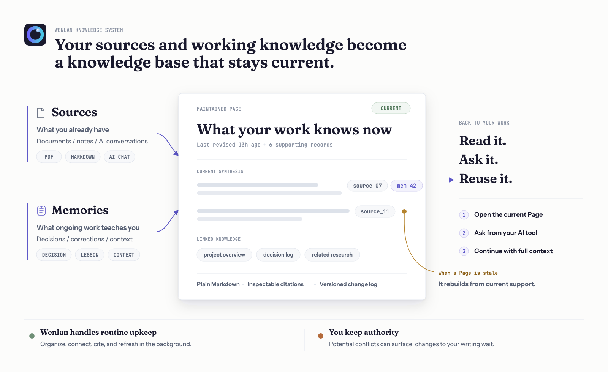
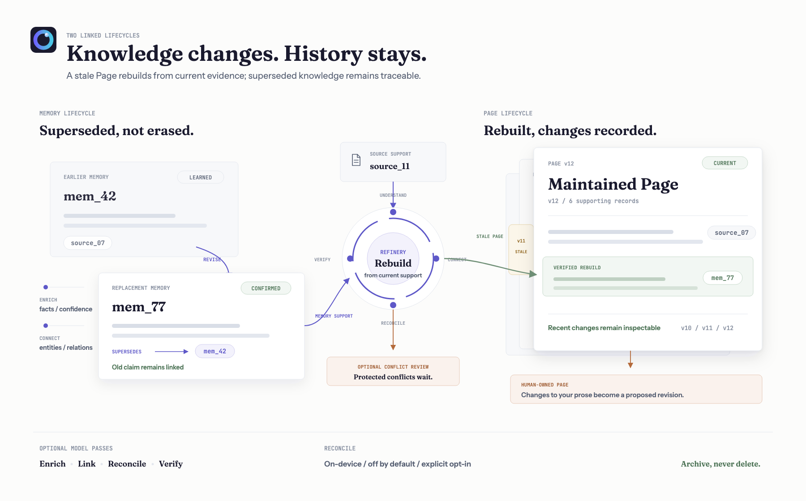

<p align="center">
  <picture>
    <source media="(max-width: 600px)" srcset="./docs/assets/readme-banner-mobile.png">
    
  </picture>
</p>

Useful work with AI shouldn't disappear when a conversation ends. Wenlan builds the right pages and keeps them current as sources change, asking only when judgment is needed.

<p align="center">
  English | <a href="./README.zh-Hans.md">简体中文</a> | <a href="./README.zh-Hant.md">繁體中文</a>
</p>

<p align="center">
  <a href="https://github.com/7xuanlu/wenlan/actions/workflows/ci.yml?query=branch%3Amain"></a>
  <a href="https://github.com/7xuanlu/wenlan/releases/latest"></a>
  <a href="#license"></a>
</p>

<p align="center">
  <a href="#start-in-30-seconds">Get&nbsp;started</a> ·
  <a href="#what-does-wenlan-build">What&nbsp;is&nbsp;this?</a> ·
  <a href="#what-can-it-do">Capabilities</a> ·
  <a href="#how-does-it-work">Daily&nbsp;workflow</a> ·
  <a href="#evaluation">Evaluation</a> ·
  <a href="#learn-more">Learn&nbsp;more</a>
</p>

<p align="center">
  
</p>

---

<a id="quickstart"></a>
<a id="start-in-30-seconds"></a>

## Get started

<a id="start-with-the-app"></a>
<a id="open-the-wiki"></a>

### Desktop app

The desktop app is the fastest way to see the complete workflow: read pages, inspect their sources, and curate the knowledge system. The current macOS Apple Silicon preview is not yet notarized, so this installer verifies the GitHub release, installs Wenlan, clears quarantine for this app only, and opens it without changing macOS security settings:

```bash
/bin/bash -c "$(curl -fsSL https://raw.githubusercontent.com/7xuanlu/wenlan/main/scripts/install-macos-app.sh)"
```

The [installer is inspectable](scripts/install-macos-app.sh). It checks the release archive against GitHub's published SHA-256 before replacing an existing app. Prefer the DMG or want to inspect the app source? See [wenlan-app releases](https://github.com/7xuanlu/wenlan-app/releases/latest) and [wenlan-app](https://github.com/7xuanlu/wenlan-app).

<a id="claude-code-in-30-seconds"></a>

<a id="codex-plugin"></a>

<a id="mcp-setup"></a>
<a id="mcp-clients"></a>

### Set up with your AI

Paste this into Claude Code, Codex, or another tool that can follow a setup guide:

```text
Set up Wenlan for this AI client by following:
https://raw.githubusercontent.com/7xuanlu/wenlan/main/docs/setup-with-ai.md

Install only what this client needs. Then verify the local runtime,
its Wenlan connection, and a capture/recall round trip.
```

The guide detects which client you are using and keeps client-specific commands out of this README. It does not configure every AI tool unless you ask it to.

Need only the headless runtime on macOS Apple Silicon?

```bash
npx -y wenlan setup
```

This downloads the prebuilt CLI, daemon, and MCP connector, starts the local runtime, and verifies it. No Rust toolchain or Cargo is required. Linux x64/ARM64 has an automated [shell setup path](docs/setup-with-ai.md#install-the-runtime); Windows x64 uses the matching archive from [Releases](https://github.com/7xuanlu/wenlan/releases/latest). macOS Intel currently has [no supported complete-runtime install](crates/wenlan-cli/README.md#macos-intel).

Manual and client-specific instructions: [AI-assisted setup](docs/setup-with-ai.md) · [Claude Code plugin](plugin/.claude-plugin/README.md) · [Codex plugin](plugin-codex/README.md) · [CLI and MCP](crates/wenlan-cli/README.md).

---

<a id="what-does-wenlan-build"></a>
<a id="why-it-compounds"></a>

## What is this?

Wenlan turns documents, notes, and past AI conversations into a source-backed knowledge base that stays current as your work evolves. Sources remain traceable; decisions, lessons, and corrections become durable memories; both can support the same maintained Pages.

<p align="center">
  <picture>
    <source media="(max-width: 600px)" srcset="./docs/assets/wenlan-system-mobile.png">
    
  </picture>
</p>

The term [llm-wiki v2](https://gist.github.com/rohitg00/2067ab416f7bbe447c1977edaaa681e2) comes from Rohitg00's proposal extending [Karpathy's original LLM-wiki](https://gist.github.com/karpathy/442a6bf555914893e9891c11519de94f). Wenlan turns that model into a product: traceable Sources, agent-captured Zettelkasten-style atomic Memories (one complete idea each), and maintained Pages built from both.

**Wenlan's distinctive move:** Sources and atomic Memories are not the end product. Wenlan turns both into Pages you can read and reuse, keeps track of what supports each Page, and preserves superseded knowledge instead of erasing it. Machine-maintained Pages can be rebuilt from current evidence; changes to your writing wait as reviewable revisions.

<p align="center">
  
</p>

### Evidence you can inspect

Source documents and imported conversations remain source records. Decisions, lessons, and corrections captured during active work become memories. Both retain where they came from; memories also track confidence, stability, corrections, and supersession.

### A wiki that compounds

Wenlan compiles related sources and memories into source-cited Markdown Pages. Pages, search, and `/recall` bring current knowledge back into later work, even when you switch AI tools; `/brief` is an optional way to assemble a broader session-start snapshot. New material can improve the same Page instead of creating another disconnected answer.

Pages and session notes stay as plain Markdown under `~/.wenlan/`. Distill and handoff workflows can commit logical file batches to a local git repository, leaving an inspectable, portable history.

The local history is directly inspectable:

```text
$ git -C ~/.wenlan log --oneline
a1b2c3d distill: 4 pages
9f8e7d6 session: embedding-work
```

**Already use Obsidian? Keep it.** Wenlan can read your existing vault as a source. To use Wenlan's own pages in Obsidian, symlink `~/.wenlan/pages/` into your vault or export a page from the desktop app. Wenlan treats edits to those pages as human-owned; later machine refreshes become reviewable revisions instead of overwriting your prose.

<a id="what-makes-wenlan-distinct"></a>
<a id="why-is-wenlan-different"></a>
<a id="two-lifecycles"></a>

### Two lifecycles, one maintained knowledge system

A generated wiki can go stale; a memory store can fragment into disconnected facts. Wenlan links two lifecycles without collapsing them into one layer.

<p align="center">
  <picture>
    <source media="(max-width: 600px)" srcset="./docs/assets/wenlan-lifecycle-mobile.png">
    
  </picture>
</p>

#### Atomic Memory

`CAPTURE -> CLASSIFY -> ENRICH -> LINK -> RECONCILE`

Capture and explicit supersession are core. Model-backed stages run only when the matching model is configured, and the reconcile pass is off by default.

| Operation | What Wenlan does |
|---|---|
| **Capture** | Agents write one complete, self-contained idea per Memory, following the Zettelkasten atomic-note principle instead of saving the whole conversation. |
| **Classify** | With the on-device model, Wenlan assigns `identity`, `preference`, `decision`, `lesson`, `gotcha`, or `fact`; a precise type supplied by the caller remains authoritative. |
| **Enrich** | With the on-device model, adds structured fields, retrieval cues, event dates, quality, importance, and tags when available. |
| **Link** | Retains provenance and, when enrichment is enabled, connects Memories to entities and relations in the knowledge graph. |
| **Reconcile** | Explicit replacements preserve a `supersedes` chain. An optional on-device pass can queue protected conflicts for review instead of overwriting history; it is off by default and must be explicitly enabled. |

Advanced configuration: set `WENLAN_ENABLE_DUAL_POOL_RESOLVE=1` to enable that reconcile pass.

#### Maintained Page

`DISTILL -> CITE -> TRACK -> REFRESH -> REVIEW`

| Operation | What Wenlan does |
|---|---|
| **Distill** | Compiles related Sources and Memories into one Markdown Page. |
| **Cite** | Retains citation records and verification status; automatic refresh discards a draft when its citation-support check fails. |
| **Track** | Records which evidence supports the Page, why it became stale, and a bounded changelog. |
| **Refresh** | When a Page is marked stale, rebuilds the eligible machine-maintained Page from current evidence. |
| **Review** | Turns changes to a Page you edited into a proposed revision instead of a silent rewrite. |

For example, import a design document and capture a debugging decision in Codex. Wenlan can compile one Page that cites both. When that Page is refreshed, it rebuilds from its current support; if you have edited it, the proposed change waits for review.

<a id="what-wenlan-is-not"></a>

### Best for work that continues

Wenlan is for software development, research, writing, consulting, product decisions, and client work that spans sessions, projects, and weeks. It is not designed for one-off chats, life-management workflows, or use as a memory SDK inside another product.

---

<a id="what-you-get"></a>
<a id="what-can-it-do"></a>

## Capabilities

- **Multi-source knowledge:** import ChatGPT and Claude history, index Obsidian or document folders, accept direct captures, and combine them as evidence for the same pages.
- **Evidence-backed knowledge:** captured memories retain source agent, confidence, stability, and supersession; distilled and refreshed Pages retain links to source records and memories, citation records and verification status, stale reasons, ownership, and revision state.
- **Maintained, reviewable pages:** automatic re-distill refreshes fail closed when their citation verification gate fails. Updates to human-owned pages become pending revisions instead of silent rewrites.
- **Between-session refinement:** optional model-backed passes can enrich captures, link entities, and distill or refresh eligible Pages while you are away; the exact stages depend on whether you configure an on-device model or an API provider.
- **Optional conflict review:** when you explicitly enable the on-device reconcile pass, protected-memory conflicts can surface for review without turning every capture into an approval queue.
- **Hybrid, connected retrieval:** libSQL combines FTS5, vector search, pages, memories, and graph context using reciprocal-rank fusion, with an optional local cross-encoder reranker.
- **Cross-tool continuity:** Claude Code, Codex, Cursor, the desktop app, and MCP clients query the same local daemon, so context captured in one can return in another.
- **Explicit spaces:** scope memories, pages, and recall to work, personal, or client contexts, with repo-aware defaults and explicit overrides.
- **Obsidian without lock-in:** index an existing vault as a read-only source, then read, edit, symlink, or export Wenlan's Markdown pages into the editor you already use.
- **Local-first ownership:** the daemon binds to localhost by default; memories and graph data stay in local libSQL, while durable pages and session notes remain user-owned Markdown under `~/.wenlan/` with local git history.

<a id="what-can-i-bring-in"></a>

### Supported sources

Wenlan starts with the material you already have and keeps each item connected to its source.

- **Past AI conversations:** Drop a ChatGPT or Claude export ZIP into the desktop app. Wenlan imports the conversations in bulk and automatically skips conversations it has already imported.
- **Notes and documents:** Connect an Obsidian vault or any folder containing `.md`, `.txt`, and `.pdf` files. Wenlan reads source folders without writing back to them. Plain folder sources are checked for changes in the background; Obsidian vaults can be resynced from the app. The CLI can also register a single supported file with `wenlan sources add <path>`.
- **Live AI work:** Claude Code, Codex, Cursor, Claude Desktop, VS Code, Gemini CLI, and other MCP clients can capture decisions, lessons, and working context into the same local store while you work.
- **Custom integrations:** The local HTTP API accepts prepared text, webpage content, and memories when you need to connect another capture workflow.

A document, an older conversation, and a new agent decision can all support the same page instead of remaining separate silos.

---

<a id="how-wenlan-works"></a>
<a id="how-does-it-work"></a>

## Daily workflow

The system above becomes a small daily loop: start with relevant knowledge, capture what matters while you work, close with a handoff, and let Wenlan refine what should return next time. Each pass leaves the same knowledge base sharper instead of creating another disconnected history.

The loop has four steps:

1. **Find current knowledge.** Open a relevant Page, search, or use `/recall <query>`; `/brief [topic]` can optionally assemble a broader session-start snapshot. Clients without plugin commands use the equivalent page, search, recall, and context tools.
2. **Capture and find knowledge while you work.** `/capture <thing>` saves a decision, lesson, gotcha, or fact with its source. `/recall <query>` retrieves only what is relevant instead of loading your whole history.
3. **Close the loop.** `/handoff` records what changed, what remains open, and where the next session should continue.
4. **Keep the wiki current.** `/distill` deliberately creates or refreshes pages. Between sessions, optional model-backed passes can enrich captures, connect related entities, and refresh eligible pages. `/lint` checks knowledge health; `/curate` brings proposed revisions and any conflict-review items created by the optional reconcile pass to you.

### Choose how Wenlan thinks

Capture, recall, hybrid search, graph context, and the Markdown store work locally without an API key or cloud account. For page synthesis and deeper enrichment, use an on-device model, an OpenAI-compatible local endpoint such as Ollama or LM Studio, or a configured cloud provider. Wenlan sends no telemetry.

Full workflow reference: [plugin/skills](plugin/skills/README.md).

---

<a id="evaluation"></a>

## Evaluation

This is a retrieval-only snapshot, not a claim about end-to-end answer quality. Method, environment receipts, and the update workflow live in [docs/eval](docs/eval/README.md).

<!-- EVAL_SNAPSHOT_START -->
| Benchmark | Recall@5 | MRR | NDCG@10 |
|---|---:|---:|---:|
| LME_Oracle (500 Q) | 93.6% | 0.857 | 0.883 |
| LME_S (deep, 90 Q) | 87.7% | 0.815 | 0.822 |
<!-- EVAL_SNAPSHOT_END -->

---

<a id="learn-more"></a>

## Learn more

More detailed documentation, concepts, and comparisons:

### Docs

- [Get started](https://wenlan.app/docs/get-started): install and verify the first local loop.
- [Daily workflow](https://wenlan.app/docs/daily-workflow): brief, capture, recall, handoff, distill, lint, and curate.
- [MCP clients](https://wenlan.app/docs/mcp-clients): connect Claude Code, Codex, Cursor, Claude Desktop, and other clients.

### Concepts

- [Why a living wiki, not just AI memory](https://wenlan.app/learn/ai-work-memory): the problem and product model in depth.
- [MCP memory server](https://wenlan.app/learn/mcp-memory-server): how Wenlan exposes knowledge across AI tools.
- [Local-first AI memory](https://wenlan.app/learn/local-first-ai-memory): data, privacy, and control.
- [Markdown and local index](https://wenlan.app/learn/markdown-local-index-ai-memory): storage, retrieval, and ownership.
- [AI agent handoff loop](https://wenlan.app/learn/ai-agent-handoff-loop): carrying work cleanly into the next session.

### Comparisons

- [Wenlan vs Basic Memory](https://wenlan.app/learn/wenlan-vs-basic-memory)
- [Wenlan vs claude-mem](https://wenlan.app/learn/wenlan-vs-claude-mem)
- [Wenlan vs Superlocal Memory](https://wenlan.app/learn/wenlan-vs-superlocal-memory)

---

## Contributing

Bug fixes, eval cases, docs, and features are welcome. Start with [CONTRIBUTING.md](CONTRIBUTING.md). Architecture and development rules are in [AGENTS.md](AGENTS.md). Security reports: [SECURITY.md](SECURITY.md). Please also read the [Code of Conduct](CODE_OF_CONDUCT.md).

---

<a id="license"></a>

## License

Wenlan is licensed under **Apache-2.0**. This includes the local runtime, CLI, MCP server, shared types, and Claude Code/Codex plugin files in this repository.

---

<a id="acknowledgments"></a>

## Lineage and peers

Wenlan (文瀾) takes its name from 文瀾閣, an imperial library that held 四庫全書 as part of one of China's largest book collections.

Wenlan's llm-wiki v2 model is its own product direction, informed by the LLM-wiki and agent-memory lineages:

- [Karpathy's LLM-wiki note](https://gist.github.com/karpathy/442a6bf555914893e9891c11519de94f) established the raw-source-to-maintained-wiki pattern.
- [Rohitg00's LLM Wiki v2 proposal](https://gist.github.com/rohitg00/2067ab416f7bbe447c1977edaaa681e2) extends that pattern with memory lifecycle, confidence, graph, and retrieval mechanisms. [agentmemory](https://github.com/rohitg00/agentmemory) is its concrete agent-memory implementation.
- [nashsu/llm_wiki](https://github.com/nashsu/llm_wiki) is a full desktop implementation of the document-centered LLM-wiki pattern.
- [basic-memory](https://github.com/basicmachines-co/basic-memory), [obsidian-mind](https://github.com/breferrari/obsidian-mind), [mcp-memory-service](https://pypi.org/project/mcp-memory-service/), [Memoria](https://github.com/matrixorigin/Memoria), and [OpenMemory](https://github.com/CaviraOSS/OpenMemory) explore adjacent local knowledge and agent-memory shapes.
