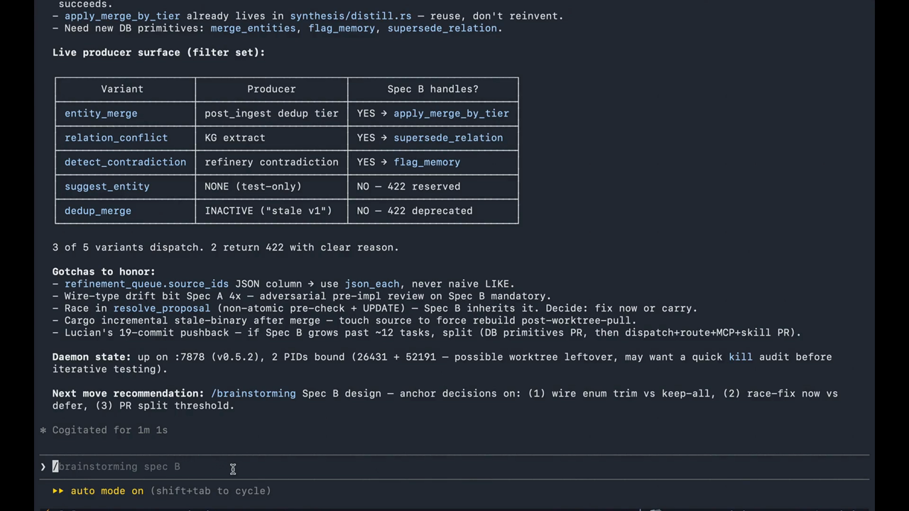

<p align="center">
  
</p>

[](https://github.com/7xuanlu/origin/actions/workflows/ci.yml)
[](https://github.com/7xuanlu/origin/releases/latest)
[](#license)

Developers have `origin` for code. Origin is local-first memory for AI work: it carries sessions, decisions, lessons, and project context across chats, projects, and time.

Markdown you can read, wiki pages it distills, plus a local database with hybrid retrieval your agents can search. Use it through the Claude Code plugin or any MCP client.

The daemon does the memory chores in the background: stores what matters, deduplicates repeat facts, links related ideas, distills wiki pages, and keeps provenance attached. This repo ships the full local runtime for the Claude Code plugin and MCP clients.

**Status:** Early preview. Expect fast iteration and some sharp edges.

<p align="center">
  <a href="https://github.com/user-attachments/assets/50522d51-5da5-4c82-a3df-9577c632797d">
    
  </a>
</p>

---

## Quickstart

### Claude Code — 30 seconds

```text
/plugin marketplace add 7xuanlu/origin
/plugin install origin@7xuanlu
/init
```

If Claude Code asks for a restart after installing, restart once, then run `/init`. The plugin handles daemon setup, MCP wiring, Basic Memory mode, and the first round-trip check.

`7xuanlu` is the GitHub repo owner. If you fork Origin, use your own handle in both commands.

Plugin details and daily commands: [plugin/](plugin/.claude-plugin/README.md).

### Other MCP clients (Cursor, Codex, Claude Desktop, Gemini CLI…)

Add Origin to any client that accepts a JSON `mcpServers` entry:

```json
{
  "mcpServers": {
    "origin": {
      "command": "npx",
      "args": ["-y", "origin-mcp"]
    }
  }
}
```

`npx -y origin-mcp` runs the connector on demand. If the local daemon is missing, Origin prints the setup command.

### Terminal / daemon setup

For automation, servers, or pre-flight installs without the Claude Code plugin, use the `origin` launcher. See [crates/origin-server](crates/origin-server/README.md) for `origin setup`, `origin install`, `origin status`, model setup, and service commands.

---

## How Origin works

Origin follows the rhythm of an AI work session.

1. **Session starts** — your agent loads relevant project context, recent handoffs, decisions, and pages.
2. **During work** — save durable decisions, lessons, gotchas, and project facts in chat.
3. **Session ends** — write a handoff so the next run knows what changed and where to continue.
4. **Between sessions** — Origin deduplicates, links related ideas, distills wiki pages, and keeps provenance attached.
5. **Next session** — context comes back through the Claude Code plugin or `origin-mcp`, without replaying full chat history.

No cloud sync or telemetry by default. Local models and Anthropic keys are opt-in.

---

## Evaluation

Retrieval quality on standard long-memory benchmarks. Numbers come from BGE-Base-EN-v1.5-Q embeddings combined with FTS5 and Reciprocal Rank Fusion. Harness at `crates/origin-core/src/eval/`; update workflow in [docs/eval](docs/eval/README.md).

Token efficiency on LoCoMo: 168 tokens per query instead of 4,505 for full replay, with 19% more relevant context than basic vector search.

| Benchmark                   | Recall@5 | MRR   | NDCG@10 |
| --------------------------- | -------- | ----- | ------- |
| LongMemEval (oracle, 500 Q) | 88.0%    | 74.2% | 79.0%   |
| LoCoMo (locomo10)           | 67.3%    | 58.9% | 64.0%   |

---

## Repo Map

Origin is daemon-first. `origin-server` owns the local database, embeddings, refinery, knowledge graph, and HTTP API on `127.0.0.1:7878`. The plugin, MCP server, CLI, and local tools are thin clients over that daemon.

| Path | What lives there |
| --- | --- |
| [crates/origin-core](crates/origin-core/README.md) | Storage, search, embeddings, refinery, graph, pages, export, eval. |
| [crates/origin-server](crates/origin-server/README.md) | Local daemon, setup, launchd service, HTTP API. |
| [crates/origin-mcp](crates/origin-mcp/README.md) | MCP server, tools, npm package. |
| [crates/origin-cli](crates/origin-cli/README.md) | Source-built developer CLI for daemon search, recall, store, list, and agents. |
| [plugin/](plugin/.claude-plugin/README.md) | Claude Code plugin (`plugin.json`, skills, hooks, `.mcp.json`). Marketplace entry at root [`.claude-plugin/marketplace.json`](.claude-plugin/marketplace.json) lists this plugin via `source: "./plugin"`. |
| [docs/eval](docs/eval/README.md) | Benchmark workflow and methodology. |

Full contributor map: [CLAUDE.md](CLAUDE.md).

---

## Build from source

Most users should install through the Claude Code plugin or the release installer above. For local development:

```bash
git clone https://github.com/7xuanlu/origin.git
cd origin
cargo build --workspace
cargo run -p origin-server
```

Build details for the daemon, MCP server, CLI, and core crates live in the crate READMEs linked above.

---

## Boundaries

- Not a chat UI. Keep using Claude, ChatGPT, Cursor, or your agent of choice.
- Not a notes app or Notion / Obsidian replacement. Markdown exists so you can read the artifact anywhere.
- Not a memory infrastructure SDK. Origin is for people using AI, not as a backend for other apps.
- Best for work that spans sessions, projects, and weeks. One-off chats may not need it.

---

## Contributing

Bug fixes, eval cases, docs, and features are welcome. Start with [CONTRIBUTING.md](CONTRIBUTING.md). Architecture and development rules are in [CLAUDE.md](CLAUDE.md). Security reports: [SECURITY.md](SECURITY.md). Please also read the [Code of Conduct](CODE_OF_CONDUCT.md).

---

## License

Origin is licensed under **Apache-2.0**. This includes the local runtime, CLI, MCP server, shared types, and Claude Code plugin files in this repo.

The permissive license keeps the daemon boundary usable for MCP clients and downstream local tools.

---

## Acknowledgments

Adjacent work shaping this space:

- Andrej Karpathy's [LLM-wiki note](https://gist.github.com/karpathy/442a6bf555914893e9891c11519de94f), which helped make the raw-to-wiki pattern legible to the community.
- Claude Code's `MEMORY.md`, the simplest version of the idea, and the one Origin aims to cooperate with.
- [PAI](https://github.com/danielmiessler/PAI), [claude-memory-compiler](https://github.com/coleam00/claude-memory-compiler), Palinode: different shapes of the same direction.
