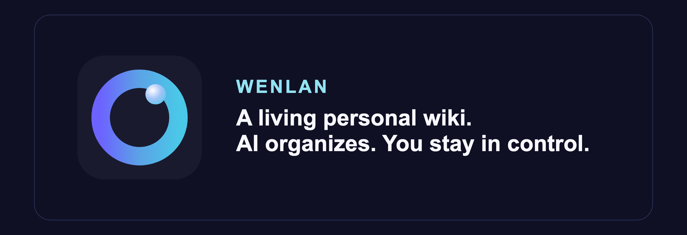
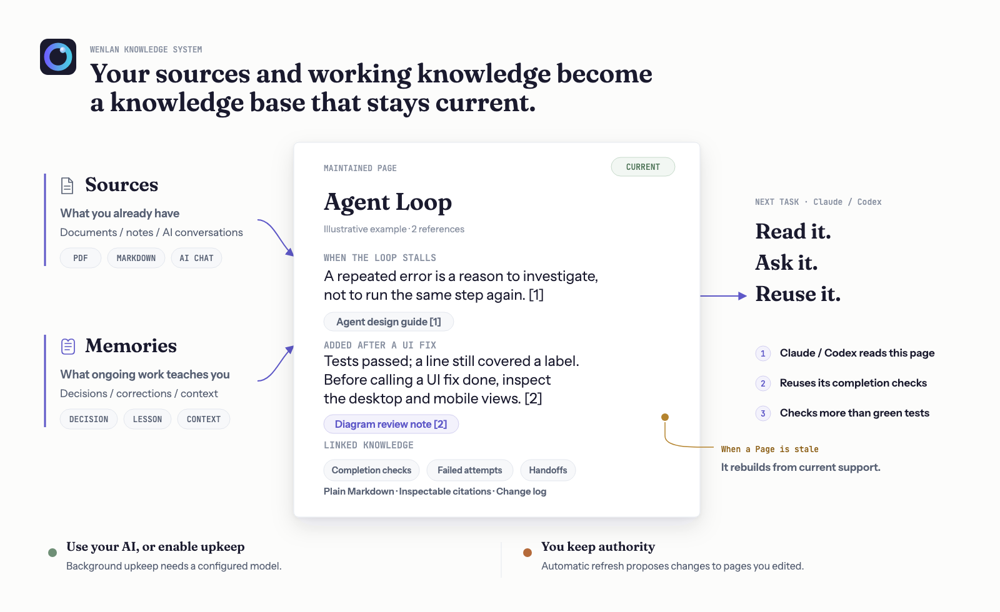
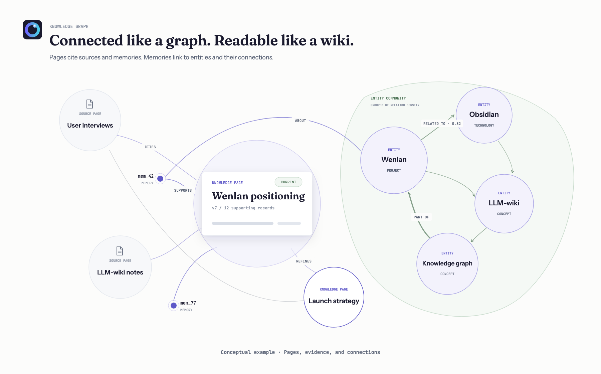
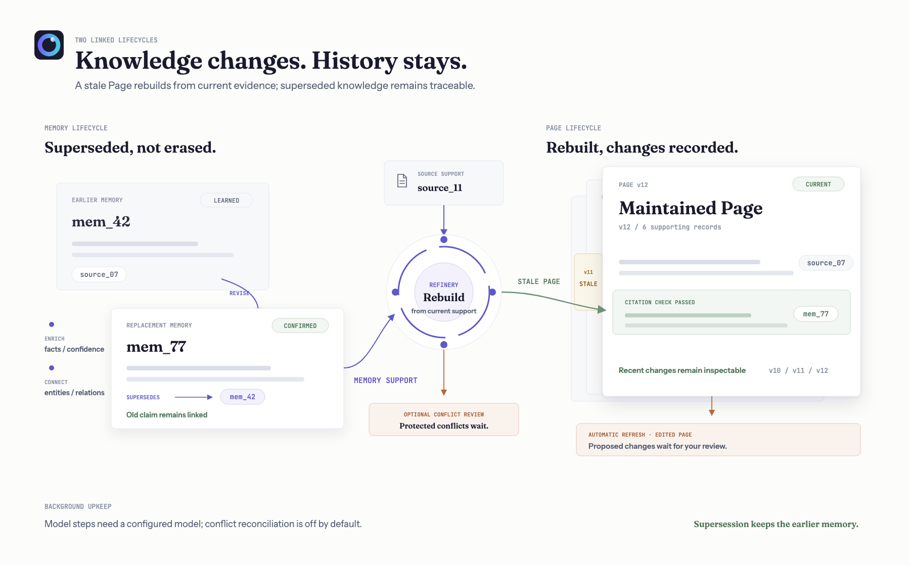

<p align="center">
  <picture>
    <source media="(max-width: 600px)" srcset="./docs/assets/readme-banner-mobile.png">
    
  </picture>
</p>

Wenlan turns your documents, notes, and AI conversations into editable pages with links to their sources, so you and your AI tools can keep building on them.

As sources change, AI keeps the pages current. If you’ve edited a page, Wenlan proposes revisions for you to review instead of automatically overwriting your work.

<p align="center">
  English | <a href="./README.zh-Hans.md">简体中文</a> | <a href="./README.zh-Hant.md">繁體中文</a> | <a href="./README.es-ES.md">Español</a>
</p>

<p align="center">
  <a href="https://github.com/7xuanlu/wenlan/actions/workflows/ci.yml?query=branch%3Amain"></a>
  <a href="https://github.com/7xuanlu/wenlan/releases/latest"></a>
  <a href="#license"></a>
</p>

<p align="center">
  <a href="#start-in-30-seconds">Get&nbsp;started</a> ·
  <a href="#what-does-wenlan-build">What&nbsp;is&nbsp;this?</a> ·
  <a href="#what-can-it-do">Capabilities</a> ·
  <a href="#how-does-it-work">Daily&nbsp;workflow</a> ·
  <a href="#evaluation">Evaluation</a> ·
  <a href="#learn-more">Learn&nbsp;more</a>
</p>

https://github.com/user-attachments/assets/35f06749-00e5-484d-a9f4-5e462de8d11e

<p align="center">
  <sub>A maintained Page in the desktop app: open any citation to inspect the Source or Memory behind the claim.</sub>
</p>

<a id="quickstart"></a>
<a id="start-in-30-seconds"></a>

## Get started

<a id="start-with-the-app"></a>
<a id="open-the-wiki"></a>
<a id="desktop-app"></a>

### 1. Download and open Wenlan

[Download the app](https://github.com/7xuanlu/wenlan/releases/latest), then open it:

- **macOS (Apple Silicon):** open the `.dmg` and drag Wenlan to Applications. The app is signed and notarized.
- **Windows x64:** run the `-setup.exe`. It is not signed yet. If SmartScreen warns you, confirm you downloaded it from the official Releases page before choosing "More info" → "Run anyway".
- **Linux:** no desktop build yet; follow the [setup guide](docs/setup-with-ai.md#install-the-runtime) to use Wenlan with your AI tools without the app.

<a id="claude-code-in-30-seconds"></a>

<a id="codex-plugin"></a>

<a id="mcp-setup"></a>
<a id="mcp-clients"></a>

### 2. Connect your AI tools to one wiki

In Wenlan's setup, connect Claude Code, Codex, or other supported AI tools so they can use the same knowledge.

<details>
<summary>Need help connecting? Ask your AI</summary>

Restart your AI tool if prompted. For help with setup, paste this into Claude Code, Codex, or another tool that can follow a setup guide:

```text
Connect this AI tool to Wenlan by following:
https://raw.githubusercontent.com/7xuanlu/wenlan/main/docs/setup-with-ai.md

Reuse my existing Wenlan installation if available.
Set up only this AI tool, then check that it can save and find a test memory.
```

</details>

### 3. Keep your work for next time

> Turn the key takeaways from this conversation into a Wenlan page.

<details>
<summary>Models, installation options, and updates</summary>

**Models**

You can ask your connected AI to organize pages. For Wenlan to organize them in the background, [configure a model](#models-and-privacy).

**macOS app from the terminal**

The installer downloads the app, checks its SHA-256, and moves it to Applications:

```bash
/bin/bash -c "$(curl -fsSL https://raw.githubusercontent.com/7xuanlu/wenlan/main/scripts/install-macos-app.sh)"
```

**Without the desktop app**

On macOS Apple Silicon:

```bash
npx -y wenlan setup
```

`npx` requires Node.js; without it, run `curl -fsSL https://raw.githubusercontent.com/7xuanlu/wenlan/main/install.sh | bash` then `wenlan setup --basic`.

This downloads the prebuilt CLI, daemon, and MCP connector, starts the local runtime, and verifies it. No Rust toolchain or Cargo is required. Linux x64/ARM64 with glibc has an automated [shell setup path](docs/setup-with-ai.md#install-the-runtime); Windows x64 uses the matching archive from [Releases](https://github.com/7xuanlu/wenlan/releases/latest). macOS Intel currently has [no supported complete-runtime install](crates/wenlan-cli/README.md#macos-intel).

**What is installed and how to update**

The desktop app bundles the daemon, CLI, and MCP connector. It starts the daemon on launch and offers to connect detected AI clients through the Claude Code or Codex plugin, or an MCP entry for other supported clients. The headless install runs the same daemon without a window; either way, your AI tools use the same local knowledge base.

To upgrade the macOS app, drag the new app over the old one and open it. Quit Wenlan 0.17.0 and older by hand first.

Manual and client-specific instructions: [AI-assisted setup](docs/setup-with-ai.md) · [Claude Code plugin](plugin/README.md) · [Codex plugin](plugin-codex/README.md) · [CLI and MCP](crates/wenlan-cli/README.md).

</details>


<a id="what-does-wenlan-build"></a>
<a id="why-it-compounds"></a>

<a id="what-is-this"></a>

## Your wiki, for you and your AI

- **Pick up where you left off.** Ask Claude Code or Codex to use an existing Wenlan page for your next task.
- **See where an answer came from.** Open a page's citations to inspect the documents, conversations, or saved decisions behind it.
- **Keep control of your edits.** When Wenlan automatically refreshes a page you've edited, it proposes changes for you to review.

Your pages are local Markdown files you can read, edit, and take with you.

<p align="center">
  <picture>
    <source media="(max-width: 600px)" srcset="./docs/assets/wenlan-system-mobile.png">
    
  </picture>
</p>

<details>
<summary>How sources, memories, and pages work together</summary>

The example adapts [agent-design guidance](https://www.anthropic.com/engineering/building-effective-agents) and [this README's diagram-review fixes](https://github.com/7xuanlu/wenlan/commit/061fbc6ab12a76ec805869e46d464a58a06db296) into a working note. It illustrates reusable knowledge, not a measured customer outcome or an automatically generated page.

Wenlan gives ongoing work a place outside the chat window. Keep selected documents and conversations, save decisions made along the way, and organize them into pages you can read, edit, and reuse. Page generation and background maintenance depend on the [configured AI path](#models-and-privacy).

<a id="what-wenlan-is-not"></a>

**Built for work that continues.** If you use AI on the same topic over days or weeks and keep hunting for earlier material or re-explaining decisions, this is the workflow Wenlan is built around. It is not a life-management system or a memory SDK embedded inside another product. You can keep using Obsidian; Wenlan does not promise to replace its plugins or migrate every vault feature.

**One knowledge system, three roles:**

- **Sources keep the material Wenlan reads traceable.** Imported conversations remain as captured records; registered files sync their current contents as they change.
- **Memories preserve what work teaches you.** Agents capture atomic decisions, lessons, corrections, and supersession with provenance.
- **Pages compile current knowledge.** Wenlan turns relevant Sources and Memories into source-cited Markdown you can reuse, refresh, and review.

**How updates work:** Sources and captured Memories can both support the same Page. Memory history records changes to individual Memories; Page history records the supporting evidence and revisions. During automatic refresh, eligible machine-maintained Pages can update directly, while Pages you have edited receive proposed revisions. Review lets you decide whether to apply an update; it is not a guarantee that the AI's conclusion is correct.

For technical readers: Wenlan follows the **LLM wiki** pattern. See the [implementation guide](https://wenlan.app/learn/distilled-wiki-pages-ai-memory) and [technical foundations](docs/technical-foundations.md) for the data model, retrieval, and maintenance rules.

</details>

<a id="knowledge-graph"></a>

### A knowledge graph that gets more useful over time

<p align="center">
  <picture>
    <source media="(max-width: 600px)" srcset="./docs/assets/wenlan-knowledge-network-mobile.png">
    
  </picture>
</p>

<details>
<summary>Graph and search details</summary>

The entity-relation graph is one part of Wenlan's wider connected wiki. **Knowledge Pages** hold maintained synthesis, **Entities** anchor reusable people, projects, and concepts, **Source Pages** make imported or synchronized material inspectable, and atomic **Memories** preserve decisions and changes. They work through separate, explicit links: Page-to-Page wikilinks, Page evidence, Memory-to-Entity links, and directed Entity relations.

Within the entity graph, a configured enrichment model extracts typed Entities, observations, and directed relations from Memories. Entity linking and resolution reuse existing nodes instead of treating every mention as new; each Memory keeps its Source and can link to multiple Entities. [How the connected model is stored ->](docs/technical-foundations.md#connected-knowledge-model)

- **Meaning and direction:** Relations use a seeded vocabulary such as `uses`, `part_of`, `contradicts`, and `replaced_by`; unknown types fall back to `related_to` and become reviewable vocabulary proposals.
- **Strength and provenance:** A relation can store confidence, an explanation, and its source Memory, so stronger and weaker claims remain distinguishable and inspectable.
- **Communities that compound:** Label propagation groups Entities by relation density, weighted by the relation count between each pair. These groups can organize optional corpus summaries while Entity links add retrieval context.
- **Correction without erasure:** Related claims, corrections, and explicit supersession stay inspectable together while original Sources and Memory history remain.

During retrieval, dense entity matching finds query-relevant entities. When eligible graph links exist, the default graph-memory stream boosts linked Memories as a third [RRF](https://cormack.uwaterloo.ca/cormacksigir09-rrf.pdf) signal. The path is data- and scope-dependent, and Space boundaries (Spaces are defined under Capabilities) still apply. [How the graph path works ->](docs/technical-foundations.md#graph-assisted-retrieval)

<a id="retrieval"></a>

### Retrieval across words, meaning, and connections

Wenlan's core search is a local hybrid pipeline, not a single vector lookup. Each stage has a different job:

- **Exact wording, [SQLite FTS5](https://www.sqlite.org/fts5.html):** a full-text index finds literal terms, identifiers, and phrases.
- **Similar meaning, FastEmbed + [`Qdrant/bge-base-en-v1.5-onnx-Q`](https://huggingface.co/Qdrant/bge-base-en-v1.5-onnx-Q):** a quantized English model creates 768-dimensional embeddings; [libSQL cosine DiskANN](https://turso.tech/blog/approximate-nearest-neighbor-search-with-diskann-in-libsql) indexes them for approximate nearest-neighbor retrieval.
- **Combined ranking, weighted [RRF](https://cormack.uwaterloo.ca/cormacksigir09-rrf.pdf) (`k = 60`):** lexical and semantic rank lists are fused without pretending their raw scores share a scale; cosine similarity also weights the vector contribution.
- **Connected context, graph-memory stream:** eligible entity links add a third RRF signal while the active read scope still filters returned Memories.
- **Optional precision, cross-encoder reranking:** unlike embeddings, [`jinaai/jina-reranker-v1-turbo-en`](https://huggingface.co/jinaai/jina-reranker-v1-turbo-en) or [`BAAI/bge-reranker-base`](https://huggingface.co/BAAI/bge-reranker-base) reads each query-candidate pair and reorders the smaller pool; reranking is off by default.

Page, episodic, and fact channels are opt-in and degrade to the remaining search signals if unavailable. Space still limits the read scope. [Methods, defaults, and limitations ->](docs/technical-foundations.md)

</details>

<a id="what-makes-wenlan-distinct"></a>
<a id="why-is-wenlan-different"></a>
<a id="two-lifecycles"></a>
<a id="two-lifecycles-one-maintained-knowledge-system"></a>

### Knowledge changes. History stays.

A generated wiki can go stale; a memory store can fragment into disconnected facts. Wenlan links two lifecycles without collapsing them into one layer.

<p align="center">
  <picture>
    <source media="(max-width: 600px)" srcset="./docs/assets/wenlan-lifecycle-mobile.png">
    
  </picture>
</p>

<details>
<summary>Updates, review, and local files</summary>

#### Atomic Memory

`CAPTURE -> CLASSIFY -> ENRICH -> LINK -> RECONCILE`

Capture and explicit supersession are core. Model-backed stages run only when the matching model is configured, and the reconcile pass is off by default.

| Operation | What Wenlan does |
|---|---|
| **Capture** | Agents write one complete, self-contained idea per Memory, following the Zettelkasten atomic-note principle instead of saving the whole conversation. |
| **Classify** | With a configured language model, Wenlan assigns `identity`, `preference`, `decision`, `lesson`, `gotcha`, or `fact`; a precise type supplied by the caller remains authoritative. |
| **Enrich** | With a configured language model, adds structured fields, retrieval cues, event dates, quality, importance, and tags when available. |
| **Link** | Retains provenance and, when enrichment is enabled, connects Memories to entities and relations in the knowledge graph. |
| **Reconcile** | Explicit replacements preserve a `supersedes` chain. A replacement from an agent whose trust level is below full queues for human review automatically, no flag required. An optional model-backed pass can also queue protected conflicts for review instead of overwriting history; that pass is off by default and must be explicitly enabled. |

Advanced configuration: set `WENLAN_ENABLE_DUAL_POOL_RESOLVE=1` to enable that reconcile pass.

#### Maintained Page

`DISTILL -> CITE -> TRACK -> REFRESH -> REVIEW`

| Operation | What Wenlan does |
|---|---|
| **Distill** | Compiles related Sources and Memories into one Markdown Page. |
| **Cite** | Retains citation records and verification status; automatic refresh discards a draft when its citation-support check fails. |
| **Track** | Records which evidence supports the Page, why it became stale, and a bounded changelog. |
| **Refresh** | When a Page is marked stale, rebuilds the eligible machine-maintained Page from current evidence. |
| **Review** | During automatic refresh, turns changes to a Page you edited into a proposed revision instead of a silent rewrite. |

For example, import a design document and capture a debugging decision in Codex. Wenlan can compile one Page that cites both. When that Page is automatically refreshed, it rebuilds from its current support; if you have edited it, the proposed change waits for review.

**Review scope:** this is an update policy, not a security barrier around your files. Direct file edits and the local manual-edit API do not pass through this queue. An explicit forced regeneration can also replace an edited Page; the desktop app asks for confirmation before that action.

<a id="local-markdown"></a>

### Local Markdown that works with Obsidian

Your durable synthesis remains ordinary files rather than a proprietary editor format:

- **Plain files:** Pages and session notes stay as Markdown under `~/.wenlan/`.
- **Inspectable history:** Distill and handoff workflows can commit logical file batches to a local git repository.
- **Obsidian coexistence:** Wenlan reads an existing vault as a source. Symlink `~/.wenlan/pages/` into the vault or export a Page from the desktop app; your edits remain human-owned, and later machine refreshes become reviewable revisions.

The local history is directly inspectable:

```text
$ git -C ~/.wenlan log --oneline
a1b2c3d distill: 4 pages
9f8e7d6 session: embedding-work
```

</details>


<a id="what-you-get"></a>
<a id="what-can-it-do"></a>
<a id="what-can-i-bring-in"></a>

## Capabilities

### Bring your material in

- **Keep useful AI conversations:** Import ChatGPT or Claude export ZIPs without duplicating conversations already imported.
- **Bring your existing notes:** Import Markdown, text files, or text-extractable PDFs, by file or folder; connect an Obsidian vault as a source. Scanned PDFs need text extraction first.
- **Quick Capture:** Save a thought or decision directly in the desktop app without opening an AI chat.
- **[Capture decisions with your AI](https://wenlan.app/learn/ai-memory-provenance):** Ask your AI tool to save decisions, lessons, corrections, preferences, and facts, with their sources and what they replace.
- **Bring in another wiki:** Import an external OKF wiki through the CLI or API, preserving source references and links. Reimporting Wenlan's own OKF exports is not supported.

### Explore your personal wiki

- **[Editable, source-linked Pages](https://wenlan.app/docs/source-backed-pages):** Turn related documents and Memories into Markdown Pages with citations and links to other Pages.
- **Cards or lists:** Browse Pages, Entities, and Spaces in the view that suits you.
- **[Knowledge graph](docs/technical-foundations.md#graph-data-and-entity-resolution):** Explore connections between people, projects, claims, and the Memories supporting them.

### Use it with your AI tools

- **[Pick up in another AI tool](https://wenlan.app/docs/architecture):** Connected Claude Code, Codex, and other MCP clients can use the same local Pages and Memories as the desktop app and CLI.
- **[Search by words and meaning](docs/technical-foundations.md#retrieval-pipeline):** Combine exact matches with local semantic search; graph connections can add relevant context.
- **[Optional deeper search](docs/technical-foundations.md#optional-channels-and-defaults):** Search Pages and finer-grained Memories, with optional reranking to refine results.
- **[Keep projects separate](https://wenlan.app/docs/spaces):** Use Spaces to choose which work, personal, client, or repository knowledge your AI searches.
- **Web access (experimental):** Connect a supported web AI client to one approved Space while your computer is online. Queries and results pass through a relay; see [how access works and its privacy limits](docs/PRIVACY.md#pre-release-standalone-wenlan-relay-connector).
- **Connect your own tools:** Send prepared text, webpage content, or Memories through the local HTTP API. It accepts content, not URLs to fetch.

### Keep knowledge current

Optional background organization and Page updates need a [configured model](#models-and-privacy).

- **Incremental sync:** File and folder Sources track changes in the background. Obsidian vaults stay read-only and resync on demand.
- **[Organize saved knowledge](docs/technical-foundations.md#typed-memory-schema):** A configured model can add types, structured details, relevant dates, tags, search cues, and graph links to Memories.
- **Updates backed by sources:** Automatic refresh rejects drafts with insufficient citations. AI-generated Pages can update; changes to Pages you have edited become review proposals.
- **[Review where judgment matters](https://wenlan.app/docs/review-and-trust):** Review protected conflicts, Page revisions, entity merges, and new vocabulary.
- **See what is happening:** Check progress and blockers in Activity. Configured sync, enrichment, and eligible Page updates can continue after the app window closes while the local service runs.

### Keep ownership and control

- **[Local, inspectable knowledge](https://wenlan.app/learn/markdown-local-index-ai-memory):** Keep Markdown Pages, citations, revisions, git history, and Obsidian exports; Memories and graph data live in local libSQL.
- **Take your wiki with you:** Export eligible Pages across Spaces as an OKF v0.2 wiki from Settings or the CLI. This is a wiki export, not a full database backup.
- **[Model choice](docs/technical-foundations.md#model-roles):** Base retrieval stays local. Optional enrichment and synthesis can use on-device Qwen, a local endpoint, or a cloud model; remote providers receive the content needed for their tasks.
- **Health checks and reviewed repairs:** [Doctor](https://wenlan.app/docs/diagnostics-and-issue-reports) and [lint](plugin/skills/lint/SKILL.md) report problems without rewriting knowledge. For supported findings, the app lets you preview and explicitly apply a repair, then verify it.

**Try it with one conversation worth keeping.** [Get started](#start-in-30-seconds). Star this repo if you'd like to come back and try it later.


<a id="how-wenlan-works"></a>
<a id="how-does-it-work"></a>

## Daily workflow

Once your AI tool is connected, you can ask in plain language:

### Before starting a task

> Find what I've saved in Wenlan about [topic], including earlier decisions and their sources.

### When you reach a useful conclusion

> Save this decision and why we made it in Wenlan, with its sources.

### When a topic deserves a page

> Create or update a Wenlan page on [topic] from the material we've saved. Keep the citations.

Open the page in Wenlan to read, edit, and check its sources. Next time, ask your AI to use it for your next task.

<details>
<summary>Plugin commands and maintenance</summary>

- **Find context:** `/recall <query>` searches saved knowledge. `/brief [topic]` reads the current Space's project summary; an optional topic adds related context from that Space.
- **Save what matters:** `/capture <thing>` saves a decision, lesson, correction, preference, or fact with its source.
- **Wrap up a session:** `/handoff` records what changed and creates or updates the Space's project summary for next time.
- **Organize and review:** `/distill` creates or refreshes wiki pages. `/lint` checks knowledge health; `/curate` reviews pending captures or revisions.

These shortcuts are available through the Wenlan plugins. Other connected clients use the equivalent MCP tools. Optional background organization and Page updates need a [configured model](#models-and-privacy).

[Full command reference](plugin/skills/README.md).

</details>

<details>
<summary>CLI offline queue details</summary>

### Offline queue (outbox)

If the local daemon is unreachable, `wenlan capture` and `wenlan brief update` write their requests to a durable local outbox and exit successfully. When the daemon returns, it drains those writes through the normal HTTP routes; inspect the queue with `wenlan outbox status` or request an immediate replay with `wenlan outbox drain`. A write the daemon rejects outright (a 4xx, such as failing the content quality gate) moves to `outbox/failed/` with a receipt instead of retrying forever; a transport failure or server error (5xx) leaves it queued for the next drain, which runs automatically every 60 seconds.

</details>

### Models and privacy

- **Local base retrieval:** The [BGE embedding model](https://huggingface.co/Qdrant/bge-base-en-v1.5-onnx-Q) runs through FastEmbed on your machine for hybrid search and needs no API key.
- **Optional on-device synthesis:** Enrichment and Page synthesis can use user-selected [`Qwen3 4B`](https://huggingface.co/unsloth/Qwen3-4B-Instruct-2507-GGUF) or [`Qwen3.5 9B`](https://huggingface.co/unsloth/Qwen3.5-9B-GGUF) through [llama.cpp](https://github.com/ggml-org/llama.cpp). Wenlan does not download or activate a language model until you choose one.
- **Other providers:** An OpenAI-compatible local endpoint such as Ollama or LM Studio, or a configured cloud provider, can supply model-backed enrichment and synthesis instead.
- **Cloud disclosure:** If the model endpoint you select is remote, Wenlan sends that task's system and user prompts to it. Local retrieval and on-device synthesis stay on your machine.
- **Optional usage statistics:** Off by default. If you opt in, Wenlan sends bounded operation counts, version and platform—not your knowledge content or an installation ID. See [privacy](docs/PRIVACY.md#telemetry).

Full workflow reference: [plugin/skills](plugin/skills/README.md). Technical model roles: [technical foundations](docs/technical-foundations.md#model-roles).

### Your data and uninstall

Nothing is locked in. Pages and session notes are Markdown under `~/.wenlan/`; memories live in one libSQL database under the platform data directory (`~/Library/Application Support/wenlan/` on macOS, `~/.local/share/wenlan/` on Linux, `%LOCALAPPDATA%\wenlan\` on Windows). Copy those two folders to back up or move a Wenlan. An install upgraded from Origin still holds a full copy of its data in `~/.origin/` and in the sibling `origin` data folder (`~/Library/Application Support/origin/` on macOS, `~/.local/share/origin/` on Linux, `%LOCALAPPDATA%\origin\` on Windows); delete or copy those two as well.

To uninstall: the app's *Run Wenlan in background at login* toggle removes the launch registration — turn it off, quit, and delete `Wenlan.app` or run the Windows uninstaller, then delete the folders above. `wenlan background off` only stops the daemon and disables autostart; it does not remove the launch registration, so a CLI-only install should instead follow the daemon uninstall bullet in [PRIVACY.md](docs/PRIVACY.md). The paths Wenlan writes are listed there.


<a id="evaluation"></a>

## Evaluation

This is a retrieval-only snapshot, not a claim about end-to-end answer quality. Method, environment receipts, and the update workflow live in [docs/eval](docs/eval/README.md).

<!-- EVAL_SNAPSHOT_START -->
| Benchmark | Recall@5 | MRR | NDCG@10 |
|---|---:|---:|---:|
| LME_Oracle (500 Q) | 93.6% | 0.857 | 0.883 |
| LME_S (deep, 90 Q) | 87.7% | 0.815 | 0.822 |
<!-- EVAL_SNAPSHOT_END -->


<a id="learn-more"></a>

## Learn more

More detailed documentation, concepts, and comparisons:

### Docs

- [Get started](https://wenlan.app/docs/get-started): install and verify the first local loop.
- [Daily workflow](https://wenlan.app/docs/daily-workflow): brief, capture, recall, handoff, distill, lint, and curate.
- [MCP clients](https://wenlan.app/docs/mcp-clients): connect Claude Code, Codex, Cursor, Claude Desktop, and other clients.

### Workflow guides

- [Build a client project knowledge base for consulting](https://wenlan.app/learn/build-client-project-knowledge-base-for-consulting)
- [Build an investment research knowledge base](https://wenlan.app/learn/build-investment-research-knowledge-base)
- [Build a product research knowledge base before writing a PRD](https://wenlan.app/learn/build-product-research-knowledge-base-for-prd)
- [Build an SRE incident knowledge base](https://wenlan.app/learn/build-sre-incident-knowledge-base)
- [Build a business metric definition knowledge base](https://wenlan.app/learn/build-business-metric-definition-knowledge-base): turn approved KPI specifications into a source-backed data dictionary with formula text, grain, exclusions, owners, revisions, and review state.

### Concepts

- [Why a living wiki, not just AI memory](https://wenlan.app/learn/ai-work-memory): the problem and product model in depth.
- [MCP memory server](https://wenlan.app/learn/mcp-memory-server): how Wenlan exposes knowledge across AI tools.
- [Local-first AI memory](https://wenlan.app/learn/local-first-ai-memory): data, privacy, and control.
- [Markdown and local index](https://wenlan.app/learn/markdown-local-index-ai-memory): storage, retrieval, and ownership.
- [AI agent handoff loop](https://wenlan.app/learn/ai-agent-handoff-loop): carrying work cleanly into the next session.
- [Research knowledge base from papers](https://wenlan.app/learn/source-backed-research-knowledge-base): build an inspectable literature matrix and source-backed synthesis from papers you already have.

### Comparisons

- [Wenlan vs Basic Memory](https://wenlan.app/learn/wenlan-vs-basic-memory)
- [Wenlan vs claude-mem](https://wenlan.app/learn/wenlan-vs-claude-mem)
- [Wenlan vs Superlocal Memory](https://wenlan.app/learn/wenlan-vs-superlocal-memory)


## Contributing

Bug fixes, eval cases, docs, and features are welcome. Installing Wenlan does not require building from source. For local development, run these commands from this repository's root:

```bash
# daemon crates (default-members — the desktop app is not compiled)
cargo build
cargo test

# desktop app (Cargo target and root-level frontend tooling)
pnpm install
pnpm dev:all
pnpm build:all
```

`pnpm dev:all` is the supported development entry point for the desktop app. It keeps development ports, data, process ownership, app identity, MCP sockets, and Remote Access state separate from the installed production runtime; a debug app started without that isolation refuses to run. See this repository's [AGENTS.md](AGENTS.md) and [CONTRIBUTING.md](.github/CONTRIBUTING.md), plus the in-tree [app/AGENTS.md](app/AGENTS.md), for the complete development workflow. Security reports: [SECURITY.md](.github/SECURITY.md). Privacy policy: [PRIVACY.md](docs/PRIVACY.md). Please also read the [Code of Conduct](.github/CODE_OF_CONDUCT.md).


<a id="code-signing-policy"></a>

## Code signing policy

Free code signing provided by [SignPath.io](https://about.signpath.io), certificate by [SignPath Foundation](https://signpath.org).

- **Authors:** [@7xuanlu](https://github.com/7xuanlu), who may commit to this repository without a further review.
- **Reviewers:** [@7xuanlu](https://github.com/7xuanlu). Every change from someone who is not a committer arrives as a pull request and is reviewed before it merges.
- **Approvers:** [@7xuanlu](https://github.com/7xuanlu), who approves each signing request and so decides which release is signed.

Multi-factor authentication is required of every maintainer, on GitHub and on SignPath, and nobody is added to either without it. Releases are built only by the tagged release workflow in this repository, on GitHub-hosted runners, from the commit the tag points at.

**Privacy policy:** [PRIVACY.md](docs/PRIVACY.md) — what Wenlan stores, where it stores it, and each case we know of in which it reaches the network. How each platform is signed: [docs/code-signing.md](docs/code-signing.md).

The SignPath application is pending. Windows installers are not signed yet.


<a id="license"></a>

## License

Wenlan uses two licenses, one per part of the repository.

- **Apache-2.0** ([`LICENSE`](LICENSE)) covers the local runtime, CLI, MCP server, shared types, and the Claude Code and Codex plugin files. Build on these freely.
- **AGPL-3.0-only** ([`app/LICENSE`](app/LICENSE)) covers the desktop app: the `app/` crate and the React frontend it ships. If you run a modified version of the app as a network service, the AGPL asks you to offer that modified source to its users.

The split is deliberate. Apache-2.0 code may be used inside an AGPL-3.0 program, so the desktop app builds on the runtime without either license being violated.


<a id="acknowledgments"></a>

## Lineage and peers

Wenlan (文瀾) takes its name from 文瀾閣, an imperial library that held 四庫全書 as part of one of China's largest book collections.

Wenlan's llm-wiki v2 model is its own product direction, informed by the LLM-wiki and agent-memory lineages:

- [Karpathy's LLM-wiki note](https://gist.github.com/karpathy/442a6bf555914893e9891c11519de94f) established the raw-source-to-maintained-wiki pattern.
- [Rohitg00's LLM Wiki v2 proposal](https://gist.github.com/rohitg00/2067ab416f7bbe447c1977edaaa681e2) extends that pattern with memory lifecycle, confidence, graph, and retrieval mechanisms. [agentmemory](https://github.com/rohitg00/agentmemory) is its concrete agent-memory implementation.
- [nashsu/llm_wiki](https://github.com/nashsu/llm_wiki) is a full desktop implementation of the document-centered LLM-wiki pattern.
- [basic-memory](https://github.com/basicmachines-co/basic-memory), [obsidian-mind](https://github.com/breferrari/obsidian-mind), [mcp-memory-service](https://pypi.org/project/mcp-memory-service/), [Memoria](https://github.com/matrixorigin/Memoria), and [OpenMemory](https://github.com/CaviraOSS/OpenMemory) explore adjacent local knowledge and agent-memory shapes.
