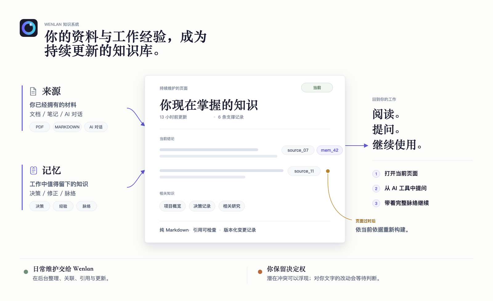
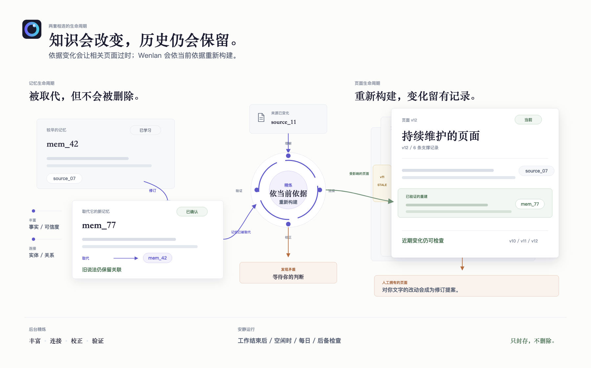

<!-- README_SYNC: source=README.md sha256=3e77184c0ff6dae42cdd2cbe95a7abb4bee126a58242030f6ab392af30d4798c -->

<p align="center">
  <picture>
    <source media="(max-width: 600px)" srcset="./docs/assets/readme-banner-mobile.png">
    
  </picture>
</p>

和 AI 聊出的成果，不该在对话结束后消失。Wenlan 会建立真正需要的页面，并在来源变化时让它们保持最新；只有需要判断时才找你。

<p align="center">
  <a href="./README.md">English</a> | 简体中文 | <a href="./README.zh-Hant.md">繁體中文</a>
</p>

<p align="center">
  <a href="https://github.com/7xuanlu/wenlan/actions/workflows/ci.yml?query=branch%3Amain"></a>
  <a href="https://github.com/7xuanlu/wenlan/releases/latest"></a>
  <a href="#license"></a>
</p>

<p align="center">
  <a href="#start-in-30-seconds">开&#8288;始&#8288;使&#8288;用</a> ·
  <a href="#what-does-wenlan-build">这&#8288;是&#8288;什&#8288;么？</a> ·
  <a href="#what-can-it-do">能&#8288;力</a> ·
  <a href="#how-does-it-work">日&#8288;常&#8288;流&#8288;程</a> ·
  <a href="#evaluation">评&#8288;估</a> ·
  <a href="#learn-more">进&#8288;一&#8288;步&#8288;了&#8288;解</a>
</p>

<p align="center">
  
</p>

---

<a id="quickstart"></a>
<a id="start-in-30-seconds"></a>

## 开始使用

<a id="start-with-the-app"></a>
<a id="open-the-wiki"></a>

### 桌面 app

桌面 app 是最快看到完整工作流程的方式：阅读页面、检查来源并整理知识体系。目前仅提供 macOS Apple Silicon 预览版，尚未经过 Apple notarization。下面的安装器会验证 GitHub release，只为 Wenlan 清除 quarantine，安装后直接打开，不会更改 macOS 系统安全设置：

```bash
/bin/bash -c "$(curl -fsSL https://raw.githubusercontent.com/7xuanlu/wenlan/main/scripts/install-macos-app.sh)"
```

你可以直接[检查安装器源码](scripts/install-macos-app.sh)。安装器会先用 GitHub 发布的 SHA-256 核对下载文件，再替换现有 app。偏好 DMG 或想查看 app 源码？请前往 [wenlan-app releases](https://github.com/7xuanlu/wenlan-app/releases/latest) 和 [wenlan-app](https://github.com/7xuanlu/wenlan-app)。

<a id="claude-code-in-30-seconds"></a>

<a id="codex-plugin"></a>

<a id="mcp-setup"></a>
<a id="mcp-clients"></a>

### 让你的 AI 完成设置

把下面这段贴给 Claude Code、Codex，或其他能够读取设置指南的工具：

```text
请为当前 AI 客户端设置 Wenlan，并严格遵循：
https://raw.githubusercontent.com/7xuanlu/wenlan/main/docs/setup-with-ai.md

只安装这个客户端需要的内容。完成后验证本地 runtime、
Wenlan connection，以及一次 capture/recall round trip。
```

指南会识别当前使用的 client，把各平台命令留在专门文档中。除非你明确要求，否则它不会设置所有 AI 工具。

只需要在 macOS Apple Silicon 上运行的无 GUI 本地服务？

```bash
npx -y wenlan setup
```

这个命令会下载预编译的 CLI、后台服务（daemon）与 MCP 连接器，启动并验证本地服务；不需要安装 Rust 或 Cargo。Linux x64/ARM64 可以使用自动化的 [shell 设置流程](docs/setup-with-ai.md#install-the-runtime)；Windows x64 请从 [Releases](https://github.com/7xuanlu/wenlan/releases/latest) 下载对应的 archive。macOS Intel 目前[没有受支持的完整 runtime 安装方式](crates/wenlan-cli/README.md#macos-intel)。

手动与各 client 设置说明：[AI 辅助设置](docs/setup-with-ai.md) · [Claude Code plugin](plugin/.claude-plugin/README.md) · [Codex plugin](plugin-codex/README.md) · [CLI 与 MCP](crates/wenlan-cli/README.md)。

---

<a id="what-does-wenlan-build"></a>
<a id="why-it-compounds"></a>

## 这是什么？

Wenlan 把文档、笔记和过去的 AI 对话整理成会随工作持续更新、每个结论都能追溯来源的知识库。原始材料保留为来源；工作中的决策、经验与修正成为长期记忆；两者都能支撑同一批持续维护的页面。

<p align="center">
  <picture>
    <source media="(max-width: 600px)" srcset="./docs/assets/wenlan-system-zh-Hans-mobile.png">
    
  </picture>
</p>

<a id="what-wenlan-is-not"></a>

**适合需要长期延续的工作。** Wenlan 面向研究者、写作者、顾问、产品团队与软件团队：当知识散落在文档、笔记和 AI 对话里，它会把这些材料变成可检查、能随项目持续改进的页面，而不是另一份聊天记录或孤立的记忆库。它不是生活管理系统，也不是嵌入其他产品的 memory SDK。

**一个知识系统，三种角色：**

- **来源保留原始材料。** 文档、笔记与导入的对话都能追溯。
- **记忆保留工作真正教会你的内容。** AI agent 捕获原子的决策、经验、修正与取代关系，并保留出处。
- **页面汇总当前知识。** Wenlan 把相关来源与记忆整理成带引用的 Markdown，让你反复使用、刷新与审核。

**在 LLM-wiki 的基础上继续推进：**

- **[LLM-wiki v1](https://gist.github.com/karpathy/442a6bf555914893e9891c11519de94f)：** Karpathy 提出不可变的来源、由 AI 维护的 Markdown Wiki，以及会随你和 AI 一起演进、规定组织与维护方式的 Schema（规则层）。Wenlan 以明确的记忆字段与内建规则，落实页面结构、出处、引用、刷新、归属和审核。
- **[LLM-wiki v2](https://gist.github.com/rohitg00/2067ab416f7bbe447c1977edaaa681e2)：** Rohitg00 加入记忆生命周期。Wenlan 把这个方向做成可以直接使用的产品：可追溯的来源、由 AI agent 按 Zettelkasten（卡片盒笔记法）捕获的原子记忆（每条只表达一个完整想法），以及同时由两者建立并持续维护的页面。

**Wenlan 最独特的做法：** 来源与原子记忆会分别支撑持续维护的页面。记忆历史保留知识如何改变；页面历史说明当前结论由哪些依据支撑。机器维护的页面可以依当前依据重建；对人工文字的改动则成为可审核的修订，不会直接覆盖。

<p align="center">
  
</p>

<a id="knowledge-graph"></a>

### 越用越有价值的知识图谱

配置 enrichment 模型后，Wenlan 会从记忆中提取本地实体关系图：人物、项目与概念成为带类型的实体，相关说法成为观察，带类型的关系则把它们连接起来。实体链接与解析会复用已有节点，而不是把每次提及都当成新事物；每条记忆仍保留来源，并可连接多个实体。

- **积累：** 新内容可以扩展图谱，同时保留原始来源与完整的记忆历史。
- **连接：** 人物、概念、决策与依据能跨工具、跨对话保持关联。
- **复用：** 已建立的连接能帮助之后的工作找到相关记忆与依据，不必每次从头重建脉络。
- **比较与修正：** 相关说法更容易放在一起检查；修正与明确的取代关系会保留前后脉络，而不是静默覆盖历史。

检索时，Wenlan 会用实体向量匹配找到与问题相关的实体。存在符合条件的图谱链接时，默认开启的图谱记忆信号（graph-memory stream）会把相连记忆作为第三路 [RRF](https://cormack.uwaterloo.ca/cormacksigir09-rrf.pdf) 排名信号加以提升。这个路径取决于现有图谱数据与读取范围，Space 边界仍然有效。[查看图谱检索如何工作 ->](docs/technical-foundations.md#graph-assisted-retrieval)

<a id="retrieval"></a>

### 从关键词、语义与关联找回正确内容

Wenlan 的核心搜索是本地混合检索流程，不是单一的向量查询。每个阶段负责不同工作：

- **原词匹配 — [SQLite FTS5](https://www.sqlite.org/fts5.html)：** 全文索引查找字面关键词、标识符与短语。
- **相近含义 — FastEmbed + [`Qdrant/bge-base-en-v1.5-onnx-Q`](https://huggingface.co/Qdrant/bge-base-en-v1.5-onnx-Q)：** 量化的英文模型会产生 768 维语义向量；[libSQL cosine DiskANN](https://turso.tech/blog/approximate-nearest-neighbor-search-with-diskann-in-libsql) 再以近似最近邻搜索（ANN）快速取得候选。
- **合并排名 — 加权 [RRF](https://cormack.uwaterloo.ca/cormacksigir09-rrf.pdf)（`k = 60`）：** 融合原词与语义排名，不假设两者的原始分数采用同一尺度；向量信号还会由余弦相似度加权。
- **关联脉络 — 图谱记忆信号（graph-memory stream）：** 符合条件的实体链接会加入第三路 RRF 信号，返回的记忆仍受当前读取范围限制。
- **可选精排 — 交叉编码器（cross-encoder）：** 与分别编码查询和记忆的 embedding 不同，[`jinaai/jina-reranker-v1-turbo-en`](https://huggingface.co/jinaai/jina-reranker-v1-turbo-en) 或 [`BAAI/bge-reranker-base`](https://huggingface.co/BAAI/bge-reranker-base) 会同时读取查询与单个候选，再对较小的候选池重新排名；默认关闭。

页面、情节记忆与事实（fact）通道都需要主动启用；不可用时会退回其余搜索信号。Space 仍负责限制读取范围。[查看方法、默认值与限制 ->](docs/technical-foundations.md)

<a id="what-makes-wenlan-distinct"></a>
<a id="why-is-wenlan-different"></a>
<a id="two-lifecycles"></a>

### 两套生命周期，一个持续维护的知识系统

一次生成的 wiki 会过时；只存记忆又容易碎成互不相连的事实。Wenlan 连接两套生命周期，但不把它们混成同一层。

<p align="center">
  <picture>
    <source media="(max-width: 600px)" srcset="./docs/assets/wenlan-lifecycle-zh-Hans-mobile.png">
    
  </picture>
</p>

#### 原子记忆

`CAPTURE -> CLASSIFY -> ENRICH -> LINK -> RECONCILE`

Capture 与明确的 supersession 属于核心流程。模型支持的阶段只会在配置相应模型后运行，Reconcile 默认关闭。

| 操作 | Wenlan 做什么 |
|---|---|
| **Capture** | AI agent 每次写入一条完整、自足的想法，遵循 Zettelkasten 的原子笔记原则，而不是保存整段对话。 |
| **Classify** | 配置本地模型后，Wenlan 将记忆分为 `identity`、`preference`、`decision`、`lesson`、`gotcha` 或 `fact`；调用方明确提供的准确类型优先。 |
| **Enrich** | 配置本地模型后，在可用时补充结构化字段、检索提示、事件日期、质量、重要性与标签。 |
| **Link** | 保留出处；启用 enrichment 后，把记忆连接到知识图谱中的实体与关系。 |
| **Reconcile** | 明确取代旧说法时保留 `supersedes` 链。可选的本地模型流程可以把受保护内容的冲突放入审核，而不是覆盖历史；它默认关闭，必须明确启用。 |

高级设置：使用 `WENLAN_ENABLE_DUAL_POOL_RESOLVE=1` 启用这个 Reconcile 流程。

#### 持续维护的页面

`DISTILL -> CITE -> TRACK -> REFRESH -> REVIEW`

| 操作 | Wenlan 做什么 |
|---|---|
| **Distill** | 把相关来源与记忆汇总成一个 Markdown 页面。 |
| **Cite** | 保留引用记录与验证状态；自动 refresh 若未通过引用支撑检查，就会丢弃草稿。 |
| **Track** | 记录哪些证据支撑页面、页面为何过时，以及有上限的变更记录。 |
| **Refresh** | 页面被标记为过时后，依当前证据重建符合条件、由机器维护的页面。 |
| **Review** | 对你编辑过的页面提出修订，而不是静默改写。 |

例如，导入一份设计文档，再让 Codex 捕获一次调试决策。Wenlan 可以把两者整理成一个同时引用两份依据的页面。这个页面 refresh 时，会依当前依据重建；如果你已经编辑过它，改动提案会等待审核。

<a id="local-markdown"></a>

### 与 Obsidian 共存的本地 Markdown

长期知识保留为普通文件，不被锁在专有编辑器格式里：

- **纯文本文件：** 页面与 session notes 都以 Markdown 保存在 `~/.wenlan/`。
- **可检查的历史：** Distill 与 handoff 可以把逻辑上属于同一批的文件提交到本地 git repository。
- **与 Obsidian 共存：** Wenlan 把现有 vault 当作来源读取。你可以把 `~/.wenlan/pages/` symlink 到 vault，或从桌面 app 导出页面；你的编辑仍由你拥有，之后的机器更新会成为可审核的修订建议。

本地历史可以直接检查：

```text
$ git -C ~/.wenlan log --oneline
a1b2c3d distill: 4 pages
9f8e7d6 session: embedding-work
```

---

<a id="what-you-get"></a>
<a id="what-can-it-do"></a>

## 能力

- **有来源支撑的页面：** Wenlan 把相关来源与记忆汇总成页面，保留依据与引用状态，追踪哪些支撑已经变化，并依当前依据刷新符合条件、由机器维护的页面。
- **审核后再覆盖：** 引用检查可以拒绝依据不足的自动刷新；对用户拥有页面的更新会成为待审核修订。可选的冲突审核能让受保护记忆的冲突浮现，而不会拦住每一次捕获。
- **关联检索：** 原词、embedding、知识图谱脉络与可选的页面检索，会找回需要的知识层，而不是加载整个知识库。
- **一个本地 Rust 服务：** 桌面 app、CLI 与 MCP 客户端共用同一个 daemon，因此在一个工具捕获的知识可以在另一个工具回来。受管理的后台模式必须明确启用；启用后，不打开客户端窗口也能继续已配置的摄取、补充、图谱连接、引用与符合条件的页面维护。退出 Wenlan 会关闭服务。
- **显式空间：** 把记忆、页面与 recall 限定在工作、个人或客户脉络中；默认可依 repo 判断，也能明确覆盖。
- **本地所有权，不被绑定：** daemon 默认只绑定 localhost；记忆与图谱数据留在本地 libSQL，页面与 session notes 则以用户拥有的 Markdown 保存，并留下本地 git 历史。现有 Obsidian vault 可以继续作为只读来源，Wenlan 页面也能 symlink 或导出到你熟悉的编辑器。

<a id="what-can-i-bring-in"></a>

### 可以带进 Wenlan 的内容

Wenlan 从你已经拥有的材料开始，并让每一项内容都能追溯到来源。

- **过去的 AI 对话：** 把 ChatGPT 或 Claude 导出的 ZIP 放进桌面 app。Wenlan 会批量导入对话，并自动跳过已经导入的内容。
- **笔记与文档：** 连接 Obsidian vault，或任何包含 `.md`、`.txt`、`.pdf` 的文件夹。Wenlan 只读取来源文件夹，不会回写；普通文件夹会在后台检查变化，Obsidian vault 则可从 app 重新同步。CLI 也能用 `wenlan sources add <path>` 登记单个支持的文件。
- **正在进行的 AI 工作：** Claude Code、Codex、Cursor、Claude Desktop、VS Code、Gemini CLI 与其他 MCP 客户端，都能在工作过程中把决策、经验和上下文存进同一个本地知识库。
- **自定义集成：** 需要接上其他采集流程时，本地 HTTP API 可以接收整理好的文本、网页内容与记忆。

一份文档、一段旧对话和一项新的 agent 决策，可以共同支撑同一个页面，而不再分散在不同孤岛中。

---

<a id="how-wenlan-works"></a>
<a id="how-does-it-work"></a>

## 日常流程

日常使用分成一个小循环：取回相关知识、保存工作重点、以 handoff 收尾，再由 Wenlan 整理下次需要的内容。每一轮都改善同一个知识库，不再累积互不相连的历史。

这个循环分成四步：

1. **找到最新知识。** 打开相关 Page、搜索，或使用 `/recall <query>`；`/brief [topic]` 可选择性汇总更完整的 session-start context。其他 AI 工具可使用等价的 page、search、recall 与 context 工具。
2. **工作时随手保存与查找。** `/capture <thing>` 保存决策、经验、踩坑或事实，并记录来源。`/recall <query>` 只取回相关内容，不加载全部历史。
3. **闭合循环。** `/handoff` 记录改动与待办，也指出下次工作的起点。
4. **让 wiki 保持最新。** `/distill` 主动建立或刷新页面。可选的模型流程会在两次工作之间补充已保存内容、连接相关知识，并刷新符合条件的页面。`/lint` 检查知识库健康状态；`/curate` 让你审核页面更新提案，以及可选 Reconcile 流程产生的冲突项目。

### 模型与隐私

- **本地基础检索：** [BGE 向量模型（embedding model）](https://huggingface.co/Qdrant/bge-base-en-v1.5-onnx-Q) 通过 FastEmbed 在你的设备上运行，用于混合搜索，不需要 API key。
- **可选的设备端整理：** 内容补充（enrichment）与页面汇总可以使用你选择的 [`Qwen3 4B`](https://huggingface.co/unsloth/Qwen3-4B-Instruct-2507-GGUF) 或 [`Qwen3.5 9B`](https://huggingface.co/unsloth/Qwen3.5-9B-GGUF)，并通过 [llama.cpp](https://github.com/ggml-org/llama.cpp) 运行。你没有选择前，Wenlan 不会下载或启用语言模型。
- **其他模型来源：** Ollama 或 LM Studio 等 OpenAI 兼容的本地端点，或已设置的云端 provider，也可以提供模型支持的内容补充与页面汇总。
- **无遥测：** Wenlan 不发送使用遥测。

完整 workflow 参考：[plugin/skills](plugin/skills/README.md)。模型分工与限制见：[技术基础（英文）](docs/technical-foundations.md#model-roles)。

---

<a id="evaluation"></a>

## 评估

以下是 retrieval-only snapshot，不代表 end-to-end answer quality。方法、环境 receipts 与更新流程见 [docs/eval](docs/eval/README.md)。

<!-- EVAL_SNAPSHOT_START -->
| Benchmark | Recall@5 | MRR | NDCG@10 |
|---|---:|---:|---:|
| LME_Oracle (500 Q) | 93.6% | 0.857 | 0.883 |
| LME_S (deep, 90 Q) | 87.7% | 0.815 | 0.822 |
<!-- EVAL_SNAPSHOT_END -->

---

<a id="learn-more"></a>

## 进一步了解

更完整的文档、概念说明与比较：

### 文档

- [开始使用](https://wenlan.app/docs/get-started)：安装并验证第一个本地循环。
- [日常工作流程](https://wenlan.app/docs/daily-workflow)：brief、capture、recall、handoff、distill、lint 与 curate。
- [MCP 客户端](https://wenlan.app/docs/mcp-clients)：连接 Claude Code、Codex、Cursor、Claude Desktop 与其他工具。

### 概念

- [为什么需要持续演进的 wiki，而不只是 AI 记忆](https://wenlan.app/learn/ai-work-memory)：深入理解问题与产品模型。
- [MCP 记忆服务器](https://wenlan.app/learn/mcp-memory-server)：Wenlan 如何让知识跨 AI 工具使用。
- [本地优先的 AI 记忆](https://wenlan.app/learn/local-first-ai-memory)：数据、隐私与控制权。
- [Markdown 与本地索引](https://wenlan.app/learn/markdown-local-index-ai-memory)：存储、检索与所有权。
- [AI agent 的交接循环](https://wenlan.app/learn/ai-agent-handoff-loop)：把工作完整带到下一次会话。

### 比较

- [Wenlan 与 Basic Memory](https://wenlan.app/learn/wenlan-vs-basic-memory)
- [Wenlan 与 claude-mem](https://wenlan.app/learn/wenlan-vs-claude-mem)
- [Wenlan 与 Superlocal Memory](https://wenlan.app/learn/wenlan-vs-superlocal-memory)

---

## 贡献

欢迎 bug fixes、eval cases、文档与功能。安装 Wenlan 不需要从源码构建；本地开发主要使用下面两组命令：

```bash
# Runtime、CLI 与 MCP（本 repository）
cargo build --workspace
cargo test --workspace

# 桌面 app（7xuanlu/wenlan-app）
pnpm install
pnpm tauri dev
pnpm build:all
```

需要从全新的 daemon 开始运行 app 时，请在 app repository 使用 `pnpm dev:all`。完整开发流程见本 repository 的 [AGENTS.md](AGENTS.md) 与 [CONTRIBUTING.md](CONTRIBUTING.md)，以及 [wenlan-app 的 AGENTS.md](https://github.com/7xuanlu/wenlan-app/blob/main/AGENTS.md)。安全性问题请见 [SECURITY.md](SECURITY.md)，也请阅读 [Code of Conduct](CODE_OF_CONDUCT.md)。

---

<a id="license"></a>

## 许可

Wenlan 采用 **Apache-2.0** 许可，包括本 repository 内的 local runtime、CLI、MCP server、shared types，以及 Claude Code/Codex plugin files。

---

<a id="acknowledgments"></a>

## 源流与同类项目

Wenlan（文澜）的名字来自文澜阁。这座皇家藏书楼收藏《四库全书》，曾是中国最大的藏书之一。

Wenlan 的 llm-wiki v2 模型是自己的产品方向，并受到 LLM-wiki 与 agent-memory 两条脉络启发：

- [Karpathy 的 LLM-wiki note](https://gist.github.com/karpathy/442a6bf555914893e9891c11519de94f) 建立了从 raw sources 到持续维护 wiki 的模式。
- [Rohitg00 的 LLM Wiki v2 proposal](https://gist.github.com/rohitg00/2067ab416f7bbe447c1977edaaa681e2) 加入 memory lifecycle、confidence、graph 与 retrieval mechanisms。[agentmemory](https://github.com/rohitg00/agentmemory) 是其具体的 agent-memory implementation。
- [nashsu/llm_wiki](https://github.com/nashsu/llm_wiki) 是以文档为核心的 LLM-wiki 完整桌面实现。
- [basic-memory](https://github.com/basicmachines-co/basic-memory)、[obsidian-mind](https://github.com/breferrari/obsidian-mind)、[mcp-memory-service](https://pypi.org/project/mcp-memory-service/)、[Memoria](https://github.com/matrixorigin/Memoria) 和 [OpenMemory](https://github.com/CaviraOSS/OpenMemory) 探索相邻的本地知识与 agent-memory 方向。
