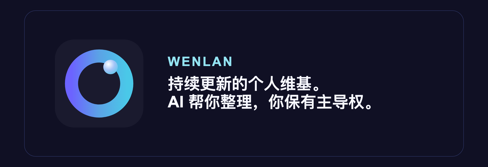
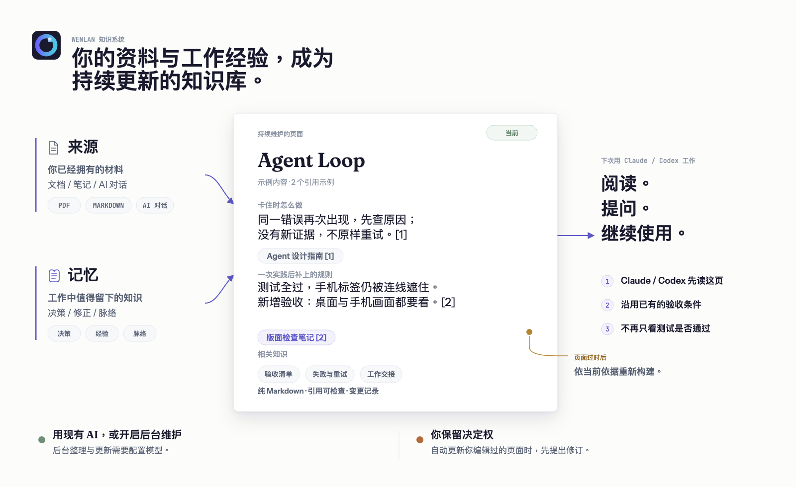
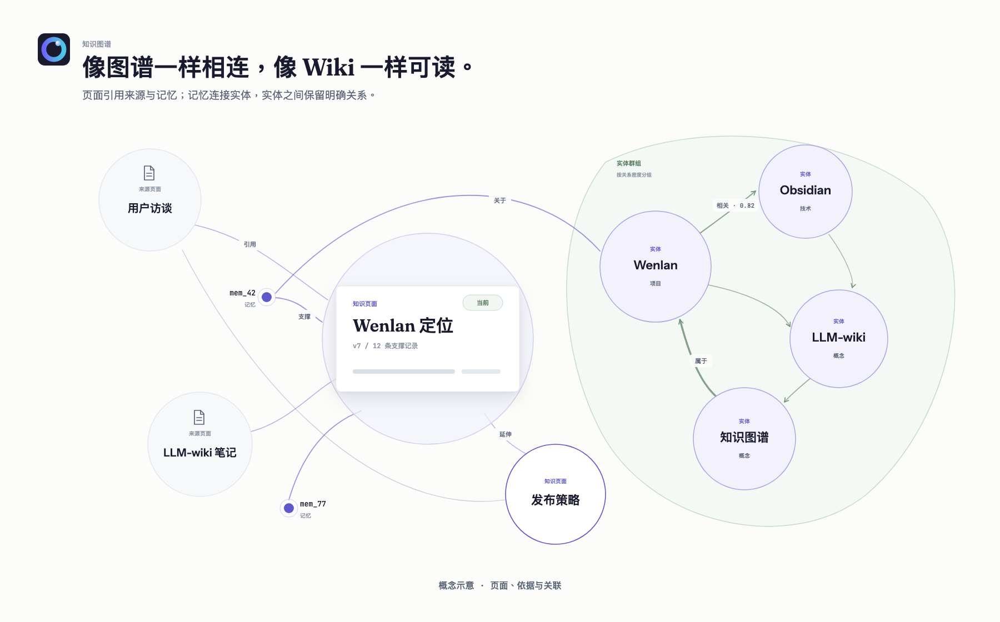
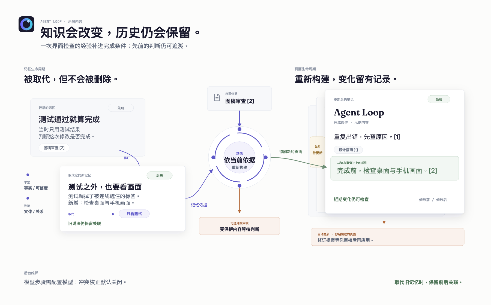

<!-- README_SYNC: source=README.md sha256=8a2a6a1713d374177d0d70418acfc3793d2a31bab4dd18308765e7d86907a0a7 -->

<p align="center">
  <picture>
    <source media="(max-width: 600px)" srcset="./docs/assets/readme-banner-zh-Hans-mobile.png">
    
  </picture>
</p>

Wenlan 把你的文档、笔记和 AI 对话整理成可编辑、附有来源链接的页面，让你和 AI 工具在已有成果上继续工作。

来源有变，可以请 AI 更新页面，也能启用后台更新。如果你编辑过页面，Wenlan 会提出修订，让你确认是否采用，而不是自动覆盖你的内容。

<p align="center">
  <a href="./README.md">English</a> | 简体中文 | <a href="./README.zh-Hant.md">繁體中文</a> | <a href="./README.es-ES.md">Español</a>
</p>

<p align="center">
  <a href="https://github.com/7xuanlu/wenlan/actions/workflows/ci.yml?query=branch%3Amain"></a>
  <a href="https://github.com/7xuanlu/wenlan/releases/latest"></a>
  <a href="#license"></a>
</p>

<p align="center">
  <a href="#start-in-30-seconds">开&#8288;始&#8288;使&#8288;用</a> ·
  <a href="#what-does-wenlan-build">这&#8288;是&#8288;什&#8288;么？</a> ·
  <a href="#what-can-it-do">能&#8288;力</a> ·
  <a href="#how-does-it-work">日&#8288;常&#8288;流&#8288;程</a> ·
  <a href="#evaluation">评&#8288;估</a> ·
  <a href="#learn-more">进&#8288;一&#8288;步&#8288;了&#8288;解</a>
</p>

https://github.com/user-attachments/assets/2c91437c-59f5-44af-a5e1-da7627b921ad

<p align="center">
  <sub>开场为组合示意，并非 app 的原生三栏界面；后续为 app 实际操作录像，展示页面与来源引用。</sub>
</p>

<a id="quickstart"></a>
<a id="start-in-30-seconds"></a>

## 开始使用

<a id="start-with-the-app"></a>
<a id="open-the-wiki"></a>
<a id="desktop-app"></a>

### 1. 下载并打开 Wenlan

[下载桌面版](https://github.com/7xuanlu/wenlan/releases/latest)，安装后打开：

- **macOS（Apple Silicon）：** 打开 `.dmg`，把 Wenlan 拖进「应用程序」。App 已签名并通过公证。
- **Windows x64：** 运行 `-setup.exe`。安装包尚未签名。如果 SmartScreen 显示警告，请先确认文件来自官方 Releases 页面，再点「更多信息」→「仍要运行」。
- **Linux：** 暂时没有桌面版；可按照[设置指南](docs/setup-with-ai.md#install-the-runtime)，不通过桌面 app，直接搭配 AI 工具使用。

首次启动会下载本地搜索模型，设置完成前请保持联网。[下载与隐私说明](docs/PRIVACY.md#when-wenlan-reaches-the-network)。

<a id="claude-code-in-30-seconds"></a>

<a id="codex-plugin"></a>

<a id="mcp-setup"></a>
<a id="mcp-clients"></a>

### 2. 让常用 AI 共用你的维基

在 Wenlan 的设置引导中，连接 Claude Code、Codex 等工具，让它们使用同一份知识。

直接请已连接的 AI 撰写页面，不必另外安装本地语言模型。

<details>
<summary>连接时需要帮助？让 AI 协助设置</summary>

如有提示，请重新启动 AI 工具。需要协助设置时，把下面这段贴给 Claude Code、Codex，或其他能够读取设置指南的工具：

```text
请按照这份指南，将当前的 AI 工具连接到 Wenlan：
https://raw.githubusercontent.com/7xuanlu/wenlan/main/docs/setup-with-ai.md

如果已安装 Wenlan，请沿用现有安装。
只设置当前这个 AI 工具，并确认它能保存及找回一条测试记忆。
```

</details>

### 3. 创建你的第一页维基

在已连接的 AI 工具中，打开一段值得保留的工作对话，选定要整理的主题：

> 把这段对话中［主题］的结论与理由，整理成附来源引用的 Wenlan 页面。

也可以先[导入笔记或 ChatGPT／Claude 导出的对话](#what-can-i-bring-in)，再请 AI 把其中一个主题整理成页面。

完成后，在 Wenlan 打开新页面，点击引用查看来源，也能补上自己的想法。下次做相关工作时，请 AI 先读这一页再继续。

后台整理与自动更新是可选功能，需要[设置模型](#models-and-privacy)。终端安装、其他平台与更新方式，请见[设置指南](docs/setup-and-data.zh-Hans.md#installation)。

遇到问题？[设置指南](docs/setup-with-ai.md) · [反馈问题](https://github.com/7xuanlu/wenlan/issues)。Issue 是公开的，请勿附上私人笔记、访问凭据、远程访问标识或未脱敏的日志。


<a id="what-does-wenlan-build"></a>
<a id="why-it-compounds"></a>

<a id="这是什么"></a>

## 你与 AI 共用的个人维基

- **零散的资料，整理成主题。** 文档、笔记与 AI 对话，汇总成彼此连接的页面，引用可以点击查证。
- **自己看，也给 AI 用。** 直接阅读、编辑，也能让 Claude Code、Codex 接着用。
- **后续维护有流程，不必每次从头整理。** 跟踪来源变化、更新相关页面并保留历史；你编辑过的内容，先确认修订再更新。

页面是本地 Markdown 文件，你可以阅读、编辑，也能带走。

<p align="center">
  <picture>
    <source media="(max-width: 900px)" srcset="./docs/assets/wenlan-system-zh-Hans-mobile.png">
    
  </picture>
</p>

<a id="what-wenlan-is-not"></a>

图中是可复用工作准则的整理示例，不代表用户成效或自动生成页面的实测。[来源、记忆与页面如何协作](docs/knowledge-guide.zh-Hans.md#sources-and-pages)。

<a id="knowledge-graph"></a>

### 从一页，找到相关的知识

Agent Loop 不只是一篇笔记：它连接重试准则、界面检查的经验，以及可继续使用的验收清单。

<p align="center">
  <picture>
    <source media="(max-width: 900px)" srcset="./docs/assets/wenlan-knowledge-network-zh-Hans-mobile.png">
    
  </picture>
</p>

<a id="retrieval"></a>
<a id="从关键词语义与关联找回正确内容"></a>

从页面找到相关概念与依据。[图谱与搜索如何运行](docs/knowledge-guide.zh-Hans.md#graph-and-search)。

<a id="what-makes-wenlan-distinct"></a>
<a id="why-is-wenlan-different"></a>
<a id="two-lifecycles"></a>
<a id="two-lifecycles-one-maintained-knowledge-system"></a>
<a id="两套生命周期一个持续维护的知识系统"></a>

### 知识会改变，历史仍会保留。

新经验补进笔记，过去的判断仍找得到。以下示例把“测试通过就算完成”改为“测试加上桌面与手机画面检查”，保留修正原因与依据。

<p align="center">
  <picture>
    <source media="(max-width: 900px)" srcset="./docs/assets/wenlan-lifecycle-zh-Hans-mobile.png">
    
  </picture>
</p>

<a id="local-markdown"></a>
<a id="原子记忆"></a>
<a id="持续维护的页面"></a>
<a id="与-obsidian-共存的本地-markdown"></a>

审核针对 AI 更新；直接修改文件与强制重建另有规则。[更新、审核与本地文件](docs/knowledge-guide.zh-Hans.md#updates-and-history)。

### 已经在用 Obsidian 和 AI 插件？

你可以用 [Copilot](https://docs.obsidiancopilot.com/agent-mode-and-tools/) 让 AI 读写笔记、用 [Smart Connections](https://github.com/brianpetro/obsidian-smart-connections) 找相关内容，再用 [Obsidian Git](https://github.com/Vinzent03/obsidian-git) 保留版本。自由度很高，但插件怎么搭配、资料何时整理、旧页面如何更新，仍需要自己安排。

Wenlan 把整理成页、跟踪来源变化、更新相关内容和保留修订历史接成一套流程，省下自行搭建与维护的工夫。整理好的知识，自己能阅读，也能让 Claude Code、Codex 接着用。

可以直接请已连接的 AI 更新页面，也能[配置模型](#models-and-privacy)启用后台更新。你编辑过的页面，更新前先提出修订，由你确认是否采用。

现有 Obsidian 仓库可以接为只读来源，不必搬动笔记。Wenlan 不会修改原本的仓库，也不会把变更同步回去。


<a id="what-you-get"></a>
<a id="what-can-it-do"></a>
<a id="what-can-i-bring-in"></a>

## 能力

### 导入你的资料

- **留下有用的 AI 对话：** 导入 ChatGPT 或 Claude 导出的 ZIP，已导入的对话不会重复加入。
- **导入现有笔记：** 导入 Markdown、文本文件或可提取文本的 PDF，也能批量读取文件夹，或把 Obsidian 仓库接为来源。扫描版 PDF 需先提取文本。
- **快速记录：** 直接在桌面 app 记下想法或决策，不必先打开 AI 对话。
- **[请 AI 记住工作重点](https://wenlan.app/learn/ai-work-memory)：** 请 AI 工具记下决策、经验、更正、偏好与事实，保留来源及替代的旧记录。
- **导入其他 wiki：** 通过 CLI 或 API 导入外部 OKF wiki，保留来源引用与链接。目前不支持重新导入 Wenlan 自己导出的 OKF。

### 浏览你的个人 wiki

- **[可编辑、有来源的页面](https://wenlan.app/docs/source-backed-pages)：** 把相关文档与记忆整理成 Markdown 页面，附引用与页面链接。
- **卡片或列表：** 用适合自己的方式浏览页面、实体与空间。
- **[知识图谱](docs/technical-foundations.md#graph-data-and-entity-resolution)：** 探索人物、项目、主张与支撑记忆之间的关系。

### 配合 AI 继续工作

- **[换个 AI，也能接着用](https://wenlan.app/docs/architecture)：** 连接后，Claude Code、Codex 与其他 MCP 客户端，可使用和桌面 app、CLI 相同的本地页面与记忆。
- **[原词与语义搜索](docs/technical-foundations.md#retrieval-pipeline)：** 结合精确匹配与本地语义搜索，图谱关系可补充相关背景。
- **[需要时，搜索得更细](docs/technical-foundations.md#optional-channels-and-defaults)：** 可选择搜索页面与更细致的记忆，并重新排序结果。
- **[不同项目，分开管理](https://wenlan.app/docs/spaces)：** 用空间选择 AI 这次要搜索的工作、个人、客户或代码库知识。
- **网页 AI 访问（实验性）：** 电脑保持联网时，让支持的网页 AI 客户端连接到你授权的一个空间。查询与结果会经过中继服务，详见[连接方式与隐私边界](docs/PRIVACY.md#pre-release-standalone-wenlan-relay-connector)。
- **接入自己的工具：** 通过本地 HTTP API 传入准备好的文本、网页内容或记忆；它接收内容，不会代为抓取网址。

### 持续更新与维护

后台整理与页面更新是可选功能，需要先[配置模型](#models-and-privacy)。

- **增量同步：** 文件与文件夹会在后台追踪变化；Obsidian 仓库保持只读，需要时再同步。
- **[整理已存的知识](docs/technical-foundations.md#typed-memory-schema)：** 配置模型后，可协助补上类型、字段、相关日期、标签、搜索提示与图谱链接。
- **有引用才更新：** 自动更新会拒绝引用不足的草稿。AI 生成的页面可以更新；你编辑过的页面则先提出修订。
- **[需要判断才审核](https://wenlan.app/docs/review-and-trust)：** 审核受保护的冲突、页面修订、实体合并与新词汇。
- **进度看得见：** 在 Activity 查看进度与受阻原因。本地服务运行时，关闭 app 窗口后仍可继续执行已配置的同步、补全与符合条件的页面更新。

### 保有数据与控制权

- **[数据在本地，也能检查](https://wenlan.app/learn/local-first-ai-memory)：** 保留 Markdown 页面、引用、修订、git 历史与 Obsidian 导出；记忆与图谱存于本地 libSQL。
- **把 wiki 带走：** 从设置或 CLI，把各空间符合条件的页面导出成 OKF v0.2 wiki。这是 wiki 导出，不是完整数据库备份。
- **[模型自己选](docs/technical-foundations.md#model-roles)：** 基础检索留在本机。可选的补全与页面合成能用设备端 Qwen、本地接口或云端模型；远程服务会收到该任务所需的内容。
- **检查问题，确认后修复：** [Doctor](https://wenlan.app/docs/diagnostics-and-issue-reports) 与 [lint](plugin/skills/lint/SKILL.md) 只报告问题，不改写知识。支持的修复可在 app 预览，确认后应用并验证。

**从一段值得留下的对话开始。** [开始使用](#start-in-30-seconds)。想之后再试，也可以先给这个 repo 一颗 Star，方便回来找到它。


<a id="how-wenlan-works"></a>
<a id="how-does-it-work"></a>

## 日常流程

AI 工具连接好后，可以直接这样说：

安装 Wenlan 插件后，也能用快捷指令。

### 开始工作前

> 找出我存进 Wenlan 的［主题］相关资料，包括之前的决定与来源。

快捷指令：`/recall [主题]`

### 得到有用的结论时

> 把这个决定、背后的原因和来源记到 Wenlan。

快捷指令：`/capture [决定、理由与来源]`

### 值得整理成页面时

> 把［主题］的已存资料整理成 Wenlan 页面，已有的就更新，并保留引用。

将已存知识整理成页面：`/distill`

在 Wenlan 里阅读、编辑页面、查看来源。下次做相关工作时，请 AI 先读这一页，再接着做。

### 工作收尾时

> 把这次的进展、决定和待解决的问题记到 Wenlan，方便下次继续。

快捷指令：`/handoff`

<details>
<summary>插件指令与维护</summary>

- **读取项目摘要：** `/brief [topic]` 读取当前空间的项目摘要；加上主题时，会补充同一空间的相关内容。
- **检查与审核：** `/lint` 检查知识库状态；`/curate` 审核待处理的记录或修订。

这些快捷指令由 Wenlan 插件提供。其他已连接的客户端使用对应的 MCP 工具。可选的后台整理与页面更新需要先[配置模型](#models-and-privacy)。

[完整指令参考](plugin/skills/README.md)。

</details>

<a id="离线队列outbox"></a>

[CLI 离线写入与重放](docs/setup-and-data.zh-Hans.md#offline-queue)。

<a id="models-and-privacy"></a>

### 模型与隐私

先用已连接的 AI 写页面，不必另装本地语言模型。后台整理与自动更新是可选功能，需要另外设置模型。

- **搜索在本机运行。** 首次启动会下载搜索模型，之后在你的电脑上运行，不需要 API key。
- **连接 AI，就可能传出内容。** 云端 AI 可将读取的知识传给其提供商；选用云端模型整理资料，也会发送该任务所需的内容。本地存储不代表这些交互都留在本机。
- **使用统计默认关闭。** 同意后才发送有限的操作计数、版本与平台，不包含知识内容或安装标识。[查看说明](docs/PRIVACY.md#telemetry)。

模型下载、更新检查、远程图片与可选远程访问的联网行为，请见[隐私说明](docs/PRIVACY.md#when-wenlan-reaches-the-network)。

[模型选项与设置](docs/setup-and-data.zh-Hans.md#models)。

### 你的数据与卸载

页面与会话笔记是 Markdown 文件；记忆与图谱保存在本地数据库。卸载 app 时，可以保留你的知识数据。

[文件位置、备份与卸载方式](docs/setup-and-data.zh-Hans.md#backup-and-removal)。


<a id="evaluation"></a>

## 评估

以下是 retrieval-only snapshot，不代表 end-to-end answer quality。方法、环境 receipts 与更新流程见 [docs/eval](docs/eval/README.md)。

<!-- EVAL_SNAPSHOT_START -->
| Benchmark | Recall@5 | MRR | NDCG@10 |
|---|---:|---:|---:|
| LME_Oracle (500 Q) | 93.6% | 0.857 | 0.883 |
| LME_S (deep, 90 Q) | 87.7% | 0.815 | 0.822 |
<!-- EVAL_SNAPSHOT_END -->


<a id="learn-more"></a>

## 进一步了解

更完整的文档、概念说明与比较：

### 文档

- [开始使用](https://wenlan.app/docs/get-started)：安装并验证第一个本地循环。
- [日常工作流程](https://wenlan.app/docs/daily-workflow)：brief、capture、recall、handoff、distill、lint 与 curate。
- [MCP 客户端](https://wenlan.app/docs/mcp-clients)：连接 Claude Code、Codex、Cursor、Claude Desktop 与其他工具。

### 工作流指南

- [建立第一个 LLM Wiki](https://wenlan.app/zh-CN/learn/distilled-wiki-pages-ai-memory)：用三份来源试做，核对引用，再检查来源更新后哪些内容需要修改。
- [为咨询项目建立客户知识库](https://wenlan.app/zh-CN/learn/build-client-project-knowledge-base-for-consulting)
- [建立有来源支撑的投资研究知识库](https://wenlan.app/zh-CN/learn/build-investment-research-knowledge-base)
- [在撰写 PRD 前建立产品研究知识库](https://wenlan.app/zh-CN/learn/build-product-research-knowledge-base-for-prd)
- [用运行手册与故障复盘建立 SRE 故障知识库](https://wenlan.app/zh-CN/learn/build-sre-incident-knowledge-base)
- [建立业务指标定义知识库](https://wenlan.app/zh-CN/learn/build-business-metric-definition-knowledge-base)：把获准的 KPI 规范整理成有来源的数据字典，保留公式文本、粒度、排除条件、负责人、修订和审核状态。

### 概念

- [为什么需要持续演进的 wiki，而不只是 AI 记忆](https://wenlan.app/learn/ai-work-memory)：深入理解问题与产品模型。
- [MCP 记忆服务器](https://wenlan.app/learn/mcp-memory-server)：Wenlan 如何让知识跨 AI 工具使用。
- [本地优先的 AI 记忆](https://wenlan.app/learn/local-first-ai-memory)：数据、隐私与控制权。
- [Markdown 与本地索引](https://wenlan.app/learn/local-first-ai-memory)：存储、检索与所有权。
- [AI agent 的交接循环](https://wenlan.app/learn/ai-agent-handoff-loop)：把工作完整带到下一次会话。
- [用论文建立研究知识库](https://wenlan.app/zh-CN/learn/source-backed-research-knowledge-base)：把已选好的论文整理成可检查的文献矩阵与来源支撑综述。

### 比较

- [Wenlan 与 Basic Memory](https://wenlan.app/learn/wenlan-vs-basic-memory)
- [Wenlan 与 claude-mem](https://wenlan.app/learn/wenlan-vs-claude-mem)
- [Wenlan 与 Superlocal Memory](https://wenlan.app/learn/wenlan-vs-superlocal-memory)


## 贡献

欢迎 bug fixes、eval cases、文档与功能。安装 Wenlan 不需要从源码构建。本地开发时，请从本 repository 的根目录运行以下命令：

```bash
# daemon crates（default-members——不会编译桌面 app）
cargo build
cargo test

# 桌面 app（Cargo target 与根目录的前端工具链）
pnpm install
pnpm dev:all
pnpm build:all
```

`pnpm dev:all` 是桌面 app 受支持的开发入口。它让开发用的端口、数据、进程归属、app 标识、MCP socket 与 Remote Access 状态都与已安装的生产运行时隔离；未处于该隔离环境的 debug build 会拒绝启动。完整开发流程见本 repository 的 [AGENTS.md](AGENTS.md) 与 [CONTRIBUTING.md](.github/CONTRIBUTING.md)，以及仓库内的 [app/AGENTS.md](app/AGENTS.md)。安全性问题请见 [SECURITY.md](.github/SECURITY.md)，隐私政策请见 [PRIVACY.md](docs/PRIVACY.md)，也请阅读 [Code of Conduct](.github/CODE_OF_CONDUCT.md)。


<a id="code-signing-policy"></a>

## 代码签名政策

macOS 桌面版已通过 Developer ID 签名与公证。Windows 安装包尚未签名。

发行版由 GitHub 托管的运行环境，按照此仓库的版本标签与对应提交构建。维护者必须在 GitHub 启用多因素认证。

[各平台的签名说明（英文）](docs/code-signing.md) · [隐私政策（英文）](docs/PRIVACY.md)。


<a id="license"></a>

## 许可

Wenlan 采用两种许可，按 repository 的不同部分划分。

- **Apache-2.0**（[`LICENSE`](LICENSE)）覆盖 local runtime、CLI、MCP server、shared types，以及 Claude Code 与 Codex 的 plugin files。可以自由基于这些开发。
- **AGPL-3.0-only**（[`app/LICENSE`](app/LICENSE)）覆盖桌面 app：`app/` crate 及其附带的 React 前端。如果你把修改过的 app 作为网络服务运行，AGPL 要求你向使用它的人提供这份修改后的源码。

这个划分是有意为之。Apache-2.0 的代码可以用在 AGPL-3.0 程序里，所以桌面 app 建立在 runtime 之上，两种许可都不会被违反。


<a id="acknowledgments"></a>

## 源流与同类项目

Wenlan（文澜）的名字来自文澜阁。这座皇家藏书楼收藏《四库全书》，曾是中国最大的藏书之一。

Wenlan 的 llm-wiki v2 模型是自己的产品方向，并受到 LLM-wiki 与 agent-memory 两条脉络启发：

- [Karpathy 的 LLM-wiki note](https://gist.github.com/karpathy/442a6bf555914893e9891c11519de94f) 建立了从 raw sources 到持续维护 wiki 的模式。
- [Rohitg00 的 LLM Wiki v2 proposal](https://gist.github.com/rohitg00/2067ab416f7bbe447c1977edaaa681e2) 加入 memory lifecycle、confidence、graph 与 retrieval mechanisms。[agentmemory](https://github.com/rohitg00/agentmemory) 是其具体的 agent-memory implementation。
- [nashsu/llm_wiki](https://github.com/nashsu/llm_wiki) 是以文档为核心的 LLM-wiki 完整桌面实现。
- [basic-memory](https://github.com/basicmachines-co/basic-memory)、[obsidian-mind](https://github.com/breferrari/obsidian-mind)、[mcp-memory-service](https://pypi.org/project/mcp-memory-service/)、[Memoria](https://github.com/matrixorigin/Memoria) 和 [OpenMemory](https://github.com/CaviraOSS/OpenMemory) 探索相邻的本地知识与 agent-memory 方向。
