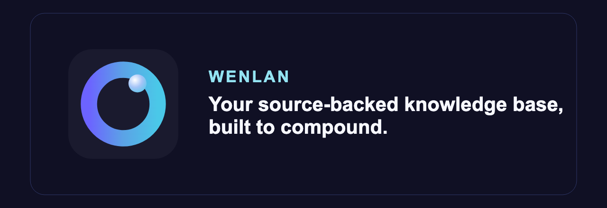
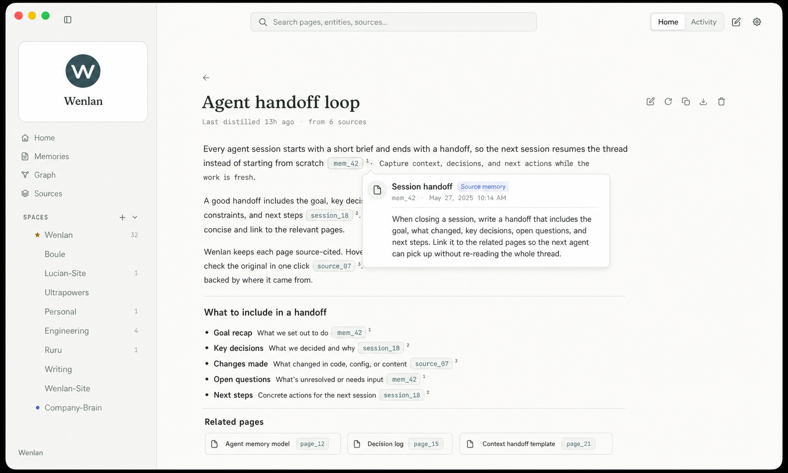
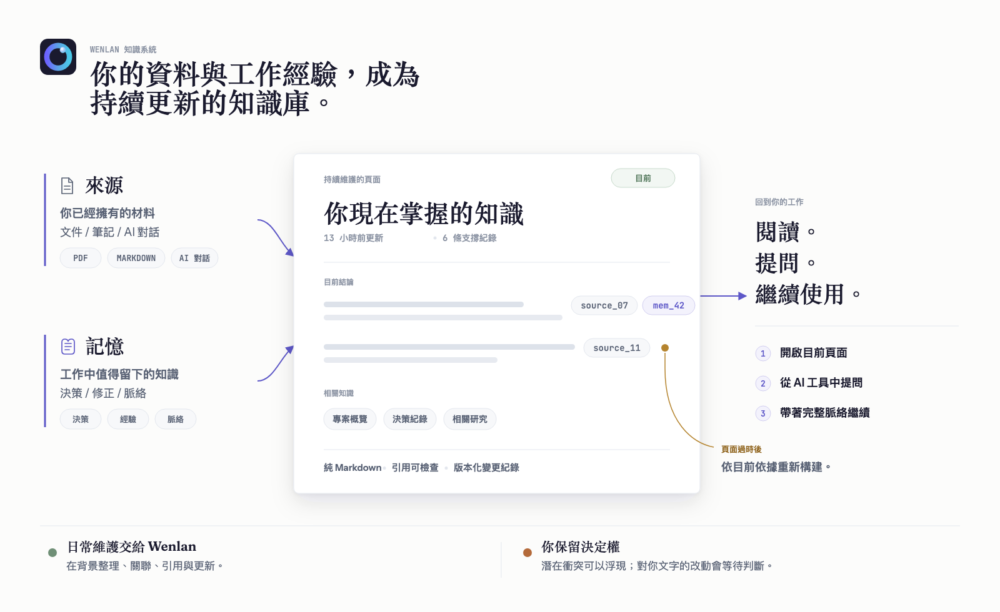
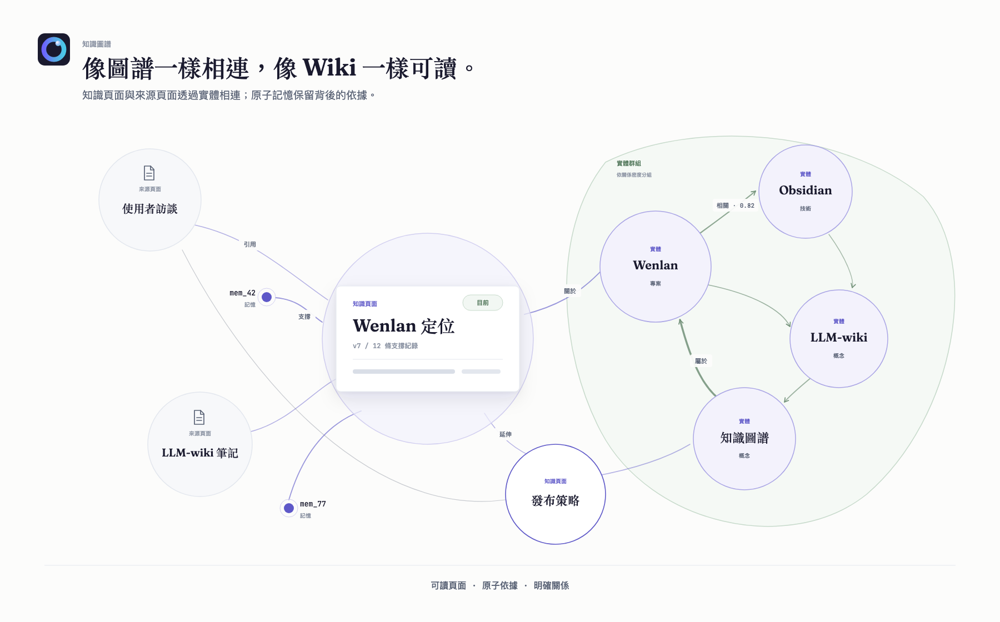
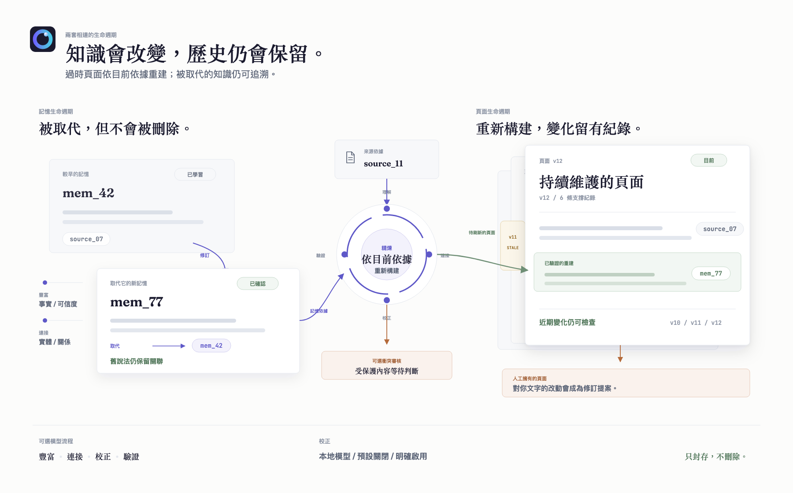

<!-- README_SYNC: source=README.md sha256=d2ed67bd1a4b51576c1c33d57e40262cb257bec83b097e8f595d574f3c5e25bf -->

<p align="center">
  <picture>
    <source media="(max-width: 600px)" srcset="./docs/assets/readme-banner-mobile.png">
    
  </picture>
</p>

和 AI 聊出的成果，不該在對話結束後消失。Wenlan 會建立真正需要的頁面，並在來源變動時讓它們保持最新；只有需要判斷時才找你。

<p align="center">
  <a href="./README.md">English</a> | <a href="./README.zh-Hans.md">简体中文</a> | 繁體中文
</p>

<p align="center">
  <a href="https://github.com/7xuanlu/wenlan/actions/workflows/ci.yml?query=branch%3Amain"></a>
  <a href="https://github.com/7xuanlu/wenlan/releases/latest"></a>
  <a href="#license"></a>
</p>

<p align="center">
  <a href="#start-in-30-seconds">開&#8288;始&#8288;使&#8288;用</a> ·
  <a href="#what-does-wenlan-build">這&#8288;是&#8288;什&#8288;麼？</a> ·
  <a href="#what-can-it-do">能&#8288;力</a> ·
  <a href="#how-does-it-work">日&#8288;常&#8288;流&#8288;程</a> ·
  <a href="#evaluation">評&#8288;估</a> ·
  <a href="#learn-more">進&#8288;一&#8288;步&#8288;了&#8288;解</a>
</p>

<p align="center">
  
</p>

<p align="center">
  <sub>桌面 app 中持續維護的頁面：開啟任一引用，就能檢查這項結論背後的來源或記憶。</sub>
</p>

---

<a id="quickstart"></a>
<a id="start-in-30-seconds"></a>

## 開始使用

<a id="start-with-the-app"></a>
<a id="open-the-wiki"></a>

### 桌面 app

桌面 app 是最快看到完整工作流程的方式：閱讀頁面、檢查來源並整理知識體系。目前僅提供 macOS Apple Silicon 預覽版，尚未經 Apple notarization。下面的安裝器會驗證 GitHub release，只為 Wenlan 清除 quarantine，安裝後直接開啟，不會變更 macOS 系統安全設定：

```bash
/bin/bash -c "$(curl -fsSL https://raw.githubusercontent.com/7xuanlu/wenlan/main/scripts/install-macos-app.sh)"
```

你可以直接[檢查安裝器原始碼](scripts/install-macos-app.sh)。安裝器會先用 GitHub 發布的 SHA-256 核對下載檔案，再替換現有 app。偏好 DMG 或想查看 app 原始碼？請前往 [wenlan-app releases](https://github.com/7xuanlu/wenlan-app/releases/latest) 和 [wenlan-app](https://github.com/7xuanlu/wenlan-app)。

<a id="claude-code-in-30-seconds"></a>

<a id="codex-plugin"></a>

<a id="mcp-setup"></a>
<a id="mcp-clients"></a>

### 讓你的 AI 完成設定

把下面這段貼給 Claude Code、Codex，或其他能夠讀取設定指南的工具：

```text
請為目前的 AI 用戶端設定 Wenlan，並嚴格遵循：
https://raw.githubusercontent.com/7xuanlu/wenlan/main/docs/setup-with-ai.md

只安裝這個用戶端需要的內容。完成後驗證本地 runtime、
Wenlan connection，以及一次 capture/recall round trip。
```

指南會識別目前使用的 client，把各平台命令留在專門文件中。除非你明確要求，否則它不會設定所有 AI 工具。

只需要在 macOS Apple Silicon 上執行的無 GUI 本地服務？

```bash
npx -y wenlan setup
```

這個命令會下載預先編譯的 CLI、背景服務（daemon）與 MCP 連接器，啟動並驗證本地服務；不需要安裝 Rust 或 Cargo。使用 glibc 的 Linux x64/ARM64 可以採用自動化的 [shell 設定流程](docs/setup-with-ai.md#install-the-runtime)；Windows x64 請從 [Releases](https://github.com/7xuanlu/wenlan/releases/latest) 下載對應的 archive。macOS Intel 目前[沒有受支援的完整 runtime 安裝方式](crates/wenlan-cli/README.md#macos-intel)。

手動與各 client 設定說明：[AI 輔助設定](docs/setup-with-ai.md) · [Claude Code plugin](plugin/.claude-plugin/README.md) · [Codex plugin](plugin-codex/README.md) · [CLI 與 MCP](crates/wenlan-cli/README.md)。

---

<a id="what-does-wenlan-build"></a>
<a id="why-it-compounds"></a>

## 這是什麼？

Wenlan 把文件、筆記和過去的 AI 對話整理成會隨工作持續更新、每個結論都能追溯來源的知識庫。原始材料保留為來源；工作中的決策、經驗與修正成為長期記憶；兩者都能支撐同一批持續維護的頁面。

<p align="center">
  <picture>
    <source media="(max-width: 600px)" srcset="./docs/assets/wenlan-system-zh-Hant-mobile.png">
    
  </picture>
</p>

<a id="what-wenlan-is-not"></a>

**適合需要長期延續的工作。** Wenlan 面向研究者、寫作者、顧問、產品團隊與軟體團隊：當知識散落在文件、筆記和 AI 對話裡，它會把這些材料變成可檢查、能隨專案持續改進的頁面，而不是另一份聊天紀錄或孤立的記憶庫。它不是生活管理系統，也不是嵌入其他產品的 memory SDK。

**一個知識系統，三種角色：**

- **來源讓 Wenlan 讀到的材料始終可追溯。** 匯入的對話保留為捕獲時的記錄；已登錄檔案會隨內容變化同步目前版本。
- **記憶保留工作真正教會你的內容。** AI agent 捕獲原子的決策、經驗、修正與取代關係，並保留出處。
- **頁面彙整目前知識。** Wenlan 把相關來源與記憶整理成附有引用的 Markdown，讓你反覆使用、更新與審核。

**在 LLM-wiki 的基礎上繼續推進：**

- **[LLM-wiki v1](https://gist.github.com/karpathy/442a6bf555914893e9891c11519de94f)：** Karpathy 提出不可變的來源、由 AI 維護的 Markdown Wiki，以及會隨你和 AI 一起演進、規定組織與維護方式的 Schema（規則層）。Wenlan 以[類型化記憶欄位](docs/technical-foundations.md#typed-memory-schema)與內建規則，落實頁面結構、出處、引用、更新、歸屬和審核。
- **[LLM-wiki v2](https://gist.github.com/rohitg00/2067ab416f7bbe447c1977edaaa681e2)：** Rohitg00 加入記憶生命週期。Wenlan 把這個方向做成可以直接使用的產品：可追溯的來源、由 AI agent 依 Zettelkasten（卡片盒筆記法）捕獲的原子記憶（每條只表達一個完整想法），以及同時由兩者建立並持續維護的頁面。

**Wenlan 最獨特的做法：** 來源與原子記憶會分別支撐持續維護的頁面。記憶歷史保留知識如何改變；頁面歷史說明目前結論由哪些依據支撐。機器維護的頁面可以依目前依據重建；對人工文字的改動則成為可審核的修訂，不會直接覆蓋。

<p align="center">
  
</p>

<a id="knowledge-graph"></a>

### 越用越有價值的知識圖譜

實體關係圖譜只是 Wenlan 更大連接式 wiki 的一部分。**知識頁面**保留持續維護的結論，**實體**固定可複用的人物、專案與概念，**來源頁面**讓匯入或同步的材料可檢查，原子**記憶**則保留決策與變化。它們透過彼此分開的明確連接協作：頁面間的 wikilink、頁面依據、記憶到實體的連接，以及實體間的有向關係。

<p align="center">
  <picture>
    <source media="(max-width: 600px)" srcset="./docs/assets/wenlan-knowledge-network-zh-Hant-mobile.png">
    
  </picture>
</p>

在實體圖譜這一層，設定 enrichment 模型後，Wenlan 會從記憶中提取帶有類型的實體、觀察與有方向的關係。實體連結與解析會複用既有節點，而不是把每次提及都當成新事物；每條記憶仍保留來源，並可連結多個實體。[查看連接模型如何儲存 ->](docs/technical-foundations.md#connected-knowledge-model)

- **含義與方向：** 關係使用 `uses`、`part_of`、`contradicts`、`replaced_by` 等預置詞彙；未知類型會回退為 `related_to`，並成為可審核的詞彙提案。
- **強度與出處：** 關係可以保存信賴度、解釋與對應的來源記憶，讓強弱不同的主張仍可區分、可檢查。
- **形成可複用群組：** 標籤傳播會依關係密度為實體分組，並按每對實體之間的關係數量加權。這些群組可組織選用的全域摘要，實體連結也會為檢索補充脈絡。
- **修正但不抹除：** 相關說法、修正與明確的取代關係可以放在一起檢查，原始來源與記憶歷史仍會保留。

檢索時，Wenlan 會用實體向量比對找到與問題相關的實體。存在符合條件的圖譜連結時，預設開啟的圖譜記憶訊號（graph-memory stream）會把相連記憶作為第三路 [RRF](https://cormack.uwaterloo.ca/cormacksigir09-rrf.pdf) 排名訊號加以提升。這個路徑取決於現有圖譜資料與讀取範圍，Space 邊界仍然有效。[查看圖譜檢索如何運作 ->](docs/technical-foundations.md#graph-assisted-retrieval)

<a id="retrieval"></a>

### 從關鍵字、語意與關聯找回正確內容

Wenlan 的核心搜尋是本地混合檢索流程，不是單一的向量查詢。每個階段負責不同工作：

- **原詞比對 — [SQLite FTS5](https://www.sqlite.org/fts5.html)：** 全文索引查找字面關鍵字、識別碼與短語。
- **相近含義 — FastEmbed + [`Qdrant/bge-base-en-v1.5-onnx-Q`](https://huggingface.co/Qdrant/bge-base-en-v1.5-onnx-Q)：** 量化的英文模型會產生 768 維語意向量；[libSQL cosine DiskANN](https://turso.tech/blog/approximate-nearest-neighbor-search-with-diskann-in-libsql) 再以近似最近鄰搜尋（ANN）快速取得候選。
- **合併排名 — 加權 [RRF](https://cormack.uwaterloo.ca/cormacksigir09-rrf.pdf)（`k = 60`）：** 融合原詞與語意排名，不假設兩者的原始分數採用同一尺度；向量訊號還會由餘弦相似度加權。
- **關聯脈絡 — 圖譜記憶訊號（graph-memory stream）：** 符合條件的實體連結會加入第三路 RRF 訊號，傳回的記憶仍受目前讀取範圍限制。
- **可選精排 — 交叉編碼器（cross-encoder）：** 與分別編碼查詢和記憶的 embedding 不同，[`jinaai/jina-reranker-v1-turbo-en`](https://huggingface.co/jinaai/jina-reranker-v1-turbo-en) 或 [`BAAI/bge-reranker-base`](https://huggingface.co/BAAI/bge-reranker-base) 會同時讀取查詢與單一候選，再對較小的候選池重新排名；預設關閉。

頁面、情節記憶與事實（fact）通道都需要主動啟用；不可用時會退回其餘搜尋訊號。Space 仍負責限制讀取範圍。[查看方法、預設值與限制 ->](docs/technical-foundations.md)

<a id="what-makes-wenlan-distinct"></a>
<a id="why-is-wenlan-different"></a>
<a id="two-lifecycles"></a>

### 兩套生命週期，一個持續維護的知識系統

一次生成的 wiki 會過時；只存記憶又容易碎成互不相連的事實。Wenlan 連結兩套生命週期，但不把它們混成同一層。

<p align="center">
  <picture>
    <source media="(max-width: 600px)" srcset="./docs/assets/wenlan-lifecycle-zh-Hant-mobile.png">
    
  </picture>
</p>

#### 原子記憶

`CAPTURE -> CLASSIFY -> ENRICH -> LINK -> RECONCILE`

Capture 與明確的 supersession 屬於核心流程。模型支援的階段只會在設定相應模型後執行，Reconcile 預設關閉。

| 操作 | Wenlan 做什麼 |
|---|---|
| **Capture** | AI agent 每次寫入一條完整、自足的想法，遵循 Zettelkasten 的原子筆記原則，而不是保存整段對話。 |
| **Classify** | 設定本地模型後，Wenlan 將記憶分為 `identity`、`preference`、`decision`、`lesson`、`gotcha` 或 `fact`；呼叫端明確提供的準確類型優先。 |
| **Enrich** | 設定本地模型後，在可用時補充結構化欄位、檢索提示、事件日期、品質、重要性與標籤。 |
| **Link** | 保留出處；啟用 enrichment 後，把記憶連結到知識圖譜中的實體與關係。 |
| **Reconcile** | 明確取代舊說法時保留 `supersedes` 鏈。可選的本地模型流程可以把受保護內容的衝突放入審核，而不是覆蓋歷史；它預設關閉，必須明確啟用。 |

進階設定：使用 `WENLAN_ENABLE_DUAL_POOL_RESOLVE=1` 啟用這個 Reconcile 流程。

#### 持續維護的頁面

`DISTILL -> CITE -> TRACK -> REFRESH -> REVIEW`

| 操作 | Wenlan 做什麼 |
|---|---|
| **Distill** | 把相關來源與記憶彙整成一個 Markdown 頁面。 |
| **Cite** | 保留引用紀錄與驗證狀態；自動 refresh 若未通過引用支撐檢查，就會捨棄草稿。 |
| **Track** | 記錄哪些證據支撐頁面、頁面為何過時，以及有上限的變更紀錄。 |
| **Refresh** | 頁面被標記為過時後，依目前證據重建符合條件、由機器維護的頁面。 |
| **Review** | 對你編輯過的頁面提出修訂，而不是靜默改寫。 |

例如，匯入一份設計文件，再讓 Codex 捕獲一次除錯決策。Wenlan 可以把兩者整理成一個同時引用兩份依據的頁面。這個頁面 refresh 時，會依目前依據重建；如果你已經編輯過它，改動提案會等待審核。

<a id="local-markdown"></a>

### 與 Obsidian 共存的本地 Markdown

長期知識保留為一般檔案，不被鎖在專有編輯器格式裡：

- **純文字檔案：** 頁面與 session notes 都以 Markdown 保存在 `~/.wenlan/`。
- **可檢查的歷史：** Distill 與 handoff 可以把邏輯上屬於同一批的檔案提交到本地 git repository。
- **與 Obsidian 共存：** Wenlan 把現有 vault 當成來源讀取。你可以把 `~/.wenlan/pages/` symlink 到 vault，或從桌面 app 匯出頁面；你的編輯仍由你擁有，之後的機器更新會成為可審核的修訂建議。

本地歷史可以直接檢查：

```text
$ git -C ~/.wenlan log --oneline
a1b2c3d distill: 4 pages
9f8e7d6 session: embedding-work
```

---

<a id="what-you-get"></a>
<a id="what-can-it-do"></a>
<a id="what-can-i-bring-in"></a>

## 能力

- **對話匯入：** 匯入 ChatGPT 或 Claude 的 ZIP；Wenlan 會自動略過已經匯入的對話。
- **文件來源：** 匯入單一 `.md`、`.txt` 或可擷取文字的 `.pdf`，遞迴讀取包含它們的資料夾，或索引 Obsidian 儲存庫中的 Markdown。
- **增量同步：** 單一檔案與一般資料夾來源會在背景追蹤變更；Obsidian 儲存庫維持唯讀，按需重新同步。
- **原子記憶（Atomic Memory）：** MCP 用戶端把一個完整的決策、經驗、更正、偏好或事實存成一筆，並用[溯源與取代](https://wenlan.app/learn/ai-memory-provenance)記錄它來自哪裡、取代了什麼。
- **[類型化補全（Typed enrichment）](docs/technical-foundations.md#typed-memory-schema)：** 設定模型後，Wenlan 會分類每筆記憶，並補上該類型定義的結構化欄位、日期、標籤、檢索提示與圖譜連結。
- **[來源支撐頁面（Source-backed Pages）](https://wenlan.app/docs/source-backed-pages)：** 把相關來源與記憶提煉成帶來源標記與 `[[wikilinks]]` 的 Markdown 頁面；daemon 還能驗證並記錄逐條引用。
- **引用門控更新（Citation-gated refresh）：** 自動更新時，引用支撐不足的草稿會被拒絕；機器頁面可更新，使用者文字只進入待審修訂。
- **[混合檢索（Hybrid retrieval）](docs/technical-foundations.md#retrieval-pipeline)：** FTS5 找原詞，本地 BGE embedding 找語意，RRF 融合排序，圖譜連結補充脈絡。
- **[檢索通道（Retrieval channels）](docs/technical-foundations.md#optional-channels-and-defaults)：** 可選的頁面、情節記憶（episodic）與逐事實（per-fact）通道擴大召回；cross-encoder 重排提高精度。
- **[知識圖譜（Knowledge graph）](docs/technical-foundations.md#graph-data-and-entity-resolution)：** 類型化實體、關係與觀察連接人物、專案、主張及其支撐記憶。
- **[人在迴路審查（Human-in-the-loop）](https://wenlan.app/docs/review-and-trust)：** 日常工作維持自動；受保護衝突、頁面修訂、實體合併與新詞彙才等待判斷。
- **[空間（Spaces）](https://wenlan.app/docs/spaces)：** 用明確範圍隔開工作、個人、客戶與程式庫的記憶、頁面和檢索結果。
- **[本地 daemon + MCP](https://wenlan.app/docs/architecture)：** 一個輕量 Rust daemon 作為本地唯一事實來源。桌面 app 與 CLI 直接呼叫它；各 AI client 透過小型 MCP 連接器存取同一份知識。
- **自訂整合：** localhost HTTP API 可接收其他收集流程準備好的文字、網頁內容與記憶。
- **背景維護：** 關閉桌面 app 後，daemon 仍會繼續執行已設定的同步、補全、引用與頁面更新。
- **[模型選擇](docs/technical-foundations.md#model-roles)：** 基礎檢索留在本機；補全與合成可用裝置端 Qwen、與 OpenAI 相容的本地端點或雲端模型。
- **[可檢查的所有權](https://wenlan.app/learn/markdown-local-index-ai-memory)：** 記憶與圖譜留在本地 libSQL；Markdown、引用、修訂、git 歷史與 Obsidian 匯出都可檢查。
- **唯讀健康檢查：** [`doctor`](https://wenlan.app/docs/diagnostics-and-issue-reports) 檢查本地服務；[`lint`](plugin/skills/lint/SKILL.md) 找出格式錯誤的引用、孤立連結、損壞的 embedding，以及搜尋索引或圖譜完整性問題，但不會改寫知識。

---

<a id="how-wenlan-works"></a>
<a id="how-does-it-work"></a>

## 日常流程

日常使用分成一個小循環：取回相關知識、保存工作重點、以 handoff 收尾，再由 Wenlan 整理下次需要的內容。每一輪都改善同一個知識庫，不再累積互不相連的歷史。

這個循環分成四步：

1. **找到最新知識。** 開啟相關 Page、搜尋，或使用 `/recall <query>`；`/brief [topic]` 可選擇性彙整更完整的 session-start context。其他 AI 工具可使用等價的 page、search、recall 與 context 工具。
2. **工作時隨手保存與查找。** `/capture <thing>` 保存決策、經驗、踩坑或事實，並記錄來源。`/recall <query>` 只取回相關內容，不載入全部歷史。
3. **閉合循環。** `/handoff` 記錄改動與待辦，也指出下次工作的起點。
4. **讓 wiki 保持最新。** `/distill` 主動建立或刷新頁面。可選的模型流程會在兩次工作之間補充已保存內容、連結相關知識，並刷新符合條件的頁面。`/lint` 檢查知識庫健康狀態；`/curate` 讓你審核頁面更新提案，以及可選 Reconcile 流程產生的衝突項目。

### 模型與隱私

- **本地基礎檢索：** [BGE 向量模型（embedding model）](https://huggingface.co/Qdrant/bge-base-en-v1.5-onnx-Q) 透過 FastEmbed 在你的裝置上執行，用於混合搜尋，不需要 API key。
- **可選的裝置端整理：** 內容補充（enrichment）與頁面彙整可以使用你選擇的 [`Qwen3 4B`](https://huggingface.co/unsloth/Qwen3-4B-Instruct-2507-GGUF) 或 [`Qwen3.5 9B`](https://huggingface.co/unsloth/Qwen3.5-9B-GGUF)，並透過 [llama.cpp](https://github.com/ggml-org/llama.cpp) 執行。你沒有選擇前，Wenlan 不會下載或啟用語言模型。
- **其他模型來源：** Ollama 或 LM Studio 等 OpenAI 相容的本地端點，或已設定的雲端 provider，也可以提供模型支援的內容補充與頁面彙整。
- **雲端說明：** 如果你選擇的模型端點位於遠端，Wenlan 會把該任務需要的 system prompt 與 user prompt 傳給它。本地檢索與裝置端整理仍留在你的裝置上。
- **無遙測：** Wenlan 不傳送使用遙測。

完整 workflow 參考：[plugin/skills](plugin/skills/README.md)。模型分工與限制見：[技術基礎（英文）](docs/technical-foundations.md#model-roles)。

---

<a id="evaluation"></a>

## 評估

以下是 retrieval-only snapshot，不代表 end-to-end answer quality。方法、環境 receipts 與更新流程見 [docs/eval](docs/eval/README.md)。

<!-- EVAL_SNAPSHOT_START -->
| Benchmark | Recall@5 | MRR | NDCG@10 |
|---|---:|---:|---:|
| LME_Oracle (500 Q) | 93.6% | 0.857 | 0.883 |
| LME_S (deep, 90 Q) | 87.7% | 0.815 | 0.822 |
<!-- EVAL_SNAPSHOT_END -->

---

<a id="learn-more"></a>

## 進一步了解

更完整的文件、概念說明與比較：

### 文件

- [開始使用](https://wenlan.app/docs/get-started)：安裝並驗證第一個本地循環。
- [日常工作流程](https://wenlan.app/docs/daily-workflow)：brief、capture、recall、handoff、distill、lint 與 curate。
- [MCP 用戶端](https://wenlan.app/docs/mcp-clients)：連接 Claude Code、Codex、Cursor、Claude Desktop 與其他工具。

### 概念

- [為什麼需要持續演進的 wiki，而不只是 AI 記憶](https://wenlan.app/learn/ai-work-memory)：深入理解問題與產品模型。
- [MCP 記憶伺服器](https://wenlan.app/learn/mcp-memory-server)：Wenlan 如何讓知識跨 AI 工具使用。
- [本機優先的 AI 記憶](https://wenlan.app/learn/local-first-ai-memory)：資料、隱私與控制權。
- [Markdown 與本地索引](https://wenlan.app/learn/markdown-local-index-ai-memory)：儲存、檢索與所有權。
- [AI agent 的交接循環](https://wenlan.app/learn/ai-agent-handoff-loop)：把工作完整帶到下一次會話。

### 比較

- [Wenlan 與 Basic Memory](https://wenlan.app/learn/wenlan-vs-basic-memory)
- [Wenlan 與 claude-mem](https://wenlan.app/learn/wenlan-vs-claude-mem)
- [Wenlan 與 Superlocal Memory](https://wenlan.app/learn/wenlan-vs-superlocal-memory)

---

## 貢獻

歡迎 bug fixes、eval cases、文件與功能。安裝 Wenlan 不需要從原始碼建置。本機開發時，請從對應 repository 的根目錄執行每組命令：

```bash
# 7xuanlu/wenlan — runtime、CLI 與 MCP
cargo build --workspace
cargo test --workspace

# 7xuanlu/wenlan-app — 桌面 app
pnpm install
pnpm tauri dev
pnpm build:all
```

需要從全新的 daemon 開始執行 app 時，請在 app repository 使用 `pnpm dev:all`。完整開發流程見本 repository 的 [AGENTS.md](AGENTS.md) 與 [CONTRIBUTING.md](CONTRIBUTING.md)，以及 [wenlan-app 的 AGENTS.md](https://github.com/7xuanlu/wenlan-app/blob/main/AGENTS.md)。安全性問題請見 [SECURITY.md](SECURITY.md)，也請閱讀 [Code of Conduct](CODE_OF_CONDUCT.md)。

---

<a id="license"></a>

## 授權

Wenlan 採用 **Apache-2.0** 授權，包括本 repository 內的 local runtime、CLI、MCP server、shared types，以及 Claude Code/Codex plugin files。

---

<a id="acknowledgments"></a>

## 源流與同類專案

Wenlan（文瀾）的名字來自文瀾閣。這座皇家藏書樓收藏《四庫全書》，曾是中國最大的藏書之一。

Wenlan 的 llm-wiki v2 模型是自己的產品方向，並受到 LLM-wiki 與 agent-memory 兩條脈絡啟發：

- [Karpathy 的 LLM-wiki note](https://gist.github.com/karpathy/442a6bf555914893e9891c11519de94f) 建立了從 raw sources 到持續維護 wiki 的模式。
- [Rohitg00 的 LLM Wiki v2 proposal](https://gist.github.com/rohitg00/2067ab416f7bbe447c1977edaaa681e2) 加入 memory lifecycle、confidence、graph 與 retrieval mechanisms。[agentmemory](https://github.com/rohitg00/agentmemory) 是其具體的 agent-memory implementation。
- [nashsu/llm_wiki](https://github.com/nashsu/llm_wiki) 是以文件為核心的 LLM-wiki 完整桌面實作。
- [basic-memory](https://github.com/basicmachines-co/basic-memory)、[obsidian-mind](https://github.com/breferrari/obsidian-mind)、[mcp-memory-service](https://pypi.org/project/mcp-memory-service/)、[Memoria](https://github.com/matrixorigin/Memoria) 和 [OpenMemory](https://github.com/CaviraOSS/OpenMemory) 探索相鄰的本地知識與 agent-memory 方向。
