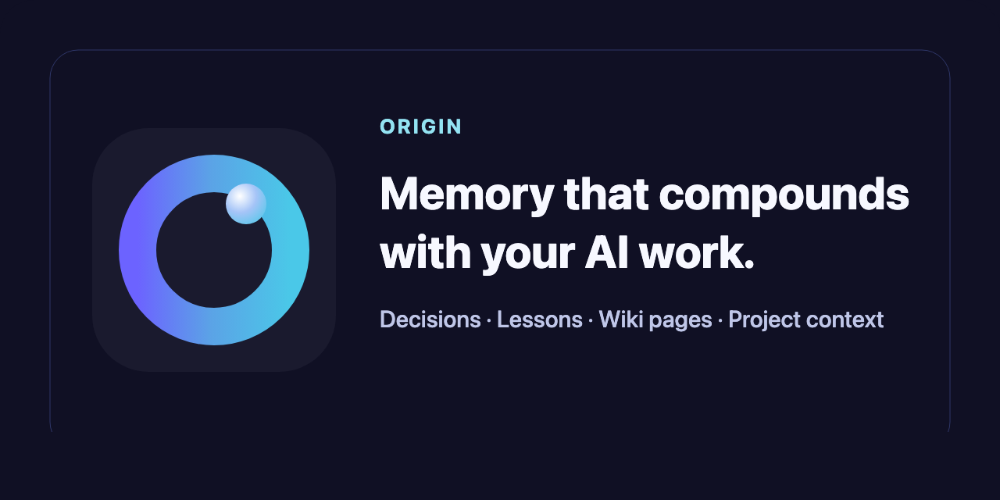
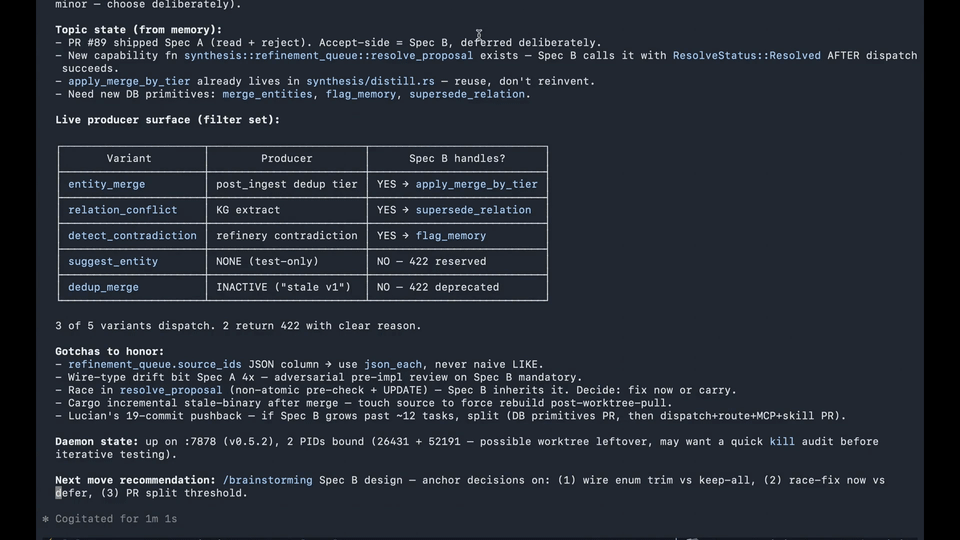

<!-- README_SYNC: source=README.md sha256=361b7f42d34f0d81edce45986cc45bd5da64d17aea77993029f27ce474f8338c -->

<p align="center">
  
</p>

[](https://github.com/7xuanlu/wenlan/actions/workflows/ci.yml?query=branch%3Amain)
[](https://github.com/7xuanlu/wenlan/releases/latest)
[](https://www.npmjs.com/package/wenlan)
[](https://www.npmjs.com/package/wenlan-mcp)
[](https://modelcontextprotocol.io)
[](#license)

<p align="center">
  
  
  
</p>

<p align="center">
  <a href="#claude-code-in-30-seconds"></a>
  <a href="#codex-plugin-local-development"></a>
  <a href="#mcp-only-setup"></a>
  <a href="#mcp-only-setup"></a>
  <a href="#mcp-only-setup"></a>
  <a href="#mcp-only-setup"></a>
  <a href="#what-you-get"></a>
  <a href="#desktop-app"></a>
</p>

<p align="center">
  <a href="./README.md">English</a> | <a href="./README.zh-Hans.md">简体中文</a> | 繁體中文
</p>

**面向 AI 原生時代的、會生長的個人知識庫，由你的 agents 構建，並由來源支撐。**

Wenlan（文瀾）的名字來自一座皇家藏書樓，它曾收藏中國規模最大的典籍之一。你的 agents 在工作時捕獲它們學到的內容；你也可以加入自己已經信任的頁面和來源，讓這座知識庫同時自下而上、自上而下地生長。Wenlan 會自行保持內容更新，並把兩類材料提煉成帶來源引用的 wiki 頁面。

每次會話開始時都有簡報，結束時都有交接記錄，所以上下文會延續，而不是從頭再來。

它不同於靜態的 llm-wiki，因為它會在會話之間持續演進；也不同於黑盒記憶，因為每個頁面都會顯示來源，你可以閱讀、信任或修正它。

[](https://youtu.be/k37gjWVPHwI)

---

## Wenlan 有什麼不同

1. **自己就值得信任。** 每個頁面都會引用它來自哪些 memories；daemon 會拒絕沒有來源的頁面，而不是讓幻覺摘要混進來。事實會被去重，變化時舊版本會被取代，所以你看到的是乾淨、最新的 wiki，而不是一堆重複片段。日常流程不會停下來等審批；只有真正衝突的捕獲才會浮現給你處理。
2. **自己持續演進。** 大多數記憶工具只是把你放進去的內容再拿出來。Wenlan 會在會話之間繼續工作，把捕獲內容聚類為帶來源引用的 wiki 頁面，並和原始 atomic notes 一起參與檢索。它不同於靜態的 llm-wiki，因為你不需要手動維護也能保持更新。
3. **一個家，不鎖定任何工具。** 每個 MCP client 都查詢同一個本地 daemon，所以在一個工具裡積累的上下文會出現在下一個工具裡。Obsidian 只是一個可選視圖，可以 symlink 進去，但你的工作並不住在那裡。
4. **真正的 git 版本管理。** Memory、page 和 session 寫入都會提交到 `~/.wenlan/.git/`，所以你可以 inspect、diff、revert 或 branch 這些 Markdown artifacts。
   ```text
   a1b2c3d page: embedding-retrieval refreshed (4 sources)
   9f8e7d6 session: handoff embedding-work
   5a4b3c2 capture: decision mem_abc123
   ```

---

## 快速開始

<a id="claude-code-in-30-seconds"></a>

### Claude Code 30 秒接入

```text
/plugin marketplace add 7xuanlu/claude-plugins
/plugin install wenlan@7xuanlu
/setup
```

如果 Claude Code 在安裝後要求重啟，請重啟一次，然後執行 `/setup`。插件會處理本地 runtime 設定、MCP wiring、本地記憶初始化，以及第一次 round-trip 檢查。

然後可以在 Claude Code 裡試試 `/brief`、`/capture <decision>` 或 `/handoff`。

插件細節和日常命令見：[plugin/](plugin/.claude-plugin/README.md)。

### Codex plugin

```bash
npx -y wenlan setup
codex plugin marketplace add .
codex plugin add wenlan@wenlan-local
```

安裝後開啟新的 Codex thread，讓 skills 和 MCP server 載入。然後可以試試 `/setup`、`/brief`、`/capture <memory>`、`/recall <query>`、`/pages <query>` 或 `/handoff`。

Plugin 細節和開發說明見：[plugin-codex/](plugin-codex/README.md)。

<a id="mcp-only-setup"></a>

### 僅 MCP 設定

如果你想在不安裝插件的情況下把 Wenlan tools 接入 Claude Code，或接入 Codex、Cursor、Claude Desktop、VS Code、Gemini CLI，請使用這種方式。

```bash
npx -y wenlan setup
~/.wenlan/bin/wenlan connect claude-code      # or: codex, cursor, claude-desktop, vscode, gemini
```

僅 MCP 模式會給 agents 提供 capture、recall、context、doctor 和 page distillation 工具。它不會安裝 plugin slash skills，例如 `/brief`、`/handoff`、`/distill` 或 `/setup`。

### 終端執行環境設定

設定本地 Wenlan runtime：

```bash
npx -y wenlan setup
```

然後從 `~/.wenlan/bin/wenlan status`、`~/.wenlan/bin/wenlan recall <query>` 或 `~/.wenlan/bin/wenlan capture <text>` 開始。CLI 細節見：[crates/wenlan-cli](crates/wenlan-cli/README.md)。

服務管理：

```bash
wenlan background on      # register + start the background runtime
wenlan restart            # stop + start the background runtime after upgrading
wenlan status
wenlan background off
```

升級 Wenlan（`npx -y wenlan setup` 或 `install.sh`）後，新 binary 已經在磁碟上，但已經執行的 runtime 仍會繼續提供舊程式碼，直到你重啟它。`wenlan background on` 現在會自動重啟；如果你用其他方式升級，請執行 `wenlan restart`。

<a id="desktop-app"></a>

### 桌面應用

桌面應用是執行在同一本地 daemon 之上的原生 UI。要使用它，需要同時安裝兩部分：

```bash
npx -y wenlan setup   # 安裝並啟動本地 daemon
```

然後下載並安裝目前 macOS Apple Silicon 應用：[Wenlan_0.3.1_aarch64.dmg](https://github.com/7xuanlu/wenlan-app/releases/download/v0.3.1/Wenlan_0.3.1_aarch64.dmg)。應用會連接到你機器上的 daemon，並讀取和 CLI、MCP clients 相同的本地記憶庫。

---

## Wenlan 如何工作

每次會話都會執行同一個 loop：工作時捕獲，讓 daemon 在會話之間 refine，然後在下一次帶著已有知識回來。

```text
      ┌──────── loops back · /handoff closes each pass ─────────┐
      ▼                                                         │
┌─────┴─────┐    ┌─────────────┐    ┌────────────────┐    ┌─────┴─────┐
│ CAPTURE   │    │ DAEMON      │    │ ONE STORE      │    │ RECALL +  │
│  in flow  │ ─▶ │  refines    │ ─▶ │  (local)       │ ─▶ │  BRIEF    │
│  /capture │    │  between    │    │  · memories    │    │  next     │
│           │    │  sessions   │    │  · wiki pages  │    │  session  │
│           │    │  dedup·link │    │  · graph       │    │  /recall  │
│           │    │  /distill   │    │                │    │  /brief   │
└───────────┘    └─────────────┘    └────────────────┘    └───────────┘
   one local daemon · one store · every MCP client reads it
   Claude Code · Cursor · Codex · Claude Desktop · VS Code · Gemini
```

每一輪都會讓 store 更清晰。放在別處會變成鬆散 snippets 的捕獲內容，會在這裡被去重、連結到相關的人和專案，並提煉成引用來源的頁面；所以下一次會話帶回來的不是原始歷史，而是知識。這就是這個 loop 所說的 compounding。

這五個動作驅動它：

1. **會話開始。** `/brief [topic]` 載入專案狀態、身份、偏好，以及和主題相關的 memories，讓 agent 帶著上下文進入工作。
2. **工作過程中。** `/capture <thing>` 在 flow 中保存 decision、lesson、gotcha 或 project fact。`/recall <query>` 用來查找任何內容。
3. **會話結束。** `/handoff` 寫下發生了什麼、還剩什麼、從哪裡繼續，讓下一輪乾淨接上。
4. **會話之間。** daemon 在後台去重重疊捕獲，並連結相關 ideas。想做一次有意的整理時，可以用 `/distill` 從相關 memories 的 clusters 中合成 wiki 頁面。
5. **下一次會話。** Claude Code 和 Codex plugins 裡的 `/brief` 會把上下文帶回來；僅 MCP clients 呼叫 `context` tool 獲得同樣的 memory。Recall 只拉回相關切片，而不是你的全部歷史，所以 context window 會留給目前工作。

完整 skill reference：[plugin/skills](plugin/skills/README.md)。

完全本地可用，不需要 API key、cloud account 或 signup。Capture、recall、hybrid search 和 graph context 都不需要外部服務；只有自動 page distillation 才需要添加本地模型或 API key。無 telemetry。

---

<a id="what-you-get"></a>

## 你會得到什麼

- **Atomic memory layer**：每條 capture 首先作為帶類型的 memory 儲存，包含 source agent、confidence、stability 和 supersession metadata。
- **Source-backed pages**：頁面保留 source memory IDs、stale reasons 和 revision state，這樣 distillation 可以刷新頁面而不丟 provenance。
- **基於 libSQL 的 hybrid retrieval**：memories、pages、FTS5 text、vector embeddings 和 graph context 位於同一個本地 store，供你的 MCP clients 查詢，並透過 reciprocal-rank fusion 融合。可選的本地 cross-encoder reranker 會進一步優化 top results。
- **Connected recall**：people、projects、tools 和 decisions 會帶著連結回來，所以一條 memory 不會孤零零出現，而是帶著周圍上下文。
- **Distill cycles**：今天可以手動執行 `/distill`；也可以添加本地模型或 API key，啟用 background extraction、page refreshes、recaps 和更豐富的 graph links。
- **自己保持新鮮**：後台 pass 會連結 entities、擴展匹配頁面，並根據 type、access 和 age 更新每條 memory 的 effective confidence，所以最近和關鍵的 memories 會浮現，陳舊內容會淡出。
- **先 review，再 trust**：低置信度 captures、pending revisions、contradictions 和 supersessions 可以浮現出來，而不是靜默進入 context。
- **Explicit spaces**：用 `space=work | personal | client-X` 給 memories、pages 和 recalls 打標籤，避免日常工作捕獲流入副專案 brief。未設定時會從目前 repo 或 workspace 自動偵測；也始終可以覆蓋。
- **資料歸你**：所有內容都是 `~/.wenlan/` 下的 plain Markdown，並由 git 版本管理。可以 grep、symlink 到 Obsidian，或隨時帶走檔案。無 lock-in。

### Spaces

Memories 屬於某個 **space**，例如 `wenlan`、`career` 或 `ideas`。可在每個 shell 中設定 active space：

    WENLAN_SPACE=career claude

也可以透過 `~/.wenlan/spaces.toml` 宣告式配置（見 `plugin/examples/spaces.toml`）。使用 CLI 管理 spaces：

    wenlan spaces list
    wenlan spaces add ideas --default
    wenlan spaces show ideas
    wenlan spaces move scratch career

`wenlan doctor` 會列印目前 resolver state，讓你精確看到是哪一層選擇了 active space。

---

## Evaluation

**Hybrid retrieval，透明 eval。** BGE-Base-EN-v1.5-Q + FTS5 + Reciprocal Rank Fusion；啟用 rerank 時，本地 BGE-Reranker-Base cross-encoder rerank 是預設路徑，BGE-Reranker-V2-M3 則是更高品質選項。下表是 retrieval 指標，不是端到端 answer quality。每次 recall query 約 168 tokens。Eval harness 位於 [`crates/wenlan-core/src/eval/`](crates/wenlan-core/src/eval/)。你可以自己執行。

更新流程和 answer-quality snapshots 位於 [docs/eval](docs/eval/README.md)。


<!-- EVAL_SNAPSHOT_START -->
| Benchmark | Recall@5 | MRR | NDCG@10 |
|---|---:|---:|---:|
| LME_Oracle (500 Q) | 93.6% | 0.857 | 0.883 |
| LME_S (deep, 90 Q) | 87.7% | 0.815 | 0.822 |
<!-- EVAL_SNAPSHOT_END -->

---

## Repo Map

Wenlan 以 daemon 為中心。`wenlan-server` 負責本地 database、embeddings、distill cycles、knowledge graph，以及執行在 `127.0.0.1:7878` 的 HTTP API。Plugin、MCP server、CLI 和本地工具都是這個 daemon 上的 thin clients。


| Path                                                   | 內容                                                                                                                                                                                                       |
| ------------------------------------------------------ | ---------------------------------------------------------------------------------------------------------------------------------------------------------------------------------------------------------- |
| [crates/wenlan-core](crates/wenlan-core/README.md)     | Storage、search、embeddings、distill cycles、graph、pages、export、eval。                                                                                                                                 |
| [crates/wenlan-server](crates/wenlan-server/README.md) | 本地 daemon 和 HTTP API。                                                                                                                                                                                  |
| [crates/wenlan-mcp](crates/wenlan-mcp/README.md)       | MCP server、tools、npm package。                                                                                                                                                                           |
| [crates/wenlan-cli](crates/wenlan-cli/README.md)       | 用於 setup、service management、search、recall、store、list、agents、model/key setup 和 doctor 的使用者 CLI。                                                                                              |
| [plugin/](plugin/.claude-plugin/README.md)             | Claude Code plugin（`plugin.json`、skills、hooks、`.mcp.json`）。                                                                                                                                          |
| [plugin-codex/](plugin-codex/)                         | Codex plugin（`.codex-plugin/plugin.json`、skills、`agents/openai.yaml`、`.mcp.json`）。                                                                                                                    |
| [docs/eval](docs/eval/README.md)                       | Benchmark workflow 和 methodology。                                                                                                                                                                        |


完整 contributor map：[CLAUDE.md](CLAUDE.md)。

---

## 從原始碼構建

Wenlan 可以在 macOS（Apple Silicon + Intel）、Linux（x86_64 + ARM64；glibc）和 Windows（x86_64）上原生構建。npm wrapper（`wenlan`、`wenlan-mcp`）和 `install.sh` 會自動偵測平台並拉取匹配的 prebuilt release。大多數使用者應該透過 Claude Code 插件或 `npx` 安裝。本地開發：

```bash
git clone https://github.com/7xuanlu/wenlan.git
cd wenlan
cargo build --workspace
cargo run -p wenlan-server
```

daemon、MCP server、CLI 和 core crates 的構建細節在上面連結的 crate READMEs 中。跨平台細節（service registration、paths、Windows install limitation）見 [AGENTS.md](AGENTS.md#cross-platform)。

---

## 瞭解更多

關於 AI work memory 以及 Wenlan 對比的長文在 [useorigin.app/learn](https://useorigin.app/learn)：

**Concepts**
- [What is AI work memory?](https://useorigin.app/learn/ai-work-memory)：Wenlan 要解決的問題形態
- [MCP memory server](https://useorigin.app/learn/mcp-memory-server)：Wenlan 如何透過 Model Context Protocol 暴露 memory
- [Local-first AI memory](https://useorigin.app/learn/local-first-ai-memory)：data、privacy 和 control
- [Markdown + local index](https://useorigin.app/learn/markdown-local-index-ai-memory)：storage model
- [AI agent handoff loop](https://useorigin.app/learn/ai-agent-handoff-loop)：防止 context loss 的 session-end discipline

**Comparisons**
- [Wenlan vs Basic Memory](https://useorigin.app/learn/origin-vs-basic-memory)：Markdown knowledge base vs AI work-session memory
- [Wenlan vs claude-mem](https://useorigin.app/learn/origin-vs-claude-mem)：observer-style Claude Code memory vs MCP-first cross-tool memory
- [Wenlan vs Superlocal Memory](https://useorigin.app/learn/origin-vs-superlocal-memory)：與另一種本地記憶形態的 tradeoffs

**Docs**
- [Get started](https://useorigin.app/docs/get-started)：install + verify 第一個本地 memory loop
- [Daily workflow](https://useorigin.app/docs/daily-workflow)：capture、handoff、distill
- [MCP clients](https://useorigin.app/docs/mcp-clients)：連接 Claude Code、Cursor、Codex、Claude Desktop、Gemini CLI

---

## Wenlan 不是什麼

- **不是 Life OS。** 沒有 habits、calendar、journal 或 life-management modules。Wenlan 只聚焦 AI work artifacts。如果你想要完整 personal OS，可以看 [PAI](https://github.com/danielmiessler/PAI)。
- **不是 workflow suite。** 一個 daemon 上約 30 個 MCP tools。如果你想要打包好的 30+ skills、8+ agents 和 auto-research loop，可以看 [pro-workflow](https://github.com/rohitg00/pro-workflow)。Wenlan 用 breadth 換 focus。
- **不是 memory infrastructure SDK。** 它面向每天使用 AI 的人，而不是給其他 app 構建 memory features 的 backend。
- **不適合一次性聊天。** 當工作跨越 sessions、projects 和 weeks 時，它最有價值。

---

## Contributing

歡迎 bug fixes、eval cases、docs 和 features。先看 [CONTRIBUTING.md](CONTRIBUTING.md)。Architecture 和 development rules 在 [CLAUDE.md](CLAUDE.md)。Security reports：[SECURITY.md](SECURITY.md)。也請閱讀 [Code of Conduct](CODE_OF_CONDUCT.md)。

---

<a id="license"></a>

## License

Wenlan 使用 **Apache-2.0** 授權。這包括本 repo 中的 local runtime、CLI、MCP server、shared types，以及 Claude Code/Codex plugin files。

這個寬鬆授權讓 daemon boundary 對 MCP clients 和下游本地工具保持可用。

---

## Acknowledgments

前輩：

- [Karpathy's LLM-wiki note](https://gist.github.com/karpathy/442a6bf555914893e9891c11519de94f)。Raw-to-wiki distillation pattern。
- Claude Code 的 `MEMORY.md`。這個想法最簡單的版本。

同路專案：

- [agentmemory](https://github.com/rohitg00/agentmemory)。Agent-side memory framework。
- [basic-memory](https://github.com/basicmachines-co/basic-memory)。面向 Claude 的 local-first knowledge management。
- [obsidian-mind](https://github.com/breferrari/obsidian-mind)。面向 coding agents 的 Obsidian-native memory and review loop。
- [pro-workflow](https://github.com/rohitg00/pro-workflow)。Claude Code productivity suite。
- [mcp-memory-service](https://github.com/doobidoo/mcp-memory-service)。MCP memory service。
- [Memoria](https://github.com/matrixorigin/Memoria)。透過 Copy-on-Write 實現的 "Git for AI Agent Memory"。
- [OpenMemory](https://github.com/CaviraOSS/OpenMemory)、[claude-memory-compiler](https://github.com/coleam00/claude-memory-compiler)、[PAI](https://github.com/danielmiessler/PAI)、Palinode。相鄰形態。

它們是同一個問題的不同形狀。選擇適合你的那個。
