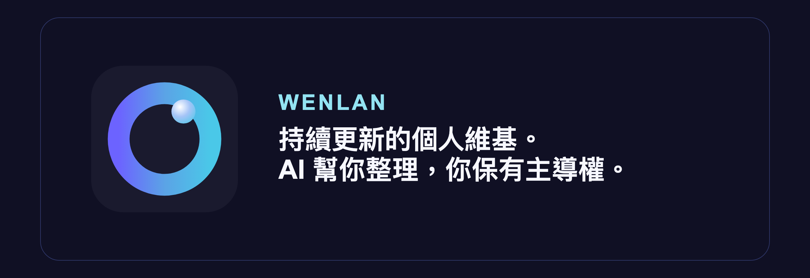
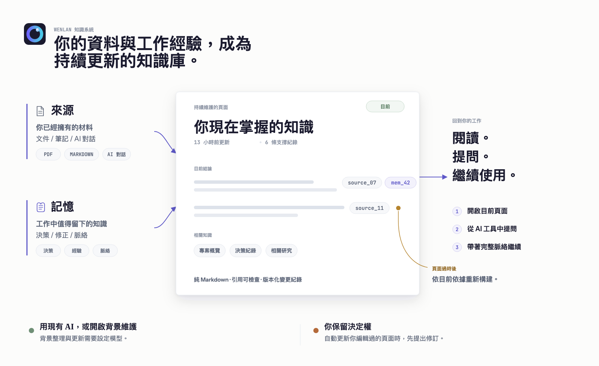
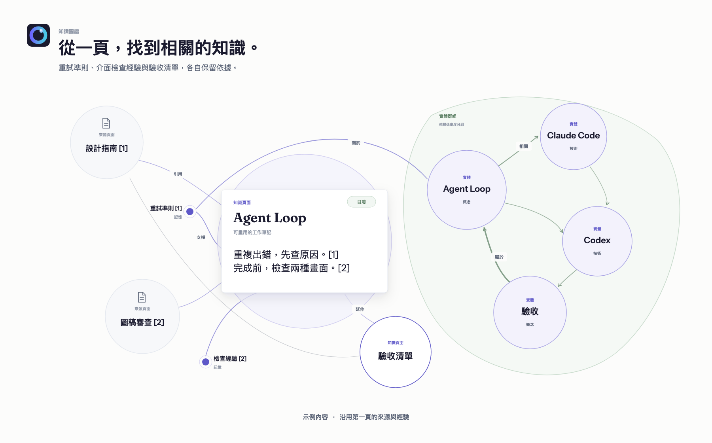
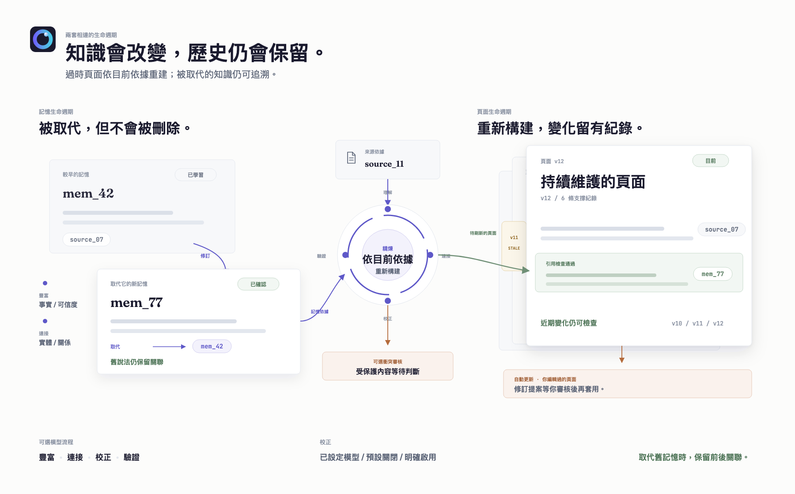

<!-- README_SYNC: source=README.md sha256=c19db1b5a08a0ead94e02d391920ed034537c47b71d1f72f696966fee37825ad -->

<p align="center">
  <picture>
    <source media="(max-width: 600px)" srcset="./docs/assets/readme-banner-zh-Hant-mobile.png">
    
  </picture>
</p>

Wenlan 把你的文件、筆記和 AI 對話整理成可編輯、附有來源連結的頁面，讓你和 AI 工具在已有成果上繼續工作。

來源有變，AI 跟著更新頁面。如果你編輯過頁面，Wenlan 會提出修訂，讓你確認是否採用，而不是自動覆寫你的內容。

<p align="center">
  <a href="./README.md">English</a> | <a href="./README.zh-Hans.md">简体中文</a> | 繁體中文 | <a href="./README.es-ES.md">Español</a>
</p>

<p align="center">
  <a href="https://github.com/7xuanlu/wenlan/actions/workflows/ci.yml?query=branch%3Amain"></a>
  <a href="https://github.com/7xuanlu/wenlan/releases/latest"></a>
  <a href="#license"></a>
</p>

<p align="center">
  <a href="#start-in-30-seconds">開&#8288;始&#8288;使&#8288;用</a> ·
  <a href="#what-does-wenlan-build">這&#8288;是&#8288;什&#8288;麼？</a> ·
  <a href="#what-can-it-do">能&#8288;力</a> ·
  <a href="#how-does-it-work">日&#8288;常&#8288;流&#8288;程</a> ·
  <a href="#evaluation">評&#8288;估</a> ·
  <a href="#learn-more">進&#8288;一&#8288;步&#8288;了&#8288;解</a>
</p>

https://github.com/user-attachments/assets/e4c934f9-c284-480f-a20f-708d9c91748d

<p align="center">
  <sub>桌面 app 中持續維護的頁面：開啟任一引用，就能檢查這項結論背後的來源或記憶。</sub>
</p>

<p align="center">
  <a href="https://github.com/7xuanlu/wenlan/releases/latest">下載&#8288;桌面&#8288;版</a> ·
  <a href="#mcp-setup">連接你的 AI</a>
</p>

---

<a id="quickstart"></a>
<a id="start-in-30-seconds"></a>

## 開始使用

<a id="start-with-the-app"></a>
<a id="open-the-wiki"></a>
<a id="desktop-app"></a>

### 1. 下載並開啟 Wenlan

[下載桌面版](https://github.com/7xuanlu/wenlan/releases/latest)，安裝後開啟：

- **macOS（Apple Silicon）：** 打開 `.dmg`，把 Wenlan 拖進「應用程式」。App 已簽署並通過公證。
- **Windows x64：** 執行 `-setup.exe`。安裝包尚未簽署。如果 SmartScreen 顯示警告，請先確認檔案來自官方 Releases 頁面，再點選「其他資訊」→「仍要執行」。
- **Linux：** 暫時沒有桌面版；可依照[設定指南](docs/setup-with-ai.md#install-the-runtime)，不透過桌面 app，直接搭配 AI 工具使用。

<a id="claude-code-in-30-seconds"></a>

<a id="codex-plugin"></a>

<a id="mcp-setup"></a>
<a id="mcp-clients"></a>

### 2. 讓常用 AI 共用你的維基

在 Wenlan 的設定導引中，連接 Claude Code、Codex 等工具，讓它們使用同一份知識。

<details>
<summary>連接時需要幫忙？讓 AI 協助設定</summary>

如有提示，請重新啟動 AI 工具。需要協助設定時，把下面這段貼給 Claude Code、Codex，或其他能夠讀取設定指南的工具：

```text
請依照這份指南，將目前的 AI 工具連接到 Wenlan：
https://raw.githubusercontent.com/7xuanlu/wenlan/main/docs/setup-with-ai.md

如果已安裝 Wenlan，請沿用現有安裝。
只設定目前這個 AI 工具，並確認它能儲存及找回一筆測試記憶。
```

</details>

### 3. 留下成果，下次接著用

> 把這次討論的重點整理成 Wenlan 頁面。

<details>
<summary>模型、其他安裝方式與更新</summary>

**模型**

你可以請已連接的 AI 整理頁面。要讓 Wenlan 自己在背景整理，則需要[設定模型](#models-and-privacy)。

**從終端機安裝 macOS app**

安裝程式會下載 app、核對 SHA-256，並放進「應用程式」：

```bash
/bin/bash -c "$(curl -fsSL https://raw.githubusercontent.com/7xuanlu/wenlan/main/scripts/install-macos-app.sh)"
```

**不使用桌面 app**

在 macOS Apple Silicon 上執行：

```bash
npx -y wenlan setup
```

`npx` 需要 Node.js；若未安裝，可先執行 `curl -fsSL https://raw.githubusercontent.com/7xuanlu/wenlan/main/install.sh | bash`，再執行 `wenlan setup --basic`。

這個命令會下載預先編譯的 CLI、背景服務（daemon）與 MCP 連接器，啟動並驗證本地服務；不需要安裝 Rust 或 Cargo。使用 glibc 的 Linux x64/ARM64 可以採用自動化的 [shell 設定流程](docs/setup-with-ai.md#install-the-runtime)；Windows x64 請從 [Releases](https://github.com/7xuanlu/wenlan/releases/latest) 下載對應的 archive。macOS Intel 目前[沒有受支援的完整 runtime 安裝方式](crates/wenlan-cli/README.md#macos-intel)。

**安裝內容與更新方式**

桌面 app 內建 daemon、CLI 與 MCP 連接器，開啟時會啟動 daemon，並提供偵測到的 AI 工具接入選項：Claude Code、Codex 使用 plugin，其他支援工具使用 MCP 設定。不使用桌面 app 時，執行的也是同一個 daemon；兩種方式都讓 AI 工具存取同一個本地知識庫。

更新 macOS app 時，把新 app 拖到舊 app 上覆蓋並開啟。Wenlan 0.17.0 及更早的版本需要先手動結束。

手動與各工具設定說明：[AI 輔助設定](docs/setup-with-ai.md) · [Claude Code plugin](plugin/README.md) · [Codex plugin](plugin-codex/README.md) · [CLI 與 MCP](crates/wenlan-cli/README.md)。

</details>


---

<a id="what-does-wenlan-build"></a>
<a id="why-it-compounds"></a>

<a id="這是什麼"></a>

## 你與 AI 共用的個人維基

- **下次接著做。** 請 Claude Code 或 Codex 參考已有的 Wenlan 頁面，繼續下一項工作。
- **看得到依據。** 點開引用，查看原始文件、對話或決策記錄。
- **自己的修改，自己決定。** 自動更新你編輯過的頁面時，Wenlan 會提出修訂，交給你確認。

頁面是本地 Markdown 檔案，你可以閱讀、編輯，也能帶走。

<p align="center">
  <picture>
    <source media="(max-width: 600px)" srcset="./docs/assets/wenlan-system-zh-Hant-mobile.png">
    
  </picture>
</p>

<details>
<summary>來源、記憶與頁面如何協作</summary>

Wenlan 讓持續進行的工作不只留在聊天視窗裡。你可以保存選定的文件與對話，記下過程中的決定，再把它們整理成可閱讀、編輯和重用的頁面。頁面生成與背景維護需要先設定[AI 路徑](#models-and-privacy)。

<a id="what-wenlan-is-not"></a>

**適合需要長期延續的工作。** 如果你會連續幾天或幾週用 AI 處理同一個主題，卻常常要翻找先前資料、重新解釋已做的決定，Wenlan 就是為這種工作流程設計的。它不是生活管理系統，也不是嵌入其他產品的 memory SDK。你仍可繼續使用 Obsidian；Wenlan 不承諾取代其外掛或完整搬移 vault 功能。

**一個知識系統，三種角色：**

- **來源讓 Wenlan 讀到的材料始終可追溯。** 匯入的對話保留為捕獲時的記錄；已登錄檔案會隨內容變化同步目前版本。
- **記憶保留工作真正教會你的內容。** AI agent 捕獲原子的決策、經驗、修正與取代關係，並保留出處。
- **頁面彙整目前知識。** Wenlan 把相關來源與記憶整理成附有引用的 Markdown，讓你反覆使用、更新與審核。

**更新方式：** 來源與捕獲的記憶都能作為同一頁面的依據。記憶歷史會記錄個別決策的變化；頁面歷史則記錄支撐頁面的依據與修訂。自動更新時，符合條件、由系統維護的頁面可直接更新；你編輯過的頁面則會收到修訂提案。審核讓你決定是否套用更新，但不代表 AI 的結論一定正確。

技術讀者可參考：Wenlan 採用 LLM wiki 的做法。資料模型、檢索與維護規則詳見 [LLM-wiki 實作指南](https://wenlan.app/zh-TW/learn/distilled-wiki-pages-ai-memory) 與[技術基礎](docs/technical-foundations.md)。

</details>

<a id="knowledge-graph"></a>

### 越用越有價值的知識圖譜

<p align="center">
  <picture>
    <source media="(max-width: 600px)" srcset="./docs/assets/wenlan-knowledge-network-zh-Hant-mobile.png">
    
  </picture>
</p>

<details>
<summary>圖譜與搜尋的技術細節</summary>

實體關係圖譜只是 Wenlan 更大連接式 wiki 的一部分。**知識頁面**保留持續維護的結論，**實體**固定可複用的人物、專案與概念，**來源頁面**讓匯入或同步的材料可檢查，原子**記憶**則保留決策與變化。它們透過彼此分開的明確連接協作：頁面間的 wikilink、頁面依據、記憶到實體的連接，以及實體間的有向關係。

在實體圖譜這一層，設定 enrichment 模型後，Wenlan 會從記憶中提取帶有類型的實體、觀察與有方向的關係。實體連結與解析會複用既有節點，而不是把每次提及都當成新事物；每條記憶仍保留來源，並可連結多個實體。[查看連接模型如何儲存 ->](docs/technical-foundations.md#connected-knowledge-model)

- **含義與方向：** 關係使用 `uses`、`part_of`、`contradicts`、`replaced_by` 等預置詞彙；未知類型會回退為 `related_to`，並成為可審核的詞彙提案。
- **強度與出處：** 關係可以保存信賴度、解釋與對應的來源記憶，讓強弱不同的主張仍可區分、可檢查。
- **形成可複用群組：** 標籤傳播會依關係密度為實體分組，並按每對實體之間的關係數量加權。這些群組可組織選用的全域摘要，實體連結也會為檢索補充脈絡。
- **修正但不抹除：** 相關說法、修正與明確的取代關係可以放在一起檢查，原始來源與記憶歷史仍會保留。

檢索時，Wenlan 會用實體向量比對找到與問題相關的實體。存在符合條件的圖譜連結時，預設開啟的圖譜記憶訊號（graph-memory stream）會把相連記憶作為第三路 [RRF](https://cormack.uwaterloo.ca/cormacksigir09-rrf.pdf) 排名訊號加以提升。這個路徑取決於現有圖譜資料與讀取範圍，Space 邊界仍然有效。[查看圖譜檢索如何運作 ->](docs/technical-foundations.md#graph-assisted-retrieval)

<a id="retrieval"></a>

### 從關鍵字、語意與關聯找回正確內容

Wenlan 的核心搜尋是本地混合檢索流程，不是單一的向量查詢。每個階段負責不同工作：

- **原詞比對，[SQLite FTS5](https://www.sqlite.org/fts5.html)：** 全文索引查找字面關鍵字、識別碼與短語。
- **相近含義，FastEmbed + [`Qdrant/bge-base-en-v1.5-onnx-Q`](https://huggingface.co/Qdrant/bge-base-en-v1.5-onnx-Q)：** 量化的英文模型會產生 768 維語意向量；[libSQL cosine DiskANN](https://turso.tech/blog/approximate-nearest-neighbor-search-with-diskann-in-libsql) 再以近似最近鄰搜尋（ANN）快速取得候選。
- **合併排名，加權 [RRF](https://cormack.uwaterloo.ca/cormacksigir09-rrf.pdf)（`k = 60`）：** 融合原詞與語意排名，不假設兩者的原始分數採用同一尺度；向量訊號還會由餘弦相似度加權。
- **關聯脈絡，圖譜記憶訊號（graph-memory stream）：** 符合條件的實體連結會加入第三路 RRF 訊號，傳回的記憶仍受目前讀取範圍限制。
- **可選精排，交叉編碼器（cross-encoder）：** 與分別編碼查詢和記憶的 embedding 不同，[`jinaai/jina-reranker-v1-turbo-en`](https://huggingface.co/jinaai/jina-reranker-v1-turbo-en) 或 [`BAAI/bge-reranker-base`](https://huggingface.co/BAAI/bge-reranker-base) 會同時讀取查詢與單一候選，再對較小的候選池重新排名；預設關閉。

頁面、情節記憶與事實（fact）通道都需要主動啟用；不可用時會退回其餘搜尋訊號。Space 仍負責限制讀取範圍。[查看方法、預設值與限制 ->](docs/technical-foundations.md)

</details>

<a id="what-makes-wenlan-distinct"></a>
<a id="why-is-wenlan-different"></a>
<a id="two-lifecycles"></a>

### 兩套生命週期，一個持續維護的知識系統

一次生成的 wiki 會過時；只存記憶又容易碎成互不相連的事實。Wenlan 連結兩套生命週期，但不把它們混成同一層。

<p align="center">
  <picture>
    <source media="(max-width: 600px)" srcset="./docs/assets/wenlan-lifecycle-zh-Hant-mobile.png">
    
  </picture>
</p>

<details>
<summary>更新、審核與本地檔案的細節</summary>

#### 原子記憶

`CAPTURE -> CLASSIFY -> ENRICH -> LINK -> RECONCILE`

Capture 與明確的 supersession 屬於核心流程。模型支援的階段只會在設定相應模型後執行，Reconcile 預設關閉。

| 操作 | Wenlan 做什麼 |
|---|---|
| **Capture** | AI agent 每次寫入一條完整、自足的想法，遵循 Zettelkasten 的原子筆記原則，而不是保存整段對話。 |
| **Classify** | 設定本地模型後，Wenlan 將記憶分為 `identity`、`preference`、`decision`、`lesson`、`gotcha` 或 `fact`；呼叫端明確提供的準確類型優先。 |
| **Enrich** | 設定本地模型後，在可用時補充結構化欄位、檢索提示、事件日期、品質、重要性與標籤。 |
| **Link** | 保留出處；啟用 enrichment 後，把記憶連結到知識圖譜中的實體與關係。 |
| **Reconcile** | 明確取代舊說法時保留 `supersedes` 鏈。若發起替換的 agent 信任等級低於 full，該替換會自動進入人工審核佇列，無需任何開關。可選的本地模型流程還可以把受保護內容的衝突放入審核，而不是覆蓋歷史；這個流程預設關閉，必須明確啟用。 |

進階設定：使用 `WENLAN_ENABLE_DUAL_POOL_RESOLVE=1` 啟用這個 Reconcile 流程。

#### 持續維護的頁面

`DISTILL -> CITE -> TRACK -> REFRESH -> REVIEW`

| 操作 | Wenlan 做什麼 |
|---|---|
| **Distill** | 把相關來源與記憶彙整成一個 Markdown 頁面。 |
| **Cite** | 保留引用紀錄與驗證狀態；自動 refresh 若未通過引用支撐檢查，就會捨棄草稿。 |
| **Track** | 記錄哪些證據支撐頁面、頁面為何過時，以及有上限的變更紀錄。 |
| **Refresh** | 頁面被標記為過時後，依目前證據重建符合條件、由機器維護的頁面。 |
| **Review** | 自動更新時，對你編輯過的頁面提出修訂，而非靜默改寫。 |

例如，匯入一份設計文件，再讓 Codex 記下一項除錯決策。Wenlan 可以把兩者整理成同一個頁面，並引用兩者。自動更新時，頁面會依目前的依據重建；若你編輯過它，更新提案會等你審閱。

**審核範圍：** 這是更新政策，不是保護你檔案的安全機制。直接編輯檔案或透過本機手動編輯 API 所做的修改，不會進入此審核佇列。明確強制重新生成也可能取代已編輯的頁面；桌面 app 會在執行前要求確認。

<a id="local-markdown"></a>

### 與 Obsidian 共存的本地 Markdown

長期知識保留為一般檔案，不被鎖在專有編輯器格式裡：

- **純文字檔案：** 頁面與 session notes 都以 Markdown 保存在 `~/.wenlan/`。
- **可檢查的歷史：** Distill 與 handoff 可以把邏輯上屬於同一批的檔案提交到本地 git repository。
- **與 Obsidian 共存：** Wenlan 把現有 vault 當成來源讀取。你可以把 `~/.wenlan/pages/` symlink 到 vault，或從桌面 app 匯出頁面；你的編輯仍由你擁有，之後的機器更新會成為可審核的修訂建議。

本地歷史可以直接檢查：

```text
$ git -C ~/.wenlan log --oneline
a1b2c3d distill: 4 pages
9f8e7d6 session: embedding-work
```

</details>

---

<a id="what-you-get"></a>
<a id="what-can-it-do"></a>
<a id="what-can-i-bring-in"></a>

## 能力

### 匯入你的資料

- **留下有用的 AI 對話：** 匯入 ChatGPT 或 Claude 匯出的 ZIP，已匯入的對話不會重複加入。
- **帶入現有筆記：** 匯入 Markdown、文字檔或可擷取文字的 PDF，也能整批讀取資料夾，或把 Obsidian 儲存庫接為來源。掃描版 PDF 須先擷取文字。
- **快速記錄：** 直接在桌面 app 記下想法或決策，不必先開啟 AI 對話。
- **[請 AI 記住工作重點](https://wenlan.app/learn/ai-memory-provenance)：** 請 AI 工具記下決策、經驗、更正、偏好與事實，保留來源及取代的舊記錄。
- **帶入其他 wiki：** 透過 CLI 或 API 匯入外部 OKF wiki，保留來源引用與連結。目前不支援重新匯入 Wenlan 自己匯出的 OKF。

### 瀏覽你的個人 wiki

- **[可編輯、有來源的頁面](https://wenlan.app/docs/source-backed-pages)：** 把相關文件與記憶整理成 Markdown 頁面，附引用與頁面連結。
- **卡片或列表：** 用適合自己的方式瀏覽頁面、實體與空間。
- **[知識圖譜](docs/technical-foundations.md#graph-data-and-entity-resolution)：** 探索人物、專案、主張與支撐記憶之間的關係。

### 搭配 AI 繼續工作

- **[換個 AI，也能接著用](https://wenlan.app/docs/architecture)：** 連接後，Claude Code、Codex 與其他 MCP 用戶端，可使用和桌面 app、CLI 相同的本地頁面與記憶。
- **[原詞與語意搜尋](docs/technical-foundations.md#retrieval-pipeline)：** 結合精確比對與本地語意搜尋，圖譜關係可補上相關脈絡。
- **[需要時，搜尋得更細](docs/technical-foundations.md#optional-channels-and-defaults)：** 可選擇搜尋頁面與更細緻的記憶，並重新排序結果。
- **[不同專案，分開管理](https://wenlan.app/docs/spaces)：** 用空間選擇 AI 這次要搜尋的工作、個人、客戶或程式庫知識。
- **網頁 AI 存取（實驗性）：** 電腦保持連線時，讓支援的網頁 AI 用戶端連到你授權的一個空間。查詢與結果會經過中繼服務，詳見[連接方式與隱私界限](docs/PRIVACY.md#pre-release-standalone-wenlan-relay-connector)。
- **接入自己的工具：** 透過本地 HTTP API 傳入準備好的文字、網頁內容或記憶；它接收內容，不會代為抓取網址。

### 持續更新與維護

背景整理與頁面更新是可選功能，需要先[設定模型](#models-and-privacy)。

- **增量同步：** 檔案與資料夾會在背景追蹤變更；Obsidian 儲存庫維持唯讀，需要時再同步。
- **[整理已存的知識](docs/technical-foundations.md#typed-memory-schema)：** 設定模型後，可協助補上類型、欄位、相關日期、標籤、搜尋提示與圖譜連結。
- **有引用才更新：** 自動更新會拒絕引用不足的草稿。AI 產生的頁面可以更新；你編輯過的頁面則先提出修訂。
- **[需要判斷才審核](https://wenlan.app/docs/review-and-trust)：** 審核受保護的衝突、頁面修訂、實體合併與新詞彙。
- **進度看得見：** 在 Activity 查看進度與卡住的原因。本地服務運作時，關閉 app 視窗後仍可繼續執行已設定的同步、補全與符合條件的頁面更新。

### 保有資料與控制權

- **[資料在本地，也能檢查](https://wenlan.app/learn/markdown-local-index-ai-memory)：** 保留 Markdown 頁面、引用、修訂、git 歷史與 Obsidian 匯出；記憶與圖譜存於本地 libSQL。
- **把 wiki 帶走：** 從設定或 CLI，把各空間符合條件的頁面匯出成 OKF v0.2 wiki。這是 wiki 匯出，不是完整資料庫備份。
- **[模型自己選](docs/technical-foundations.md#model-roles)：** 基礎檢索留在本機。可選的補全與頁面合成能用裝置端 Qwen、本地端點或雲端模型；遠端服務會收到該任務所需的內容。
- **檢查問題，確認後修復：** [Doctor](https://wenlan.app/docs/diagnostics-and-issue-reports) 與 [lint](plugin/skills/lint/SKILL.md) 只回報問題，不改寫知識。支援的修復可在 app 預覽，確認後套用並驗證。

**從一段值得留下的對話開始。** [開始使用](#start-in-30-seconds)。想之後再試，也可以先給這個 repo 一顆 Star，方便回來找到它。

---

<a id="how-wenlan-works"></a>
<a id="how-does-it-work"></a>

## 日常流程

AI 工具連接好後，可以直接這樣說：

### 開始工作前

> 找出我存進 Wenlan 的［主題］相關資料，包括之前的決定與來源。

### 得到有用的結論時

> 把這個決定、背後的原因和來源記到 Wenlan。

### 值得整理成頁面時

> 把［主題］的已存資料整理成 Wenlan 頁面，已有的就更新，並保留引用。

在 Wenlan 裡閱讀、編輯頁面、查看來源。下次做相關工作時，請 AI 先讀這一頁，再接著做。

<details>
<summary>插件指令與維護</summary>

- **找回脈絡：** `/recall <query>` 搜尋已存的知識。`/brief [topic]` 讀取目前空間的專案摘要；加上主題時，會補充同一空間的相關內容。
- **留下重點：** `/capture <thing>` 記下決策、經驗、更正、偏好或事實，並保留來源。
- **工作收尾：** `/handoff` 記錄這次的進展，建立或更新空間的專案摘要，方便下次接續。
- **整理與審核：** `/distill` 建立或更新 wiki 頁面。`/lint` 檢查知識庫狀態；`/curate` 審核待處理的記錄或修訂。

這些快捷指令由 Wenlan 插件提供。其他已連接的用戶端使用對應的 MCP 工具。可選的背景整理與頁面更新需要先[設定模型](#models-and-privacy)。

[完整指令參考](plugin/skills/README.md)。

</details>

<details>
<summary>CLI 離線佇列詳情</summary>

### 離線佇列（outbox）

如果本機守護程序無法連線，`wenlan capture` 與 `wenlan brief update` 會把請求寫入本機持久化佇列（outbox）並正常結束。守護程序恢復後，它會透過一般 HTTP 路由排空這些寫入；用 `wenlan outbox status` 檢視佇列，或用 `wenlan outbox drain` 立即重播。被守護程序直接拒絕的寫入（4xx，例如未通過內容品質檢查）會連同回條移到 `outbox/failed/`，而不是無限重試；傳輸失敗或伺服器錯誤（5xx）則留在佇列中等待下一次排空，排空每 60 秒自動執行一次。

</details>

<a id="models-and-privacy"></a>

### 模型與隱私

- **本地基礎檢索：** [BGE 向量模型（embedding model）](https://huggingface.co/Qdrant/bge-base-en-v1.5-onnx-Q) 透過 FastEmbed 在你的裝置上執行，用於混合搜尋，不需要 API key。
- **可選的裝置端整理：** 內容補充（enrichment）與頁面彙整可以使用你選擇的 [`Qwen3 4B`](https://huggingface.co/unsloth/Qwen3-4B-Instruct-2507-GGUF) 或 [`Qwen3.5 9B`](https://huggingface.co/unsloth/Qwen3.5-9B-GGUF)，並透過 [llama.cpp](https://github.com/ggml-org/llama.cpp) 執行。你沒有選擇前，Wenlan 不會下載或啟用語言模型。
- **其他模型來源：** Ollama 或 LM Studio 等 OpenAI 相容的本地端點，或已設定的雲端 provider，也可以提供模型支援的內容補充與頁面彙整。
- **雲端說明：** 如果你選擇的模型端點位於遠端，Wenlan 會把該任務需要的 system prompt 與 user prompt 傳給它。本地檢索與裝置端整理仍留在你的裝置上。
- **選用使用統計：** 預設關閉。只有你同意後，Wenlan 才會傳送有限的操作計數、版本與平台，不包含知識內容或安裝識別碼。詳見[隱私說明](docs/PRIVACY.md#telemetry)。

完整 workflow 參考：[plugin/skills](plugin/skills/README.md)。模型分工與限制見：[技術基礎（英文）](docs/technical-foundations.md#model-roles)。

### 你的資料與移除

沒有任何鎖定。頁面和工作階段筆記是 `~/.wenlan/` 下的 Markdown；記憶保存在平台資料目錄下的一個 libSQL 資料庫中（macOS 為 `~/Library/Application Support/wenlan/`，Linux 為 `~/.local/share/wenlan/`，Windows 為 `%LOCALAPPDATA%\wenlan\`）。複製這兩個資料夾即可備份或搬移你的 Wenlan。如果這次安裝是從 Origin 升級而來，仍會在 `~/.origin/` 和同層的 `origin` 資料資料夾中（macOS 為 `~/Library/Application Support/origin/`，Linux 為 `~/.local/share/origin/`，Windows 為 `%LOCALAPPDATA%\origin\`）各保留一份完整資料；這兩個資料夾也請一併刪除或複製。

移除：app 中「登入時在背景執行文瀾」開關會移除開機註冊——關閉它並結束程式，刪除 `Wenlan.app` 或執行 Windows 解除安裝程式，然後刪除上述資料夾。`wenlan background off` 只會停止守護程序並關閉開機自動啟動，不會移除開機註冊；僅使用 CLI 的安裝請改為參照 [PRIVACY.md](docs/PRIVACY.md) 中守護程序的解除安裝項目。Wenlan 寫入的路徑列在其中。

---

<a id="evaluation"></a>

## 評估

以下是 retrieval-only snapshot，不代表 end-to-end answer quality。方法、環境 receipts 與更新流程見 [docs/eval](docs/eval/README.md)。

<!-- EVAL_SNAPSHOT_START -->
| Benchmark | Recall@5 | MRR | NDCG@10 |
|---|---:|---:|---:|
| LME_Oracle (500 Q) | 93.6% | 0.857 | 0.883 |
| LME_S (deep, 90 Q) | 87.7% | 0.815 | 0.822 |
<!-- EVAL_SNAPSHOT_END -->

---

<a id="learn-more"></a>

## 進一步了解

更完整的文件、概念說明與比較：

### 文件

- [開始使用](https://wenlan.app/docs/get-started)：安裝並驗證第一個本地循環。
- [日常工作流程](https://wenlan.app/docs/daily-workflow)：brief、capture、recall、handoff、distill、lint 與 curate。
- [MCP 用戶端](https://wenlan.app/docs/mcp-clients)：連接 Claude Code、Codex、Cursor、Claude Desktop 與其他工具。

### 工作流程指南

- [為顧問專案建立客戶知識庫](https://wenlan.app/zh-TW/learn/build-client-project-knowledge-base-for-consulting)
- [建立有來源支撐的投資研究知識庫](https://wenlan.app/zh-TW/learn/build-investment-research-knowledge-base)
- [在撰寫 PRD 前建立產品研究知識庫](https://wenlan.app/zh-TW/learn/build-product-research-knowledge-base-for-prd)
- [用 runbook 與事故復盤建立 SRE 事故知識庫](https://wenlan.app/zh-TW/learn/build-sre-incident-knowledge-base)
- [建立商業指標定義知識庫](https://wenlan.app/zh-TW/learn/build-business-metric-definition-knowledge-base)：把核准的 KPI 規格整理成有來源的資料字典，保留公式文字、粒度、排除條件、負責人、修訂與複核狀態。

### 概念

- [為什麼需要持續演進的 wiki，而不只是 AI 記憶](https://wenlan.app/learn/ai-work-memory)：深入理解問題與產品模型。
- [MCP 記憶伺服器](https://wenlan.app/learn/mcp-memory-server)：Wenlan 如何讓知識跨 AI 工具使用。
- [本機優先的 AI 記憶](https://wenlan.app/learn/local-first-ai-memory)：資料、隱私與控制權。
- [Markdown 與本地索引](https://wenlan.app/learn/markdown-local-index-ai-memory)：儲存、檢索與所有權。
- [AI agent 的交接循環](https://wenlan.app/learn/ai-agent-handoff-loop)：把工作完整帶到下一次會話。
- [用論文建立研究知識庫](https://wenlan.app/zh-TW/learn/source-backed-research-knowledge-base)：把已選好的論文整理成可檢查的文獻矩陣與來源支撐綜合。

### 比較

- [Wenlan 與 Basic Memory](https://wenlan.app/learn/wenlan-vs-basic-memory)
- [Wenlan 與 claude-mem](https://wenlan.app/learn/wenlan-vs-claude-mem)
- [Wenlan 與 Superlocal Memory](https://wenlan.app/learn/wenlan-vs-superlocal-memory)

---

## 貢獻

歡迎 bug fixes、eval cases、文件與功能。安裝 Wenlan 不需要從原始碼建置。本機開發時，請從本 repository 的根目錄執行以下命令：

```bash
# daemon crates（default-members——不會編譯桌面 app）
cargo build
cargo test

# 桌面 app（Cargo target 與根目錄的前端工具鏈）
pnpm install
pnpm dev:all
pnpm build:all
```

`pnpm dev:all` 是桌面 app 受支援的開發進入點。它讓開發用的連接埠、資料、行程歸屬、app 識別、MCP socket 與 Remote Access 狀態都與已安裝的正式執行環境隔離；未處於該隔離環境的 debug build 會拒絕啟動。完整開發流程見本 repository 的 [AGENTS.md](AGENTS.md) 與 [CONTRIBUTING.md](.github/CONTRIBUTING.md)，以及儲存庫內的 [app/AGENTS.md](app/AGENTS.md)。安全性問題請見 [SECURITY.md](.github/SECURITY.md)，隱私權政策請見 [PRIVACY.md](docs/PRIVACY.md)，也請閱讀 [Code of Conduct](.github/CODE_OF_CONDUCT.md)。

---

<a id="code-signing-policy"></a>

## Code signing policy

Free code signing provided by [SignPath.io](https://about.signpath.io), certificate by [SignPath Foundation](https://signpath.org).

- **Authors：**[@7xuanlu](https://github.com/7xuanlu)，可直接向本 repository 提交 commit，無需額外 review。
- **Reviewers：**[@7xuanlu](https://github.com/7xuanlu)。非 committer 的每一處改動都以 pull request 形式提交，合併前先經過 review。
- **Approvers：**[@7xuanlu](https://github.com/7xuanlu)，審批每一次簽章請求，決定哪一個 release 被簽章。

本專案要求每位 maintainer 在 GitHub 與 SignPath 上都啟用多因素驗證；未啟用者不會被加入其中任何一方。Release 只由本 repository 的 tag release workflow 建置，執行在 GitHub 託管的 runner 上，來源是該 tag 指向的 commit。

**隱私權政策：**[PRIVACY.md](docs/PRIVACY.md) —— Wenlan 保存什麼、保存在哪裡，以及我們已知它會存取網路的各種情況。各平台的簽章方式見 [docs/code-signing.md](docs/code-signing.md)。

SignPath 的申請正在審核中，Windows 安裝包尚未簽署。

---

<a id="license"></a>

## 授權

Wenlan 採用兩種授權，依 repository 的不同部分劃分。

- **Apache-2.0**（[`LICENSE`](LICENSE)）涵蓋 local runtime、CLI、MCP server、shared types，以及 Claude Code 與 Codex 的 plugin files。可以自由基於這些開發。
- **AGPL-3.0-only**（[`app/LICENSE`](app/LICENSE)）涵蓋桌面 app：`app/` crate 及其附帶的 React 前端。如果你把修改過的 app 作為網路服務運行，AGPL 要求你向使用它的人提供這份修改後的原始碼。

這個劃分是刻意為之。Apache-2.0 的程式碼可以用在 AGPL-3.0 程式裡，所以桌面 app 建立在 runtime 之上，兩種授權都不會被違反。

---

<a id="acknowledgments"></a>

## 源流與同類專案

Wenlan（文瀾）的名字來自文瀾閣。這座皇家藏書樓收藏《四庫全書》，曾是中國最大的藏書之一。

Wenlan 的 llm-wiki v2 模型是自己的產品方向，並受到 LLM-wiki 與 agent-memory 兩條脈絡啟發：

- [Karpathy 的 LLM-wiki note](https://gist.github.com/karpathy/442a6bf555914893e9891c11519de94f) 建立了從 raw sources 到持續維護 wiki 的模式。
- [Rohitg00 的 LLM Wiki v2 proposal](https://gist.github.com/rohitg00/2067ab416f7bbe447c1977edaaa681e2) 加入 memory lifecycle、confidence、graph 與 retrieval mechanisms。[agentmemory](https://github.com/rohitg00/agentmemory) 是其具體的 agent-memory implementation。
- [nashsu/llm_wiki](https://github.com/nashsu/llm_wiki) 是以文件為核心的 LLM-wiki 完整桌面實作。
- [basic-memory](https://github.com/basicmachines-co/basic-memory)、[obsidian-mind](https://github.com/breferrari/obsidian-mind)、[mcp-memory-service](https://pypi.org/project/mcp-memory-service/)、[Memoria](https://github.com/matrixorigin/Memoria) 和 [OpenMemory](https://github.com/CaviraOSS/OpenMemory) 探索相鄰的本地知識與 agent-memory 方向。
